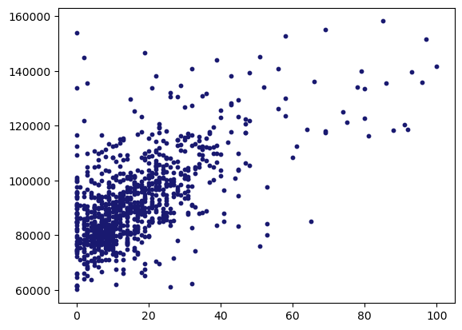

# College Guide Project
## Stephanie Fissel


```python
import pandas as pd
import matplotlib.pyplot as plt
import seaborn as sns
import numpy as np
```

# TUITION COST


```python
tuition_cost = pd.read_csv('https://raw.githubusercontent.com/rfordatascience/tidytuesday/master/data/2020/2020-03-10/tuition_cost.csv')
tuition_cost.head()
```


<div>
<style scoped>
    .dataframe tbody tr th:only-of-type {
        vertical-align: middle;
    }

    .dataframe tbody tr th {
        vertical-align: top;
    }

    .dataframe thead th {
        text-align: right;
    }
</style>
<table border="1" class="dataframe">
  <thead>
    <tr style="text-align: right;">
      <th></th>
      <th>name</th>
      <th>state</th>
      <th>state_code</th>
      <th>type</th>
      <th>degree_length</th>
      <th>room_and_board</th>
      <th>in_state_tuition</th>
      <th>in_state_total</th>
      <th>out_of_state_tuition</th>
      <th>out_of_state_total</th>
    </tr>
  </thead>
  <tbody>
    <tr>
      <th>0</th>
      <td>Aaniiih Nakoda College</td>
      <td>Montana</td>
      <td>MT</td>
      <td>Public</td>
      <td>2 Year</td>
      <td>NaN</td>
      <td>2380</td>
      <td>2380</td>
      <td>2380</td>
      <td>2380</td>
    </tr>
    <tr>
      <th>1</th>
      <td>Abilene Christian University</td>
      <td>Texas</td>
      <td>TX</td>
      <td>Private</td>
      <td>4 Year</td>
      <td>10350.0</td>
      <td>34850</td>
      <td>45200</td>
      <td>34850</td>
      <td>45200</td>
    </tr>
    <tr>
      <th>2</th>
      <td>Abraham Baldwin Agricultural College</td>
      <td>Georgia</td>
      <td>GA</td>
      <td>Public</td>
      <td>2 Year</td>
      <td>8474.0</td>
      <td>4128</td>
      <td>12602</td>
      <td>12550</td>
      <td>21024</td>
    </tr>
    <tr>
      <th>3</th>
      <td>Academy College</td>
      <td>Minnesota</td>
      <td>MN</td>
      <td>For Profit</td>
      <td>2 Year</td>
      <td>NaN</td>
      <td>17661</td>
      <td>17661</td>
      <td>17661</td>
      <td>17661</td>
    </tr>
    <tr>
      <th>4</th>
      <td>Academy of Art University</td>
      <td>California</td>
      <td>CA</td>
      <td>For Profit</td>
      <td>4 Year</td>
      <td>16648.0</td>
      <td>27810</td>
      <td>44458</td>
      <td>27810</td>
      <td>44458</td>
    </tr>
  </tbody>
</table>
</div>


```python
tuition_cost.shape
```


    (2973, 10)


```python
tuition_cost[tuition_cost['name'] == 'Georgetown University'].head(50)
```


<div>
<style scoped>
    .dataframe tbody tr th:only-of-type {
        vertical-align: middle;
    }

    .dataframe tbody tr th {
        vertical-align: top;
    }

    .dataframe thead th {
        text-align: right;
    }
</style>
<table border="1" class="dataframe">
  <thead>
    <tr style="text-align: right;">
      <th></th>
      <th>name</th>
      <th>state</th>
      <th>state_code</th>
      <th>type</th>
      <th>degree_length</th>
      <th>room_and_board</th>
      <th>in_state_tuition</th>
      <th>in_state_total</th>
      <th>out_of_state_tuition</th>
      <th>out_of_state_total</th>
    </tr>
  </thead>
  <tbody>
    <tr>
      <th>902</th>
      <td>Georgetown University</td>
      <td>NaN</td>
      <td>DC</td>
      <td>Private</td>
      <td>4 Year</td>
      <td>16509.0</td>
      <td>54104</td>
      <td>70613</td>
      <td>54104</td>
      <td>70613</td>
    </tr>
  </tbody>
</table>
</div>


```python
#check for NaN values
tuition_cost.isnull().values.any()
```


    True


```python
#there are NaN values for schools in PR because it is not a state - get rid of state column and just rely on stat_code
#there are also NaN values for room_and_board because some schools but the room&board make a difference for totals and decision making
```


```python
#Only looking at 4-year schools
four_year = tuition_cost[~tuition_cost['degree_length'].isin(['2 Year'])]
four_year.head()
```


<div>
<style scoped>
    .dataframe tbody tr th:only-of-type {
        vertical-align: middle;
    }

    .dataframe tbody tr th {
        vertical-align: top;
    }

    .dataframe thead th {
        text-align: right;
    }
</style>
<table border="1" class="dataframe">
  <thead>
    <tr style="text-align: right;">
      <th></th>
      <th>name</th>
      <th>state</th>
      <th>state_code</th>
      <th>type</th>
      <th>degree_length</th>
      <th>room_and_board</th>
      <th>in_state_tuition</th>
      <th>in_state_total</th>
      <th>out_of_state_tuition</th>
      <th>out_of_state_total</th>
    </tr>
  </thead>
  <tbody>
    <tr>
      <th>1</th>
      <td>Abilene Christian University</td>
      <td>Texas</td>
      <td>TX</td>
      <td>Private</td>
      <td>4 Year</td>
      <td>10350.0</td>
      <td>34850</td>
      <td>45200</td>
      <td>34850</td>
      <td>45200</td>
    </tr>
    <tr>
      <th>4</th>
      <td>Academy of Art University</td>
      <td>California</td>
      <td>CA</td>
      <td>For Profit</td>
      <td>4 Year</td>
      <td>16648.0</td>
      <td>27810</td>
      <td>44458</td>
      <td>27810</td>
      <td>44458</td>
    </tr>
    <tr>
      <th>5</th>
      <td>Adams State University</td>
      <td>Colorado</td>
      <td>CO</td>
      <td>Public</td>
      <td>4 Year</td>
      <td>8782.0</td>
      <td>9440</td>
      <td>18222</td>
      <td>20456</td>
      <td>29238</td>
    </tr>
    <tr>
      <th>6</th>
      <td>Adelphi University</td>
      <td>New York</td>
      <td>NY</td>
      <td>Private</td>
      <td>4 Year</td>
      <td>16030.0</td>
      <td>38660</td>
      <td>54690</td>
      <td>38660</td>
      <td>54690</td>
    </tr>
    <tr>
      <th>8</th>
      <td>Adrian College</td>
      <td>Michigan</td>
      <td>MI</td>
      <td>Private</td>
      <td>4 Year</td>
      <td>11318.0</td>
      <td>37087</td>
      <td>48405</td>
      <td>37087</td>
      <td>48405</td>
    </tr>
  </tbody>
</table>
</div>


```python
four_year.shape
```


    (1853, 10)


```python
four_yr = four_year.drop(columns = ['state', 'degree_length', 'room_and_board', 'in_state_tuition', 'out_of_state_tuition'])
four_yr.head()
```


<div>
<style scoped>
    .dataframe tbody tr th:only-of-type {
        vertical-align: middle;
    }

    .dataframe tbody tr th {
        vertical-align: top;
    }

    .dataframe thead th {
        text-align: right;
    }
</style>
<table border="1" class="dataframe">
  <thead>
    <tr style="text-align: right;">
      <th></th>
      <th>name</th>
      <th>state_code</th>
      <th>type</th>
      <th>in_state_total</th>
      <th>out_of_state_total</th>
    </tr>
  </thead>
  <tbody>
    <tr>
      <th>1</th>
      <td>Abilene Christian University</td>
      <td>TX</td>
      <td>Private</td>
      <td>45200</td>
      <td>45200</td>
    </tr>
    <tr>
      <th>4</th>
      <td>Academy of Art University</td>
      <td>CA</td>
      <td>For Profit</td>
      <td>44458</td>
      <td>44458</td>
    </tr>
    <tr>
      <th>5</th>
      <td>Adams State University</td>
      <td>CO</td>
      <td>Public</td>
      <td>18222</td>
      <td>29238</td>
    </tr>
    <tr>
      <th>6</th>
      <td>Adelphi University</td>
      <td>NY</td>
      <td>Private</td>
      <td>54690</td>
      <td>54690</td>
    </tr>
    <tr>
      <th>8</th>
      <td>Adrian College</td>
      <td>MI</td>
      <td>Private</td>
      <td>48405</td>
      <td>48405</td>
    </tr>
  </tbody>
</table>
</div>


```python
four_yr.sort_values(by = 'in_state_total', ascending=True).head()
```


<div>
<style scoped>
    .dataframe tbody tr th:only-of-type {
        vertical-align: middle;
    }

    .dataframe tbody tr th {
        vertical-align: top;
    }

    .dataframe thead th {
        text-align: right;
    }
</style>
<table border="1" class="dataframe">
  <thead>
    <tr style="text-align: right;">
      <th></th>
      <th>name</th>
      <th>state_code</th>
      <th>type</th>
      <th>in_state_total</th>
      <th>out_of_state_total</th>
    </tr>
  </thead>
  <tbody>
    <tr>
      <th>995</th>
      <td>Haskell Indian Nations University</td>
      <td>KS</td>
      <td>Public</td>
      <td>1430</td>
      <td>1430</td>
    </tr>
    <tr>
      <th>2648</th>
      <td>University of Puerto Rico: Arecibo</td>
      <td>PR</td>
      <td>Public</td>
      <td>1769</td>
      <td>1987</td>
    </tr>
    <tr>
      <th>2651</th>
      <td>University of Puerto Rico: Humacao</td>
      <td>PR</td>
      <td>Public</td>
      <td>1794</td>
      <td>1794</td>
    </tr>
    <tr>
      <th>2649</th>
      <td>University of Puerto Rico: Bayamon University ...</td>
      <td>PR</td>
      <td>Public</td>
      <td>2022</td>
      <td>2022</td>
    </tr>
    <tr>
      <th>2652</th>
      <td>University of Puerto Rico: Mayaguez</td>
      <td>PR</td>
      <td>Public</td>
      <td>2083</td>
      <td>4105</td>
    </tr>
  </tbody>
</table>
</div>


```python
four_yr.sort_values(by = 'out_of_state_total', ascending=True).head()
```


<div>
<style scoped>
    .dataframe tbody tr th:only-of-type {
        vertical-align: middle;
    }

    .dataframe tbody tr th {
        vertical-align: top;
    }

    .dataframe thead th {
        text-align: right;
    }
</style>
<table border="1" class="dataframe">
  <thead>
    <tr style="text-align: right;">
      <th></th>
      <th>name</th>
      <th>state_code</th>
      <th>type</th>
      <th>in_state_total</th>
      <th>out_of_state_total</th>
    </tr>
  </thead>
  <tbody>
    <tr>
      <th>995</th>
      <td>Haskell Indian Nations University</td>
      <td>KS</td>
      <td>Public</td>
      <td>1430</td>
      <td>1430</td>
    </tr>
    <tr>
      <th>2651</th>
      <td>University of Puerto Rico: Humacao</td>
      <td>PR</td>
      <td>Public</td>
      <td>1794</td>
      <td>1794</td>
    </tr>
    <tr>
      <th>2648</th>
      <td>University of Puerto Rico: Arecibo</td>
      <td>PR</td>
      <td>Public</td>
      <td>1769</td>
      <td>1987</td>
    </tr>
    <tr>
      <th>2649</th>
      <td>University of Puerto Rico: Bayamon University ...</td>
      <td>PR</td>
      <td>Public</td>
      <td>2022</td>
      <td>2022</td>
    </tr>
    <tr>
      <th>2653</th>
      <td>University of Puerto Rico: Medical Sciences</td>
      <td>PR</td>
      <td>Public</td>
      <td>2196</td>
      <td>2196</td>
    </tr>
  </tbody>
</table>
</div>


```python
update = four_yr[~four_yr['state_code'].isin(['PR', 'VI'])]
update.head()
```


<div>
<style scoped>
    .dataframe tbody tr th:only-of-type {
        vertical-align: middle;
    }

    .dataframe tbody tr th {
        vertical-align: top;
    }

    .dataframe thead th {
        text-align: right;
    }
</style>
<table border="1" class="dataframe">
  <thead>
    <tr style="text-align: right;">
      <th></th>
      <th>name</th>
      <th>state_code</th>
      <th>type</th>
      <th>in_state_total</th>
      <th>out_of_state_total</th>
    </tr>
  </thead>
  <tbody>
    <tr>
      <th>1</th>
      <td>Abilene Christian University</td>
      <td>TX</td>
      <td>Private</td>
      <td>45200</td>
      <td>45200</td>
    </tr>
    <tr>
      <th>4</th>
      <td>Academy of Art University</td>
      <td>CA</td>
      <td>For Profit</td>
      <td>44458</td>
      <td>44458</td>
    </tr>
    <tr>
      <th>5</th>
      <td>Adams State University</td>
      <td>CO</td>
      <td>Public</td>
      <td>18222</td>
      <td>29238</td>
    </tr>
    <tr>
      <th>6</th>
      <td>Adelphi University</td>
      <td>NY</td>
      <td>Private</td>
      <td>54690</td>
      <td>54690</td>
    </tr>
    <tr>
      <th>8</th>
      <td>Adrian College</td>
      <td>MI</td>
      <td>Private</td>
      <td>48405</td>
      <td>48405</td>
    </tr>
  </tbody>
</table>
</div>


```python
pub = update[~update['type'].isin(['Private', 'For Profit'])]
pub.head()
```


<div>
<style scoped>
    .dataframe tbody tr th:only-of-type {
        vertical-align: middle;
    }

    .dataframe tbody tr th {
        vertical-align: top;
    }

    .dataframe thead th {
        text-align: right;
    }
</style>
<table border="1" class="dataframe">
  <thead>
    <tr style="text-align: right;">
      <th></th>
      <th>name</th>
      <th>state_code</th>
      <th>type</th>
      <th>in_state_total</th>
      <th>out_of_state_total</th>
    </tr>
  </thead>
  <tbody>
    <tr>
      <th>5</th>
      <td>Adams State University</td>
      <td>CO</td>
      <td>Public</td>
      <td>18222</td>
      <td>29238</td>
    </tr>
    <tr>
      <th>14</th>
      <td>Alabama Agricultural and Mechanical University</td>
      <td>AL</td>
      <td>Public</td>
      <td>18077</td>
      <td>26297</td>
    </tr>
    <tr>
      <th>16</th>
      <td>Alabama State University</td>
      <td>AL</td>
      <td>Public</td>
      <td>16490</td>
      <td>24818</td>
    </tr>
    <tr>
      <th>21</th>
      <td>Albany State University</td>
      <td>GA</td>
      <td>Public</td>
      <td>15604</td>
      <td>28680</td>
    </tr>
    <tr>
      <th>26</th>
      <td>Alcorn State University</td>
      <td>MS</td>
      <td>Public</td>
      <td>16752</td>
      <td>16752</td>
    </tr>
  </tbody>
</table>
</div>


```python
public_school = pub.drop(columns = ['type'])
public_school.head()
```


<div>
<style scoped>
    .dataframe tbody tr th:only-of-type {
        vertical-align: middle;
    }

    .dataframe tbody tr th {
        vertical-align: top;
    }

    .dataframe thead th {
        text-align: right;
    }
</style>
<table border="1" class="dataframe">
  <thead>
    <tr style="text-align: right;">
      <th></th>
      <th>name</th>
      <th>state_code</th>
      <th>in_state_total</th>
      <th>out_of_state_total</th>
    </tr>
  </thead>
  <tbody>
    <tr>
      <th>5</th>
      <td>Adams State University</td>
      <td>CO</td>
      <td>18222</td>
      <td>29238</td>
    </tr>
    <tr>
      <th>14</th>
      <td>Alabama Agricultural and Mechanical University</td>
      <td>AL</td>
      <td>18077</td>
      <td>26297</td>
    </tr>
    <tr>
      <th>16</th>
      <td>Alabama State University</td>
      <td>AL</td>
      <td>16490</td>
      <td>24818</td>
    </tr>
    <tr>
      <th>21</th>
      <td>Albany State University</td>
      <td>GA</td>
      <td>15604</td>
      <td>28680</td>
    </tr>
    <tr>
      <th>26</th>
      <td>Alcorn State University</td>
      <td>MS</td>
      <td>16752</td>
      <td>16752</td>
    </tr>
  </tbody>
</table>
</div>


```python
#public_school.sort_values('state_code', inplace = True)
```


```python
#public_school.sort_values(by = 'in_state_total', ascending = True)
```


```python
pubs = public_school.sort_index(axis=0, by = 'in_state_total', ascending = True)
pubs.head()
```

    /Users/stephaniefissel/anaconda3/lib/python3.7/site-packages/ipykernel_launcher.py:1: FutureWarning: by argument to sort_index is deprecated, please use .sort_values(by=...)
      """Entry point for launching an IPython kernel.


<div>
<style scoped>
    .dataframe tbody tr th:only-of-type {
        vertical-align: middle;
    }

    .dataframe tbody tr th {
        vertical-align: top;
    }

    .dataframe thead th {
        text-align: right;
    }
</style>
<table border="1" class="dataframe">
  <thead>
    <tr style="text-align: right;">
      <th></th>
      <th>name</th>
      <th>state_code</th>
      <th>in_state_total</th>
      <th>out_of_state_total</th>
    </tr>
  </thead>
  <tbody>
    <tr>
      <th>995</th>
      <td>Haskell Indian Nations University</td>
      <td>KS</td>
      <td>1430</td>
      <td>1430</td>
    </tr>
    <tr>
      <th>1764</th>
      <td>Oglala Lakota College</td>
      <td>SD</td>
      <td>3560</td>
      <td>3560</td>
    </tr>
    <tr>
      <th>2147</th>
      <td>Sinte Gleska University</td>
      <td>SD</td>
      <td>3700</td>
      <td>3700</td>
    </tr>
    <tr>
      <th>956</th>
      <td>Green River College</td>
      <td>WA</td>
      <td>4581</td>
      <td>4581</td>
    </tr>
    <tr>
      <th>1707</th>
      <td>Northern New Mexico College</td>
      <td>NM</td>
      <td>4765</td>
      <td>4765</td>
    </tr>
  </tbody>
</table>
</div>


```python
pubs.drop_duplicates(subset='state_code', 
                    keep = 'first', inplace = True)
pubs.head()
```


<div>
<style scoped>
    .dataframe tbody tr th:only-of-type {
        vertical-align: middle;
    }

    .dataframe tbody tr th {
        vertical-align: top;
    }

    .dataframe thead th {
        text-align: right;
    }
</style>
<table border="1" class="dataframe">
  <thead>
    <tr style="text-align: right;">
      <th></th>
      <th>name</th>
      <th>state_code</th>
      <th>in_state_total</th>
      <th>out_of_state_total</th>
    </tr>
  </thead>
  <tbody>
    <tr>
      <th>995</th>
      <td>Haskell Indian Nations University</td>
      <td>KS</td>
      <td>1430</td>
      <td>1430</td>
    </tr>
    <tr>
      <th>1764</th>
      <td>Oglala Lakota College</td>
      <td>SD</td>
      <td>3560</td>
      <td>3560</td>
    </tr>
    <tr>
      <th>956</th>
      <td>Green River College</td>
      <td>WA</td>
      <td>4581</td>
      <td>4581</td>
    </tr>
    <tr>
      <th>1707</th>
      <td>Northern New Mexico College</td>
      <td>NM</td>
      <td>4765</td>
      <td>4765</td>
    </tr>
    <tr>
      <th>1778</th>
      <td>Ohio University: Eastern Campus</td>
      <td>OH</td>
      <td>4830</td>
      <td>6742</td>
    </tr>
  </tbody>
</table>
</div>


```python
pubs.sort_values(by='state_code', ascending = True).head()
```


<div>
<style scoped>
    .dataframe tbody tr th:only-of-type {
        vertical-align: middle;
    }

    .dataframe tbody tr th {
        vertical-align: top;
    }

    .dataframe thead th {
        text-align: right;
    }
</style>
<table border="1" class="dataframe">
  <thead>
    <tr style="text-align: right;">
      <th></th>
      <th>name</th>
      <th>state_code</th>
      <th>in_state_total</th>
      <th>out_of_state_total</th>
    </tr>
  </thead>
  <tbody>
    <tr>
      <th>2487</th>
      <td>University of Alaska Southeast</td>
      <td>AK</td>
      <td>16292</td>
      <td>28604</td>
    </tr>
    <tr>
      <th>119</th>
      <td>Athens State University</td>
      <td>AL</td>
      <td>6810</td>
      <td>12870</td>
    </tr>
    <tr>
      <th>2496</th>
      <td>University of Arkansas for Medical Sciences</td>
      <td>AR</td>
      <td>8197</td>
      <td>15973</td>
    </tr>
    <tr>
      <th>1701</th>
      <td>Northern Arizona University</td>
      <td>AZ</td>
      <td>21846</td>
      <td>36110</td>
    </tr>
    <tr>
      <th>317</th>
      <td>California State University: Fresno</td>
      <td>CA</td>
      <td>17172</td>
      <td>29052</td>
    </tr>
  </tbody>
</table>
</div>


```python
pubs.to_csv(r'/Users/stephaniefissel/Desktop/pubs.csv') 
```


```python
out = update.drop(columns = ['type'])
out.head()
```


<div>
<style scoped>
    .dataframe tbody tr th:only-of-type {
        vertical-align: middle;
    }

    .dataframe tbody tr th {
        vertical-align: top;
    }

    .dataframe thead th {
        text-align: right;
    }
</style>
<table border="1" class="dataframe">
  <thead>
    <tr style="text-align: right;">
      <th></th>
      <th>name</th>
      <th>state_code</th>
      <th>in_state_total</th>
      <th>out_of_state_total</th>
    </tr>
  </thead>
  <tbody>
    <tr>
      <th>1</th>
      <td>Abilene Christian University</td>
      <td>TX</td>
      <td>45200</td>
      <td>45200</td>
    </tr>
    <tr>
      <th>4</th>
      <td>Academy of Art University</td>
      <td>CA</td>
      <td>44458</td>
      <td>44458</td>
    </tr>
    <tr>
      <th>5</th>
      <td>Adams State University</td>
      <td>CO</td>
      <td>18222</td>
      <td>29238</td>
    </tr>
    <tr>
      <th>6</th>
      <td>Adelphi University</td>
      <td>NY</td>
      <td>54690</td>
      <td>54690</td>
    </tr>
    <tr>
      <th>8</th>
      <td>Adrian College</td>
      <td>MI</td>
      <td>48405</td>
      <td>48405</td>
    </tr>
  </tbody>
</table>
</div>


```python
outs = out.sort_index(axis=0, by = 'in_state_total', ascending = True)
outs.head()
```

    /Users/stephaniefissel/anaconda3/lib/python3.7/site-packages/ipykernel_launcher.py:1: FutureWarning: by argument to sort_index is deprecated, please use .sort_values(by=...)
      """Entry point for launching an IPython kernel.


<div>
<style scoped>
    .dataframe tbody tr th:only-of-type {
        vertical-align: middle;
    }

    .dataframe tbody tr th {
        vertical-align: top;
    }

    .dataframe thead th {
        text-align: right;
    }
</style>
<table border="1" class="dataframe">
  <thead>
    <tr style="text-align: right;">
      <th></th>
      <th>name</th>
      <th>state_code</th>
      <th>in_state_total</th>
      <th>out_of_state_total</th>
    </tr>
  </thead>
  <tbody>
    <tr>
      <th>995</th>
      <td>Haskell Indian Nations University</td>
      <td>KS</td>
      <td>1430</td>
      <td>1430</td>
    </tr>
    <tr>
      <th>1623</th>
      <td>New Charter University</td>
      <td>CA</td>
      <td>2691</td>
      <td>2691</td>
    </tr>
    <tr>
      <th>1764</th>
      <td>Oglala Lakota College</td>
      <td>SD</td>
      <td>3560</td>
      <td>3560</td>
    </tr>
    <tr>
      <th>2147</th>
      <td>Sinte Gleska University</td>
      <td>SD</td>
      <td>3700</td>
      <td>3700</td>
    </tr>
    <tr>
      <th>174</th>
      <td>Beckfield College</td>
      <td>KY</td>
      <td>4000</td>
      <td>4000</td>
    </tr>
  </tbody>
</table>
</div>


```python
outs.drop_duplicates(subset='state_code', 
                    keep = 'first', inplace = True)
outs.head()
```


<div>
<style scoped>
    .dataframe tbody tr th:only-of-type {
        vertical-align: middle;
    }

    .dataframe tbody tr th {
        vertical-align: top;
    }

    .dataframe thead th {
        text-align: right;
    }
</style>
<table border="1" class="dataframe">
  <thead>
    <tr style="text-align: right;">
      <th></th>
      <th>name</th>
      <th>state_code</th>
      <th>in_state_total</th>
      <th>out_of_state_total</th>
    </tr>
  </thead>
  <tbody>
    <tr>
      <th>995</th>
      <td>Haskell Indian Nations University</td>
      <td>KS</td>
      <td>1430</td>
      <td>1430</td>
    </tr>
    <tr>
      <th>1623</th>
      <td>New Charter University</td>
      <td>CA</td>
      <td>2691</td>
      <td>2691</td>
    </tr>
    <tr>
      <th>1764</th>
      <td>Oglala Lakota College</td>
      <td>SD</td>
      <td>3560</td>
      <td>3560</td>
    </tr>
    <tr>
      <th>174</th>
      <td>Beckfield College</td>
      <td>KY</td>
      <td>4000</td>
      <td>4000</td>
    </tr>
    <tr>
      <th>922</th>
      <td>God's Bible School and College</td>
      <td>OH</td>
      <td>4270</td>
      <td>4270</td>
    </tr>
  </tbody>
</table>
</div>


```python
outs.sort_values(by='state_code', ascending = True).head()
```


<div>
<style scoped>
    .dataframe tbody tr th:only-of-type {
        vertical-align: middle;
    }

    .dataframe tbody tr th {
        vertical-align: top;
    }

    .dataframe thead th {
        text-align: right;
    }
</style>
<table border="1" class="dataframe">
  <thead>
    <tr style="text-align: right;">
      <th></th>
      <th>name</th>
      <th>state_code</th>
      <th>in_state_total</th>
      <th>out_of_state_total</th>
    </tr>
  </thead>
  <tbody>
    <tr>
      <th>18</th>
      <td>Alaska Bible College</td>
      <td>AK</td>
      <td>15000</td>
      <td>15000</td>
    </tr>
    <tr>
      <th>1067</th>
      <td>Huntsville Bible College</td>
      <td>AL</td>
      <td>5390</td>
      <td>5390</td>
    </tr>
    <tr>
      <th>2496</th>
      <td>University of Arkansas for Medical Sciences</td>
      <td>AR</td>
      <td>8197</td>
      <td>15973</td>
    </tr>
    <tr>
      <th>50</th>
      <td>American Indian College of the Assemblies of God</td>
      <td>AZ</td>
      <td>7208</td>
      <td>7208</td>
    </tr>
    <tr>
      <th>1623</th>
      <td>New Charter University</td>
      <td>CA</td>
      <td>2691</td>
      <td>2691</td>
    </tr>
  </tbody>
</table>
</div>


```python
outs.to_csv(r'/Users/stephaniefissel/Desktop/outs.csv') 
```

# TUITION INCOME


```python
tuition_income = pd.read_csv('https://raw.githubusercontent.com/rfordatascience/tidytuesday/master/data/2020/2020-03-10/tuition_income.csv')
tuition_income.head()
```


<div>
<style scoped>
    .dataframe tbody tr th:only-of-type {
        vertical-align: middle;
    }

    .dataframe tbody tr th {
        vertical-align: top;
    }

    .dataframe thead th {
        text-align: right;
    }
</style>
<table border="1" class="dataframe">
  <thead>
    <tr style="text-align: right;">
      <th></th>
      <th>name</th>
      <th>state</th>
      <th>total_price</th>
      <th>year</th>
      <th>campus</th>
      <th>net_cost</th>
      <th>income_lvl</th>
    </tr>
  </thead>
  <tbody>
    <tr>
      <th>0</th>
      <td>Piedmont International University</td>
      <td>NC</td>
      <td>20174</td>
      <td>2016</td>
      <td>On Campus</td>
      <td>11475.00000</td>
      <td>0 to 30,000</td>
    </tr>
    <tr>
      <th>1</th>
      <td>Piedmont International University</td>
      <td>NC</td>
      <td>20174</td>
      <td>2016</td>
      <td>On Campus</td>
      <td>11451.00000</td>
      <td>30,001 to 48,000</td>
    </tr>
    <tr>
      <th>2</th>
      <td>Piedmont International University</td>
      <td>NC</td>
      <td>20174</td>
      <td>2016</td>
      <td>On Campus</td>
      <td>16229.00000</td>
      <td>48_001 to 75,000</td>
    </tr>
    <tr>
      <th>3</th>
      <td>Piedmont International University</td>
      <td>NC</td>
      <td>20174</td>
      <td>2016</td>
      <td>On Campus</td>
      <td>15592.00000</td>
      <td>75,001 to 110,000</td>
    </tr>
    <tr>
      <th>4</th>
      <td>Piedmont International University</td>
      <td>NC</td>
      <td>20514</td>
      <td>2017</td>
      <td>On Campus</td>
      <td>11668.39249</td>
      <td>0 to 30,000</td>
    </tr>
  </tbody>
</table>
</div>


```python
#check for NaN values
tuition_income.isnull().values.any()
```


    False


```python
drop_year = tuition_income[~tuition_income['year'].isin(['2010', '2011', '2012', '2013', '2014', '2015', '2016', '2017'])]
one_year = drop_year.drop(columns = ['year', 'state'])
```


```python
group = one_year.groupby(["name", "income_lvl"]).mean()
#****only take most recent year data** --> 2018 data
group.head()
```


<div>
<style scoped>
    .dataframe tbody tr th:only-of-type {
        vertical-align: middle;
    }

    .dataframe tbody tr th {
        vertical-align: top;
    }

    .dataframe thead th {
        text-align: right;
    }
</style>
<table border="1" class="dataframe">
  <thead>
    <tr style="text-align: right;">
      <th></th>
      <th></th>
      <th>total_price</th>
      <th>net_cost</th>
    </tr>
    <tr>
      <th>name</th>
      <th>income_lvl</th>
      <th></th>
      <th></th>
    </tr>
  </thead>
  <tbody>
    <tr>
      <th rowspan="5" valign="top">ASA College</th>
      <th>0 to 30,000</th>
      <td>35526.0</td>
      <td>25713.55365</td>
    </tr>
    <tr>
      <th>30,001 to 48,000</th>
      <td>35526.0</td>
      <td>25539.20759</td>
    </tr>
    <tr>
      <th>48_001 to 75,000</th>
      <td>35526.0</td>
      <td>26154.89826</td>
    </tr>
    <tr>
      <th>75,001 to 110,000</th>
      <td>35526.0</td>
      <td>31243.81078</td>
    </tr>
    <tr>
      <th>Over 110,000</th>
      <td>35526.0</td>
      <td>29780.30011</td>
    </tr>
  </tbody>
</table>
</div>


```python
#percent decrease in tuition after scholarships and awards
group['percent_decrease'] = abs((group['net_cost'] - group['total_price'])/group['total_price']) * 100
group.head()
```


<div>
<style scoped>
    .dataframe tbody tr th:only-of-type {
        vertical-align: middle;
    }

    .dataframe tbody tr th {
        vertical-align: top;
    }

    .dataframe thead th {
        text-align: right;
    }
</style>
<table border="1" class="dataframe">
  <thead>
    <tr style="text-align: right;">
      <th></th>
      <th></th>
      <th>total_price</th>
      <th>net_cost</th>
      <th>percent_decrease</th>
    </tr>
    <tr>
      <th>name</th>
      <th>income_lvl</th>
      <th></th>
      <th></th>
      <th></th>
    </tr>
  </thead>
  <tbody>
    <tr>
      <th rowspan="5" valign="top">ASA College</th>
      <th>0 to 30,000</th>
      <td>35526.0</td>
      <td>25713.55365</td>
      <td>27.620465</td>
    </tr>
    <tr>
      <th>30,001 to 48,000</th>
      <td>35526.0</td>
      <td>25539.20759</td>
      <td>28.111221</td>
    </tr>
    <tr>
      <th>48_001 to 75,000</th>
      <td>35526.0</td>
      <td>26154.89826</td>
      <td>26.378150</td>
    </tr>
    <tr>
      <th>75,001 to 110,000</th>
      <td>35526.0</td>
      <td>31243.81078</td>
      <td>12.053677</td>
    </tr>
    <tr>
      <th>Over 110,000</th>
      <td>35526.0</td>
      <td>29780.30011</td>
      <td>16.173225</td>
    </tr>
  </tbody>
</table>
</div>


```python
#average percent decrease in total price for all income levels
group1 = group.groupby(['name']).mean()
group1.head()
```


<div>
<style scoped>
    .dataframe tbody tr th:only-of-type {
        vertical-align: middle;
    }

    .dataframe tbody tr th {
        vertical-align: top;
    }

    .dataframe thead th {
        text-align: right;
    }
</style>
<table border="1" class="dataframe">
  <thead>
    <tr style="text-align: right;">
      <th></th>
      <th>total_price</th>
      <th>net_cost</th>
      <th>percent_decrease</th>
    </tr>
    <tr>
      <th>name</th>
      <th></th>
      <th></th>
      <th></th>
    </tr>
  </thead>
  <tbody>
    <tr>
      <th>ASA College</th>
      <td>35526.0</td>
      <td>27686.354078</td>
      <td>22.067348</td>
    </tr>
    <tr>
      <th>ATA Career Education</th>
      <td>29032.0</td>
      <td>14484.810742</td>
      <td>50.107431</td>
    </tr>
    <tr>
      <th>ATA College</th>
      <td>29936.0</td>
      <td>19858.804930</td>
      <td>33.662463</td>
    </tr>
    <tr>
      <th>Aaniiih Nakoda College</th>
      <td>17030.0</td>
      <td>5280.800000</td>
      <td>68.991192</td>
    </tr>
    <tr>
      <th>Abilene Christian University</th>
      <td>49722.0</td>
      <td>27520.337592</td>
      <td>44.651588</td>
    </tr>
  </tbody>
</table>
</div>


```python
exp = group1.sort_values(by='total_price', ascending=False)
expensive = exp.head(25)
expensive.head()
```


<div>
<style scoped>
    .dataframe tbody tr th:only-of-type {
        vertical-align: middle;
    }

    .dataframe tbody tr th {
        vertical-align: top;
    }

    .dataframe thead th {
        text-align: right;
    }
</style>
<table border="1" class="dataframe">
  <thead>
    <tr style="text-align: right;">
      <th></th>
      <th>total_price</th>
      <th>net_cost</th>
      <th>percent_decrease</th>
    </tr>
    <tr>
      <th>name</th>
      <th></th>
      <th></th>
      <th></th>
    </tr>
  </thead>
  <tbody>
    <tr>
      <th>Aviator College of Aeronautical Science and Technology</th>
      <td>96114.0</td>
      <td>19134.967540</td>
      <td>80.091384</td>
    </tr>
    <tr>
      <th>Columbia University in the City of New York</th>
      <td>80163.0</td>
      <td>18315.678250</td>
      <td>77.151955</td>
    </tr>
    <tr>
      <th>University of Chicago</th>
      <td>78555.0</td>
      <td>14128.600230</td>
      <td>82.014385</td>
    </tr>
    <tr>
      <th>Harvey Mudd College</th>
      <td>76947.0</td>
      <td>23973.114590</td>
      <td>68.844640</td>
    </tr>
    <tr>
      <th>Jewish Theological Seminary of America</th>
      <td>76813.0</td>
      <td>22227.101232</td>
      <td>71.063360</td>
    </tr>
  </tbody>
</table>
</div>


```python
expensive.to_csv(r'/Users/stephaniefissel/Desktop/expensive.csv') 
```


```python
group1.to_csv(r'/Users/stephaniefissel/Desktop/group1.csv') 
```

# SALARY POTENTIAL


```python
#colleges are ranked by states which are ordered alphabetically
salary_potential = pd.read_csv('https://raw.githubusercontent.com/rfordatascience/tidytuesday/master/data/2020/2020-03-10/salary_potential.csv')
salary_potential.head()
```


<div>
<style scoped>
    .dataframe tbody tr th:only-of-type {
        vertical-align: middle;
    }

    .dataframe tbody tr th {
        vertical-align: top;
    }

    .dataframe thead th {
        text-align: right;
    }
</style>
<table border="1" class="dataframe">
  <thead>
    <tr style="text-align: right;">
      <th></th>
      <th>rank</th>
      <th>name</th>
      <th>state_name</th>
      <th>early_career_pay</th>
      <th>mid_career_pay</th>
      <th>make_world_better_percent</th>
      <th>stem_percent</th>
    </tr>
  </thead>
  <tbody>
    <tr>
      <th>0</th>
      <td>1</td>
      <td>Auburn University</td>
      <td>Alabama</td>
      <td>54400</td>
      <td>104500</td>
      <td>51.0</td>
      <td>31</td>
    </tr>
    <tr>
      <th>1</th>
      <td>2</td>
      <td>University of Alabama in Huntsville</td>
      <td>Alabama</td>
      <td>57500</td>
      <td>103900</td>
      <td>59.0</td>
      <td>45</td>
    </tr>
    <tr>
      <th>2</th>
      <td>3</td>
      <td>The University of Alabama</td>
      <td>Alabama</td>
      <td>52300</td>
      <td>97400</td>
      <td>50.0</td>
      <td>15</td>
    </tr>
    <tr>
      <th>3</th>
      <td>4</td>
      <td>Tuskegee University</td>
      <td>Alabama</td>
      <td>54500</td>
      <td>93500</td>
      <td>61.0</td>
      <td>30</td>
    </tr>
    <tr>
      <th>4</th>
      <td>5</td>
      <td>Samford University</td>
      <td>Alabama</td>
      <td>48400</td>
      <td>90500</td>
      <td>52.0</td>
      <td>3</td>
    </tr>
  </tbody>
</table>
</div>


```python
salary_potential.shape
```


    (935, 7)


```python
corr = salary_potential.drop(columns = ['rank', 'state_name', 'make_world_better_percent', 'early_career_pay'])
corr.head()
```


<div>
<style scoped>
    .dataframe tbody tr th:only-of-type {
        vertical-align: middle;
    }

    .dataframe tbody tr th {
        vertical-align: top;
    }

    .dataframe thead th {
        text-align: right;
    }
</style>
<table border="1" class="dataframe">
  <thead>
    <tr style="text-align: right;">
      <th></th>
      <th>name</th>
      <th>mid_career_pay</th>
      <th>stem_percent</th>
    </tr>
  </thead>
  <tbody>
    <tr>
      <th>0</th>
      <td>Auburn University</td>
      <td>104500</td>
      <td>31</td>
    </tr>
    <tr>
      <th>1</th>
      <td>University of Alabama in Huntsville</td>
      <td>103900</td>
      <td>45</td>
    </tr>
    <tr>
      <th>2</th>
      <td>The University of Alabama</td>
      <td>97400</td>
      <td>15</td>
    </tr>
    <tr>
      <th>3</th>
      <td>Tuskegee University</td>
      <td>93500</td>
      <td>30</td>
    </tr>
    <tr>
      <th>4</th>
      <td>Samford University</td>
      <td>90500</td>
      <td>3</td>
    </tr>
  </tbody>
</table>
</div>


```python
x = corr['stem_percent']
y = corr['mid_career_pay']
plt.scatter(x,y, s=10, c='midnightblue')
plt.show()
```





```python
salary_potential[salary_potential['name'] == 'University of Virginia-Main Campus']
```


<div>
<style scoped>
    .dataframe tbody tr th:only-of-type {
        vertical-align: middle;
    }

    .dataframe tbody tr th {
        vertical-align: top;
    }

    .dataframe thead th {
        text-align: right;
    }
</style>
<table border="1" class="dataframe">
  <thead>
    <tr style="text-align: right;">
      <th></th>
      <th>rank</th>
      <th>name</th>
      <th>state_name</th>
      <th>early_career_pay</th>
      <th>mid_career_pay</th>
      <th>make_world_better_percent</th>
      <th>stem_percent</th>
    </tr>
  </thead>
  <tbody>
    <tr>
      <th>843</th>
      <td>3</td>
      <td>University of Virginia-Main Campus</td>
      <td>Virginia</td>
      <td>64500</td>
      <td>117500</td>
      <td>46.0</td>
      <td>23</td>
    </tr>
  </tbody>
</table>
</div>


```python
#check for NaN values
salary_potential.isnull().values.any()
```


    True


```python
#could take the top ranking college from each state with the highest early/mid career salary
```


```python
high_salary = salary_potential.drop(columns = ['rank', 'state_name', 'make_world_better_percent', 'stem_percent'])
high_salary.head()
```


<div>
<style scoped>
    .dataframe tbody tr th:only-of-type {
        vertical-align: middle;
    }

    .dataframe tbody tr th {
        vertical-align: top;
    }

    .dataframe thead th {
        text-align: right;
    }
</style>
<table border="1" class="dataframe">
  <thead>
    <tr style="text-align: right;">
      <th></th>
      <th>name</th>
      <th>early_career_pay</th>
      <th>mid_career_pay</th>
    </tr>
  </thead>
  <tbody>
    <tr>
      <th>0</th>
      <td>Auburn University</td>
      <td>54400</td>
      <td>104500</td>
    </tr>
    <tr>
      <th>1</th>
      <td>University of Alabama in Huntsville</td>
      <td>57500</td>
      <td>103900</td>
    </tr>
    <tr>
      <th>2</th>
      <td>The University of Alabama</td>
      <td>52300</td>
      <td>97400</td>
    </tr>
    <tr>
      <th>3</th>
      <td>Tuskegee University</td>
      <td>54500</td>
      <td>93500</td>
    </tr>
    <tr>
      <th>4</th>
      <td>Samford University</td>
      <td>48400</td>
      <td>90500</td>
    </tr>
  </tbody>
</table>
</div>


```python
#highest mid-career salary
high_salary.sort_values(by='mid_career_pay', ascending=False).head()
```


<div>
<style scoped>
    .dataframe tbody tr th:only-of-type {
        vertical-align: middle;
    }

    .dataframe tbody tr th {
        vertical-align: top;
    }

    .dataframe thead th {
        text-align: right;
    }
</style>
<table border="1" class="dataframe">
  <thead>
    <tr style="text-align: right;">
      <th></th>
      <th>name</th>
      <th>early_career_pay</th>
      <th>mid_career_pay</th>
    </tr>
  </thead>
  <tbody>
    <tr>
      <th>54</th>
      <td>Harvey Mudd College</td>
      <td>88800</td>
      <td>158200</td>
    </tr>
    <tr>
      <th>376</th>
      <td>Massachusetts Institute of Technology</td>
      <td>86300</td>
      <td>155200</td>
    </tr>
    <tr>
      <th>55</th>
      <td>Samuel Merritt University</td>
      <td>91200</td>
      <td>154100</td>
    </tr>
    <tr>
      <th>351</th>
      <td>United States Naval Academy</td>
      <td>80100</td>
      <td>152800</td>
    </tr>
    <tr>
      <th>56</th>
      <td>California Institute of Technology</td>
      <td>84100</td>
      <td>151600</td>
    </tr>
  </tbody>
</table>
</div>


```python
high_salary[high_salary['name'] == 'University of Virginia-Main Campus']
```


<div>
<style scoped>
    .dataframe tbody tr th:only-of-type {
        vertical-align: middle;
    }

    .dataframe tbody tr th {
        vertical-align: top;
    }

    .dataframe thead th {
        text-align: right;
    }
</style>
<table border="1" class="dataframe">
  <thead>
    <tr style="text-align: right;">
      <th></th>
      <th>name</th>
      <th>early_career_pay</th>
      <th>mid_career_pay</th>
    </tr>
  </thead>
  <tbody>
    <tr>
      <th>843</th>
      <td>University of Virginia-Main Campus</td>
      <td>64500</td>
      <td>117500</td>
    </tr>
  </tbody>
</table>
</div>


```python
#lowest mid-career salary
low_salary=high_salary.sort_values(by='mid_career_pay', ascending=True).head()
low_salary
```


<div>
<style scoped>
    .dataframe tbody tr th:only-of-type {
        vertical-align: middle;
    }

    .dataframe tbody tr th {
        vertical-align: top;
    }

    .dataframe thead th {
        text-align: right;
    }
</style>
<table border="1" class="dataframe">
  <thead>
    <tr style="text-align: right;">
      <th></th>
      <th>name</th>
      <th>early_career_pay</th>
      <th>mid_career_pay</th>
    </tr>
  </thead>
  <tbody>
    <tr>
      <th>97</th>
      <td>Nazarene Bible College</td>
      <td>33600</td>
      <td>60100</td>
    </tr>
    <tr>
      <th>53</th>
      <td>Philander Smith College</td>
      <td>34600</td>
      <td>61200</td>
    </tr>
    <tr>
      <th>623</th>
      <td>Trinity Bible College and Graduate School</td>
      <td>34100</td>
      <td>61300</td>
    </tr>
    <tr>
      <th>333</th>
      <td>New Orleans Baptist Theological Seminary</td>
      <td>33900</td>
      <td>61500</td>
    </tr>
    <tr>
      <th>695</th>
      <td>New Hope Christian College-Eugene</td>
      <td>34200</td>
      <td>61600</td>
    </tr>
  </tbody>
</table>
</div>


```python
high_salary.isnull().values.any()
```


    False


```python
#make world better-top colleges
better_world = salary_potential.drop(columns = ['rank', 'early_career_pay', 'mid_career_pay', 'stem_percent'])
better = better_world.dropna()
better.sort_values(by='make_world_better_percent', ascending=False).head()
```


<div>
<style scoped>
    .dataframe tbody tr th:only-of-type {
        vertical-align: middle;
    }

    .dataframe tbody tr th {
        vertical-align: top;
    }

    .dataframe thead th {
        text-align: right;
    }
</style>
<table border="1" class="dataframe">
  <thead>
    <tr style="text-align: right;">
      <th></th>
      <th>name</th>
      <th>state_name</th>
      <th>make_world_better_percent</th>
    </tr>
  </thead>
  <tbody>
    <tr>
      <th>914</th>
      <td>Bellin College</td>
      <td>Wisconsin</td>
      <td>94.0</td>
    </tr>
    <tr>
      <th>55</th>
      <td>Samuel Merritt University</td>
      <td>California</td>
      <td>90.0</td>
    </tr>
    <tr>
      <th>771</th>
      <td>Baptist Memorial College of Health Sciences</td>
      <td>Tennessee</td>
      <td>90.0</td>
    </tr>
    <tr>
      <th>136</th>
      <td>Adventist University of Health Sciences</td>
      <td>Florida</td>
      <td>88.0</td>
    </tr>
    <tr>
      <th>736</th>
      <td>Medical University of South Carolina</td>
      <td>South-Carolina</td>
      <td>88.0</td>
    </tr>
  </tbody>
</table>
</div>


```python
better.to_csv(r'/Users/stephaniefissel/Desktop/better.csv') 
```


```python
#top stem
stem = salary_potential.drop(columns = ['rank', 'state_name', 'early_career_pay', 'mid_career_pay', 'make_world_better_percent'])
stem.sort_values(by='stem_percent', ascending=False).head()
```


<div>
<style scoped>
    .dataframe tbody tr th:only-of-type {
        vertical-align: middle;
    }

    .dataframe tbody tr th {
        vertical-align: top;
    }

    .dataframe thead th {
        text-align: right;
    }
</style>
<table border="1" class="dataframe">
  <thead>
    <tr style="text-align: right;">
      <th></th>
      <th>name</th>
      <th>stem_percent</th>
    </tr>
  </thead>
  <tbody>
    <tr>
      <th>567</th>
      <td>Webb Institute</td>
      <td>100</td>
    </tr>
    <tr>
      <th>56</th>
      <td>California Institute of Technology</td>
      <td>97</td>
    </tr>
    <tr>
      <th>211</th>
      <td>Rose-Hulman Institute of Technology</td>
      <td>96</td>
    </tr>
    <tr>
      <th>79</th>
      <td>Colorado School of Mines</td>
      <td>93</td>
    </tr>
    <tr>
      <th>757</th>
      <td>South Dakota School of Mines and Technology</td>
      <td>92</td>
    </tr>
  </tbody>
</table>
</div>


# HISTORICAL TUITION


```python
historical_tuition = pd.read_csv('https://raw.githubusercontent.com/rfordatascience/tidytuesday/master/data/2020/2020-03-10/historical_tuition.csv')
historical_tuition.head()
```


<div>
<style scoped>
    .dataframe tbody tr th:only-of-type {
        vertical-align: middle;
    }

    .dataframe tbody tr th {
        vertical-align: top;
    }

    .dataframe thead th {
        text-align: right;
    }
</style>
<table border="1" class="dataframe">
  <thead>
    <tr style="text-align: right;">
      <th></th>
      <th>type</th>
      <th>year</th>
      <th>tuition_type</th>
      <th>tuition_cost</th>
    </tr>
  </thead>
  <tbody>
    <tr>
      <th>0</th>
      <td>All Institutions</td>
      <td>1985-86</td>
      <td>All Constant</td>
      <td>10893</td>
    </tr>
    <tr>
      <th>1</th>
      <td>All Institutions</td>
      <td>1985-86</td>
      <td>4 Year Constant</td>
      <td>12274</td>
    </tr>
    <tr>
      <th>2</th>
      <td>All Institutions</td>
      <td>1985-86</td>
      <td>2 Year Constant</td>
      <td>7508</td>
    </tr>
    <tr>
      <th>3</th>
      <td>All Institutions</td>
      <td>1985-86</td>
      <td>All Current</td>
      <td>4885</td>
    </tr>
    <tr>
      <th>4</th>
      <td>All Institutions</td>
      <td>1985-86</td>
      <td>4 Year Current</td>
      <td>5504</td>
    </tr>
  </tbody>
</table>
</div>


```python
#check for NaN values
historical_tuition.isnull().values.any()
```


    False


```python
constant_year = historical_tuition[~historical_tuition['tuition_type'].isin(['All Constant', '4 Year Constant', '2 Year Constant', 'All Current', '2 Year Current'])]
constant = constant_year.drop(columns = ['tuition_type'])
constant.reset_index().head()
```


<div>
<style scoped>
    .dataframe tbody tr th:only-of-type {
        vertical-align: middle;
    }

    .dataframe tbody tr th {
        vertical-align: top;
    }

    .dataframe thead th {
        text-align: right;
    }
</style>
<table border="1" class="dataframe">
  <thead>
    <tr style="text-align: right;">
      <th></th>
      <th>index</th>
      <th>type</th>
      <th>year</th>
      <th>tuition_cost</th>
    </tr>
  </thead>
  <tbody>
    <tr>
      <th>0</th>
      <td>4</td>
      <td>All Institutions</td>
      <td>1985-86</td>
      <td>5504</td>
    </tr>
    <tr>
      <th>1</th>
      <td>10</td>
      <td>All Institutions</td>
      <td>1995-96</td>
      <td>10330</td>
    </tr>
    <tr>
      <th>2</th>
      <td>16</td>
      <td>All Institutions</td>
      <td>2000-01</td>
      <td>12922</td>
    </tr>
    <tr>
      <th>3</th>
      <td>22</td>
      <td>All Institutions</td>
      <td>2001-02</td>
      <td>13639</td>
    </tr>
    <tr>
      <th>4</th>
      <td>28</td>
      <td>All Institutions</td>
      <td>2002-03</td>
      <td>14439</td>
    </tr>
  </tbody>
</table>
</div>


```python
piv = constant.pivot_table(index=['year'], columns='type', values='tuition_cost')
piv.reset_index().head()
```


<div>
<style scoped>
    .dataframe tbody tr th:only-of-type {
        vertical-align: middle;
    }

    .dataframe tbody tr th {
        vertical-align: top;
    }

    .dataframe thead th {
        text-align: right;
    }
</style>
<table border="1" class="dataframe">
  <thead>
    <tr style="text-align: right;">
      <th>type</th>
      <th>year</th>
      <th>All Institutions</th>
      <th>Private</th>
      <th>Public</th>
    </tr>
  </thead>
  <tbody>
    <tr>
      <th>0</th>
      <td>1985-86</td>
      <td>5504.0</td>
      <td>9228.0</td>
      <td>3859.0</td>
    </tr>
    <tr>
      <th>1</th>
      <td>1995-96</td>
      <td>10330.0</td>
      <td>17612.0</td>
      <td>7014.0</td>
    </tr>
    <tr>
      <th>2</th>
      <td>2000-01</td>
      <td>12922.0</td>
      <td>21856.0</td>
      <td>8653.0</td>
    </tr>
    <tr>
      <th>3</th>
      <td>2001-02</td>
      <td>13639.0</td>
      <td>22896.0</td>
      <td>9196.0</td>
    </tr>
    <tr>
      <th>4</th>
      <td>2002-03</td>
      <td>14439.0</td>
      <td>23787.0</td>
      <td>9787.0</td>
    </tr>
  </tbody>
</table>
</div>


```python
tuit = pd.read_csv('/Users/stephaniefissel/Desktop/historical_tuition1.csv')
tuit.head()
```


    ---------------------------------------------------------------------------

    FileNotFoundError                         Traceback (most recent call last)

    /var/folders/8r/l9bhr01n5vg776r7zxhjcf3c0000gn/T/ipykernel_56480/2846928259.py in <module>
    ----> 1 tuit = pd.read_csv('/Users/stephaniefissel/Desktop/historical_tuition1.csv')
          2 tuit.head()


    ~/anaconda3/lib/python3.7/site-packages/pandas/io/parsers.py in parser_f(filepath_or_buffer, sep, delimiter, header, names, index_col, usecols, squeeze, prefix, mangle_dupe_cols, dtype, engine, converters, true_values, false_values, skipinitialspace, skiprows, skipfooter, nrows, na_values, keep_default_na, na_filter, verbose, skip_blank_lines, parse_dates, infer_datetime_format, keep_date_col, date_parser, dayfirst, iterator, chunksize, compression, thousands, decimal, lineterminator, quotechar, quoting, doublequote, escapechar, comment, encoding, dialect, tupleize_cols, error_bad_lines, warn_bad_lines, delim_whitespace, low_memory, memory_map, float_precision)
        700                     skip_blank_lines=skip_blank_lines)
        701 
    --> 702         return _read(filepath_or_buffer, kwds)
        703 
        704     parser_f.__name__ = name


    ~/anaconda3/lib/python3.7/site-packages/pandas/io/parsers.py in _read(filepath_or_buffer, kwds)
        427 
        428     # Create the parser.
    --> 429     parser = TextFileReader(filepath_or_buffer, **kwds)
        430 
        431     if chunksize or iterator:


    ~/anaconda3/lib/python3.7/site-packages/pandas/io/parsers.py in __init__(self, f, engine, **kwds)
        893             self.options['has_index_names'] = kwds['has_index_names']
        894 
    --> 895         self._make_engine(self.engine)
        896 
        897     def close(self):


    ~/anaconda3/lib/python3.7/site-packages/pandas/io/parsers.py in _make_engine(self, engine)
       1120     def _make_engine(self, engine='c'):
       1121         if engine == 'c':
    -> 1122             self._engine = CParserWrapper(self.f, **self.options)
       1123         else:
       1124             if engine == 'python':


    ~/anaconda3/lib/python3.7/site-packages/pandas/io/parsers.py in __init__(self, src, **kwds)
       1851         kwds['usecols'] = self.usecols
       1852 
    -> 1853         self._reader = parsers.TextReader(src, **kwds)
       1854         self.unnamed_cols = self._reader.unnamed_cols
       1855 


    pandas/_libs/parsers.pyx in pandas._libs.parsers.TextReader.__cinit__()


    pandas/_libs/parsers.pyx in pandas._libs.parsers.TextReader._setup_parser_source()


    FileNotFoundError: [Errno 2] File b'/Users/stephaniefissel/Desktop/historical_tuition1.csv' does not exist: b'/Users/stephaniefissel/Desktop/historical_tuition1.csv'


```python
tuition = tuit[~tuit['tuition_type'].isin(['All Constant', '4 Year Constant', '2 Year Constant', 'All Current', '2 Year Current'])]
tuition1 = tuition[~tuition['year'].isin(['1985-86'])]
tuition1.head()
```


<div>
<style scoped>
    .dataframe tbody tr th:only-of-type {
        vertical-align: middle;
    }

    .dataframe tbody tr th {
        vertical-align: top;
    }

    .dataframe thead th {
        text-align: right;
    }
</style>
<table border="1" class="dataframe">
  <thead>
    <tr style="text-align: right;">
      <th></th>
      <th>type</th>
      <th>year</th>
      <th>tuition_type</th>
      <th>tuition_cost</th>
    </tr>
  </thead>
  <tbody>
    <tr>
      <th>10</th>
      <td>All Institutions</td>
      <td>1995-96</td>
      <td>4 Year Current</td>
      <td>10330</td>
    </tr>
    <tr>
      <th>16</th>
      <td>All Institutions</td>
      <td>2000-01</td>
      <td>4 Year Current</td>
      <td>12922</td>
    </tr>
    <tr>
      <th>22</th>
      <td>All Institutions</td>
      <td>2001-02</td>
      <td>4 Year Current</td>
      <td>13639</td>
    </tr>
    <tr>
      <th>28</th>
      <td>All Institutions</td>
      <td>2002-03</td>
      <td>4 Year Current</td>
      <td>14439</td>
    </tr>
    <tr>
      <th>34</th>
      <td>All Institutions</td>
      <td>2003-04</td>
      <td>4 Year Current</td>
      <td>15505</td>
    </tr>
  </tbody>
</table>
</div>


```python
pivot = tuition1.pivot_table(index=['year'], columns='type', values='tuition_cost')
pivot.reset_index()
```


<div>
<style scoped>
    .dataframe tbody tr th:only-of-type {
        vertical-align: middle;
    }

    .dataframe tbody tr th {
        vertical-align: top;
    }

    .dataframe thead th {
        text-align: right;
    }
</style>
<table border="1" class="dataframe">
  <thead>
    <tr style="text-align: right;">
      <th>type</th>
      <th>year</th>
      <th>All Institutions</th>
      <th>Private</th>
      <th>Public</th>
    </tr>
  </thead>
  <tbody>
    <tr>
      <th>0</th>
      <td>1995-96</td>
      <td>10330</td>
      <td>17612</td>
      <td>7014</td>
    </tr>
    <tr>
      <th>1</th>
      <td>2000-01</td>
      <td>12922</td>
      <td>21856</td>
      <td>8653</td>
    </tr>
    <tr>
      <th>2</th>
      <td>2001-02</td>
      <td>13639</td>
      <td>22896</td>
      <td>9196</td>
    </tr>
    <tr>
      <th>3</th>
      <td>2002-03</td>
      <td>14439</td>
      <td>23787</td>
      <td>9787</td>
    </tr>
    <tr>
      <th>4</th>
      <td>2003-04</td>
      <td>15505</td>
      <td>25070</td>
      <td>10674</td>
    </tr>
    <tr>
      <th>5</th>
      <td>2004-05</td>
      <td>16510</td>
      <td>26260</td>
      <td>11426</td>
    </tr>
    <tr>
      <th>6</th>
      <td>2005-06</td>
      <td>17451</td>
      <td>27333</td>
      <td>12108</td>
    </tr>
    <tr>
      <th>7</th>
      <td>2006-07</td>
      <td>18471</td>
      <td>28919</td>
      <td>12799</td>
    </tr>
    <tr>
      <th>8</th>
      <td>2007-08</td>
      <td>19363</td>
      <td>30226</td>
      <td>13429</td>
    </tr>
    <tr>
      <th>9</th>
      <td>2008-09</td>
      <td>20409</td>
      <td>31232</td>
      <td>14212</td>
    </tr>
    <tr>
      <th>10</th>
      <td>2009-10</td>
      <td>21126</td>
      <td>31847</td>
      <td>15036</td>
    </tr>
    <tr>
      <th>11</th>
      <td>2010-11</td>
      <td>22074</td>
      <td>32517</td>
      <td>15919</td>
    </tr>
    <tr>
      <th>12</th>
      <td>2011-12</td>
      <td>23011</td>
      <td>33677</td>
      <td>16787</td>
    </tr>
    <tr>
      <th>13</th>
      <td>2012-13</td>
      <td>23871</td>
      <td>35071</td>
      <td>17475</td>
    </tr>
    <tr>
      <th>14</th>
      <td>2013-14</td>
      <td>24701</td>
      <td>36599</td>
      <td>18100</td>
    </tr>
    <tr>
      <th>15</th>
      <td>2014-15</td>
      <td>25409</td>
      <td>37988</td>
      <td>18632</td>
    </tr>
    <tr>
      <th>16</th>
      <td>2015-16</td>
      <td>26132</td>
      <td>39534</td>
      <td>19204</td>
    </tr>
    <tr>
      <th>17</th>
      <td>2016-17</td>
      <td>26593</td>
      <td>41468</td>
      <td>19488</td>
    </tr>
  </tbody>
</table>
</div>


```python
pivot.to_csv(r'/Users/stephaniefissel/Desktop/pivot.csv')
```

# DIVERSITY


```python
diversity_school = pd.read_csv('https://raw.githubusercontent.com/rfordatascience/tidytuesday/master/data/2020/2020-03-10/diversity_school.csv')
diversity_school.head()
```


<div>
<style scoped>
    .dataframe tbody tr th:only-of-type {
        vertical-align: middle;
    }

    .dataframe tbody tr th {
        vertical-align: top;
    }

    .dataframe thead th {
        text-align: right;
    }
</style>
<table border="1" class="dataframe">
  <thead>
    <tr style="text-align: right;">
      <th></th>
      <th>name</th>
      <th>total_enrollment</th>
      <th>state</th>
      <th>category</th>
      <th>enrollment</th>
    </tr>
  </thead>
  <tbody>
    <tr>
      <th>0</th>
      <td>University of Phoenix-Arizona</td>
      <td>195059</td>
      <td>Arizona</td>
      <td>Women</td>
      <td>134722</td>
    </tr>
    <tr>
      <th>1</th>
      <td>University of Phoenix-Arizona</td>
      <td>195059</td>
      <td>Arizona</td>
      <td>American Indian / Alaska Native</td>
      <td>876</td>
    </tr>
    <tr>
      <th>2</th>
      <td>University of Phoenix-Arizona</td>
      <td>195059</td>
      <td>Arizona</td>
      <td>Asian</td>
      <td>1959</td>
    </tr>
    <tr>
      <th>3</th>
      <td>University of Phoenix-Arizona</td>
      <td>195059</td>
      <td>Arizona</td>
      <td>Black</td>
      <td>31455</td>
    </tr>
    <tr>
      <th>4</th>
      <td>University of Phoenix-Arizona</td>
      <td>195059</td>
      <td>Arizona</td>
      <td>Hispanic</td>
      <td>13984</td>
    </tr>
  </tbody>
</table>
</div>


```python
diversity_school.isnull().values.any()
```


    True


```python
diversity_school['percentage'] = (diversity_school['enrollment']/diversity_school['total_enrollment'])*100
```


```python
diversity_school.drop(columns=['total_enrollment', 'state', 'enrollment']).head(0)
```


<div>
<style scoped>
    .dataframe tbody tr th:only-of-type {
        vertical-align: middle;
    }

    .dataframe tbody tr th {
        vertical-align: top;
    }

    .dataframe thead th {
        text-align: right;
    }
</style>
<table border="1" class="dataframe">
  <thead>
    <tr style="text-align: right;">
      <th></th>
      <th>name</th>
      <th>category</th>
      <th>percentage</th>
    </tr>
  </thead>
  <tbody>
  </tbody>
</table>
</div>


```python
diversity_school.sort_values(by='name', ascending=True).head(0)
```


<div>
<style scoped>
    .dataframe tbody tr th:only-of-type {
        vertical-align: middle;
    }

    .dataframe tbody tr th {
        vertical-align: top;
    }

    .dataframe thead th {
        text-align: right;
    }
</style>
<table border="1" class="dataframe">
  <thead>
    <tr style="text-align: right;">
      <th></th>
      <th>name</th>
      <th>total_enrollment</th>
      <th>state</th>
      <th>category</th>
      <th>enrollment</th>
      <th>percentage</th>
    </tr>
  </thead>
  <tbody>
  </tbody>
</table>
</div>


```python
diversity = diversity_school.pivot_table(index=['name'], columns='category', values='percentage')
```


```python
diversity['Men'] = 100-diversity['Women']
```


```python
ethnic_diversity1 = diversity[['Women', 'Men', 'White', 'Black', 'Hispanic', 'Asian', 'American Indian / Alaska Native', 'Native Hawaiian / Pacific Islander', 'Two Or More Races', 'Non-Resident Foreign', 'Unknown', 'Total Minority']].reset_index()
ethnic_diversity1
```


<div>
<style scoped>
    .dataframe tbody tr th:only-of-type {
        vertical-align: middle;
    }

    .dataframe tbody tr th {
        vertical-align: top;
    }

    .dataframe thead th {
        text-align: right;
    }
</style>
<table border="1" class="dataframe">
  <thead>
    <tr style="text-align: right;">
      <th>category</th>
      <th>name</th>
      <th>Women</th>
      <th>Men</th>
      <th>White</th>
      <th>Black</th>
      <th>Hispanic</th>
      <th>Asian</th>
      <th>American Indian / Alaska Native</th>
      <th>Native Hawaiian / Pacific Islander</th>
      <th>Two Or More Races</th>
      <th>Non-Resident Foreign</th>
      <th>Unknown</th>
      <th>Total Minority</th>
    </tr>
  </thead>
  <tbody>
    <tr>
      <th>0</th>
      <td>A.T. Still University of Health Sciences</td>
      <td>55.889647</td>
      <td>44.110353</td>
      <td>61.314321</td>
      <td>5.269684</td>
      <td>5.858648</td>
      <td>14.042157</td>
      <td>0.588965</td>
      <td>0.309981</td>
      <td>6.230626</td>
      <td>1.642901</td>
      <td>4.742715</td>
      <td>32.300062</td>
    </tr>
    <tr>
      <th>1</th>
      <td>AIB College of Business</td>
      <td>52.564103</td>
      <td>47.435897</td>
      <td>45.069034</td>
      <td>3.747535</td>
      <td>4.832347</td>
      <td>0.788955</td>
      <td>0.295858</td>
      <td>0.493097</td>
      <td>1.282051</td>
      <td>1.972387</td>
      <td>41.518738</td>
      <td>11.439842</td>
    </tr>
    <tr>
      <th>2</th>
      <td>AOMA Graduate School of Integrative Medicine</td>
      <td>74.489796</td>
      <td>25.510204</td>
      <td>70.408163</td>
      <td>5.102041</td>
      <td>8.673469</td>
      <td>6.632653</td>
      <td>0.000000</td>
      <td>0.000000</td>
      <td>0.000000</td>
      <td>0.000000</td>
      <td>9.183673</td>
      <td>20.408163</td>
    </tr>
    <tr>
      <th>3</th>
      <td>ASA Institute of Business and Computer Technology</td>
      <td>62.651384</td>
      <td>37.348616</td>
      <td>4.195502</td>
      <td>32.439446</td>
      <td>38.667820</td>
      <td>7.461073</td>
      <td>0.086505</td>
      <td>0.129758</td>
      <td>1.319204</td>
      <td>15.354671</td>
      <td>0.346021</td>
      <td>80.103806</td>
    </tr>
    <tr>
      <th>4</th>
      <td>ATA Career Education</td>
      <td>90.776699</td>
      <td>9.223301</td>
      <td>56.310680</td>
      <td>10.194175</td>
      <td>15.533981</td>
      <td>0.485437</td>
      <td>0.000000</td>
      <td>0.000000</td>
      <td>0.970874</td>
      <td>0.000000</td>
      <td>16.504854</td>
      <td>27.184466</td>
    </tr>
    <tr>
      <th>5</th>
      <td>ATA College</td>
      <td>94.533030</td>
      <td>5.466970</td>
      <td>38.952164</td>
      <td>36.902050</td>
      <td>3.416856</td>
      <td>0.455581</td>
      <td>0.000000</td>
      <td>0.683371</td>
      <td>2.277904</td>
      <td>0.000000</td>
      <td>17.312073</td>
      <td>43.735763</td>
    </tr>
    <tr>
      <th>6</th>
      <td>ATS Institute of Technology</td>
      <td>90.631808</td>
      <td>9.368192</td>
      <td>7.189542</td>
      <td>86.056645</td>
      <td>4.575163</td>
      <td>1.307190</td>
      <td>0.217865</td>
      <td>0.000000</td>
      <td>0.217865</td>
      <td>0.000000</td>
      <td>0.435730</td>
      <td>92.374728</td>
    </tr>
    <tr>
      <th>7</th>
      <td>AVTEC-Alaska's Institute of Technology</td>
      <td>21.147357</td>
      <td>78.852643</td>
      <td>53.880765</td>
      <td>1.124859</td>
      <td>4.274466</td>
      <td>1.574803</td>
      <td>18.785152</td>
      <td>1.124859</td>
      <td>5.286839</td>
      <td>0.000000</td>
      <td>13.948256</td>
      <td>32.170979</td>
    </tr>
    <tr>
      <th>8</th>
      <td>Aaniiih Nakoda College</td>
      <td>61.168385</td>
      <td>38.831615</td>
      <td>11.340206</td>
      <td>0.000000</td>
      <td>0.687285</td>
      <td>0.000000</td>
      <td>87.972509</td>
      <td>0.000000</td>
      <td>0.000000</td>
      <td>0.000000</td>
      <td>0.000000</td>
      <td>88.659794</td>
    </tr>
    <tr>
      <th>9</th>
      <td>Abilene Christian University</td>
      <td>57.872148</td>
      <td>42.127852</td>
      <td>66.839846</td>
      <td>8.741812</td>
      <td>13.146600</td>
      <td>1.039078</td>
      <td>0.406596</td>
      <td>0.000000</td>
      <td>4.043370</td>
      <td>4.178902</td>
      <td>1.603795</td>
      <td>27.377457</td>
    </tr>
    <tr>
      <th>10</th>
      <td>Abraham Baldwin Agricultural College</td>
      <td>52.689416</td>
      <td>47.310584</td>
      <td>78.889532</td>
      <td>11.769809</td>
      <td>5.696935</td>
      <td>1.041064</td>
      <td>0.260266</td>
      <td>0.028918</td>
      <td>0.867553</td>
      <td>1.417004</td>
      <td>0.028918</td>
      <td>19.664546</td>
    </tr>
    <tr>
      <th>11</th>
      <td>Academy College</td>
      <td>22.047244</td>
      <td>77.952756</td>
      <td>62.992126</td>
      <td>11.023622</td>
      <td>4.724409</td>
      <td>7.874016</td>
      <td>0.787402</td>
      <td>2.362205</td>
      <td>0.787402</td>
      <td>0.000000</td>
      <td>9.448819</td>
      <td>27.559055</td>
    </tr>
    <tr>
      <th>12</th>
      <td>Academy for Five Element Acupuncture</td>
      <td>77.464789</td>
      <td>22.535211</td>
      <td>80.281690</td>
      <td>5.633803</td>
      <td>4.225352</td>
      <td>7.042254</td>
      <td>0.000000</td>
      <td>0.000000</td>
      <td>0.000000</td>
      <td>2.816901</td>
      <td>0.000000</td>
      <td>16.901408</td>
    </tr>
    <tr>
      <th>13</th>
      <td>Academy for Jewish Religion</td>
      <td>73.846154</td>
      <td>26.153846</td>
      <td>100.000000</td>
      <td>0.000000</td>
      <td>0.000000</td>
      <td>0.000000</td>
      <td>0.000000</td>
      <td>0.000000</td>
      <td>0.000000</td>
      <td>0.000000</td>
      <td>0.000000</td>
      <td>0.000000</td>
    </tr>
    <tr>
      <th>14</th>
      <td>Academy for Nursing and Health Occupations</td>
      <td>85.613208</td>
      <td>14.386792</td>
      <td>15.566038</td>
      <td>68.867925</td>
      <td>9.433962</td>
      <td>1.179245</td>
      <td>0.000000</td>
      <td>0.000000</td>
      <td>0.000000</td>
      <td>0.000000</td>
      <td>4.952830</td>
      <td>79.481132</td>
    </tr>
    <tr>
      <th>15</th>
      <td>Academy of Art University</td>
      <td>57.947673</td>
      <td>42.052327</td>
      <td>22.718906</td>
      <td>6.567184</td>
      <td>9.091507</td>
      <td>7.178543</td>
      <td>0.460163</td>
      <td>0.493032</td>
      <td>2.051012</td>
      <td>34.006048</td>
      <td>17.433605</td>
      <td>25.841441</td>
    </tr>
    <tr>
      <th>16</th>
      <td>Academy of Chinese Culture and Health Sciences</td>
      <td>58.219178</td>
      <td>41.780822</td>
      <td>31.506849</td>
      <td>6.164384</td>
      <td>6.849315</td>
      <td>32.876712</td>
      <td>1.369863</td>
      <td>2.054795</td>
      <td>0.000000</td>
      <td>3.424658</td>
      <td>15.753425</td>
      <td>49.315068</td>
    </tr>
    <tr>
      <th>17</th>
      <td>Academy of Court Reporting at Cincinnati</td>
      <td>75.362319</td>
      <td>24.637681</td>
      <td>44.927536</td>
      <td>43.478261</td>
      <td>4.347826</td>
      <td>0.000000</td>
      <td>0.000000</td>
      <td>0.000000</td>
      <td>1.449275</td>
      <td>0.000000</td>
      <td>5.797101</td>
      <td>49.275362</td>
    </tr>
    <tr>
      <th>18</th>
      <td>Academy of Couture Art</td>
      <td>72.727273</td>
      <td>27.272727</td>
      <td>13.636364</td>
      <td>54.545455</td>
      <td>9.090909</td>
      <td>18.181818</td>
      <td>0.000000</td>
      <td>0.000000</td>
      <td>0.000000</td>
      <td>0.000000</td>
      <td>4.545455</td>
      <td>81.818182</td>
    </tr>
    <tr>
      <th>19</th>
      <td>Academy of Natural Therapy</td>
      <td>85.185185</td>
      <td>14.814815</td>
      <td>83.333333</td>
      <td>0.000000</td>
      <td>16.666667</td>
      <td>0.000000</td>
      <td>0.000000</td>
      <td>0.000000</td>
      <td>0.000000</td>
      <td>0.000000</td>
      <td>0.000000</td>
      <td>16.666667</td>
    </tr>
    <tr>
      <th>20</th>
      <td>Acupuncture and Integrative Medicine College</td>
      <td>79.710145</td>
      <td>20.289855</td>
      <td>64.492754</td>
      <td>4.347826</td>
      <td>5.797101</td>
      <td>8.695652</td>
      <td>0.000000</td>
      <td>0.724638</td>
      <td>6.521739</td>
      <td>3.623188</td>
      <td>5.797101</td>
      <td>26.086957</td>
    </tr>
    <tr>
      <th>21</th>
      <td>Acupuncture and Massage College</td>
      <td>67.088608</td>
      <td>32.911392</td>
      <td>26.582278</td>
      <td>10.759494</td>
      <td>51.265823</td>
      <td>5.063291</td>
      <td>0.632911</td>
      <td>0.000000</td>
      <td>2.531646</td>
      <td>3.164557</td>
      <td>0.000000</td>
      <td>70.253165</td>
    </tr>
    <tr>
      <th>22</th>
      <td>Adams State University</td>
      <td>54.787571</td>
      <td>45.212429</td>
      <td>56.309448</td>
      <td>6.055802</td>
      <td>25.745086</td>
      <td>1.173114</td>
      <td>1.173114</td>
      <td>0.317058</td>
      <td>3.994927</td>
      <td>0.000000</td>
      <td>5.231452</td>
      <td>38.459100</td>
    </tr>
    <tr>
      <th>23</th>
      <td>Adelphi University</td>
      <td>72.575558</td>
      <td>27.424442</td>
      <td>53.324573</td>
      <td>11.261498</td>
      <td>13.232589</td>
      <td>7.279895</td>
      <td>0.131406</td>
      <td>0.078844</td>
      <td>2.010512</td>
      <td>5.729304</td>
      <td>6.951380</td>
      <td>33.994744</td>
    </tr>
    <tr>
      <th>24</th>
      <td>Adirondack Community College</td>
      <td>57.381681</td>
      <td>42.618319</td>
      <td>89.757476</td>
      <td>2.966800</td>
      <td>3.178714</td>
      <td>0.894749</td>
      <td>0.423829</td>
      <td>0.047092</td>
      <td>1.789498</td>
      <td>0.211914</td>
      <td>0.729927</td>
      <td>9.300683</td>
    </tr>
    <tr>
      <th>25</th>
      <td>Adler Graduate School</td>
      <td>76.902174</td>
      <td>23.097826</td>
      <td>83.423913</td>
      <td>11.141304</td>
      <td>2.173913</td>
      <td>2.173913</td>
      <td>1.086957</td>
      <td>0.000000</td>
      <td>0.000000</td>
      <td>0.000000</td>
      <td>0.000000</td>
      <td>16.576087</td>
    </tr>
    <tr>
      <th>26</th>
      <td>Adler University</td>
      <td>78.286853</td>
      <td>21.713147</td>
      <td>60.557769</td>
      <td>12.749004</td>
      <td>10.557769</td>
      <td>3.784861</td>
      <td>0.398406</td>
      <td>0.000000</td>
      <td>2.589641</td>
      <td>4.083665</td>
      <td>5.278884</td>
      <td>30.079681</td>
    </tr>
    <tr>
      <th>27</th>
      <td>Adrian College</td>
      <td>47.958562</td>
      <td>52.041438</td>
      <td>71.054235</td>
      <td>9.323583</td>
      <td>4.875076</td>
      <td>0.609385</td>
      <td>0.182815</td>
      <td>0.000000</td>
      <td>3.290676</td>
      <td>0.060938</td>
      <td>10.603291</td>
      <td>18.281536</td>
    </tr>
    <tr>
      <th>28</th>
      <td>Advanced College</td>
      <td>92.000000</td>
      <td>8.000000</td>
      <td>1.600000</td>
      <td>24.800000</td>
      <td>67.200000</td>
      <td>5.600000</td>
      <td>0.000000</td>
      <td>0.800000</td>
      <td>0.000000</td>
      <td>0.000000</td>
      <td>0.000000</td>
      <td>98.400000</td>
    </tr>
    <tr>
      <th>29</th>
      <td>Advanced Computing Institute</td>
      <td>59.887006</td>
      <td>40.112994</td>
      <td>5.649718</td>
      <td>26.836158</td>
      <td>2.824859</td>
      <td>3.389831</td>
      <td>0.000000</td>
      <td>0.000000</td>
      <td>2.542373</td>
      <td>58.757062</td>
      <td>0.000000</td>
      <td>35.593220</td>
    </tr>
    <tr>
      <th>...</th>
      <td>...</td>
      <td>...</td>
      <td>...</td>
      <td>...</td>
      <td>...</td>
      <td>...</td>
      <td>...</td>
      <td>...</td>
      <td>...</td>
      <td>...</td>
      <td>...</td>
      <td>...</td>
      <td>...</td>
    </tr>
    <tr>
      <th>4544</th>
      <td>Yeshiva Karlin Stolin Beth Aaron V'Israel Rabb...</td>
      <td>0.000000</td>
      <td>100.000000</td>
      <td>100.000000</td>
      <td>0.000000</td>
      <td>0.000000</td>
      <td>0.000000</td>
      <td>0.000000</td>
      <td>0.000000</td>
      <td>0.000000</td>
      <td>0.000000</td>
      <td>0.000000</td>
      <td>0.000000</td>
    </tr>
    <tr>
      <th>4545</th>
      <td>Yeshiva Mikdash Melech</td>
      <td>0.000000</td>
      <td>100.000000</td>
      <td>100.000000</td>
      <td>0.000000</td>
      <td>0.000000</td>
      <td>0.000000</td>
      <td>0.000000</td>
      <td>0.000000</td>
      <td>0.000000</td>
      <td>0.000000</td>
      <td>0.000000</td>
      <td>0.000000</td>
    </tr>
    <tr>
      <th>4546</th>
      <td>Yeshiva Ohr Elchonon Chabad/West Coast Talmudi...</td>
      <td>0.000000</td>
      <td>100.000000</td>
      <td>96.932515</td>
      <td>0.000000</td>
      <td>0.000000</td>
      <td>0.000000</td>
      <td>0.000000</td>
      <td>0.000000</td>
      <td>0.000000</td>
      <td>3.067485</td>
      <td>0.000000</td>
      <td>0.000000</td>
    </tr>
    <tr>
      <th>4547</th>
      <td>Yeshiva Shaar Hatorah-Grodno</td>
      <td>0.000000</td>
      <td>100.000000</td>
      <td>100.000000</td>
      <td>0.000000</td>
      <td>0.000000</td>
      <td>0.000000</td>
      <td>0.000000</td>
      <td>0.000000</td>
      <td>0.000000</td>
      <td>0.000000</td>
      <td>0.000000</td>
      <td>0.000000</td>
    </tr>
    <tr>
      <th>4548</th>
      <td>Yeshiva Shaarei Torah of Rockland</td>
      <td>0.000000</td>
      <td>100.000000</td>
      <td>100.000000</td>
      <td>0.000000</td>
      <td>0.000000</td>
      <td>0.000000</td>
      <td>0.000000</td>
      <td>0.000000</td>
      <td>0.000000</td>
      <td>0.000000</td>
      <td>0.000000</td>
      <td>0.000000</td>
    </tr>
    <tr>
      <th>4549</th>
      <td>Yeshiva Toras Chaim</td>
      <td>0.000000</td>
      <td>100.000000</td>
      <td>95.813953</td>
      <td>0.000000</td>
      <td>0.000000</td>
      <td>0.000000</td>
      <td>0.000000</td>
      <td>0.000000</td>
      <td>0.000000</td>
      <td>4.186047</td>
      <td>0.000000</td>
      <td>0.000000</td>
    </tr>
    <tr>
      <th>4550</th>
      <td>Yeshiva University</td>
      <td>51.717076</td>
      <td>48.282924</td>
      <td>64.461248</td>
      <td>2.268431</td>
      <td>3.134846</td>
      <td>4.552615</td>
      <td>0.094518</td>
      <td>0.236295</td>
      <td>0.456837</td>
      <td>10.129175</td>
      <td>14.666037</td>
      <td>10.743541</td>
    </tr>
    <tr>
      <th>4551</th>
      <td>Yeshiva Yesodei Hatorah</td>
      <td>0.000000</td>
      <td>100.000000</td>
      <td>98.550725</td>
      <td>0.000000</td>
      <td>0.000000</td>
      <td>0.000000</td>
      <td>0.000000</td>
      <td>0.000000</td>
      <td>0.000000</td>
      <td>1.449275</td>
      <td>0.000000</td>
      <td>0.000000</td>
    </tr>
    <tr>
      <th>4552</th>
      <td>Yeshiva and Kollel Harbotzas Torah</td>
      <td>0.000000</td>
      <td>100.000000</td>
      <td>100.000000</td>
      <td>0.000000</td>
      <td>0.000000</td>
      <td>0.000000</td>
      <td>0.000000</td>
      <td>0.000000</td>
      <td>0.000000</td>
      <td>0.000000</td>
      <td>0.000000</td>
      <td>0.000000</td>
    </tr>
    <tr>
      <th>4553</th>
      <td>Yeshiva of Far Rockaway Derech Ayson Rabbinica...</td>
      <td>0.000000</td>
      <td>100.000000</td>
      <td>100.000000</td>
      <td>0.000000</td>
      <td>0.000000</td>
      <td>0.000000</td>
      <td>0.000000</td>
      <td>0.000000</td>
      <td>0.000000</td>
      <td>0.000000</td>
      <td>0.000000</td>
      <td>0.000000</td>
    </tr>
    <tr>
      <th>4554</th>
      <td>Yeshiva of Machzikai Hadas</td>
      <td>0.000000</td>
      <td>100.000000</td>
      <td>100.000000</td>
      <td>0.000000</td>
      <td>0.000000</td>
      <td>0.000000</td>
      <td>0.000000</td>
      <td>0.000000</td>
      <td>0.000000</td>
      <td>0.000000</td>
      <td>0.000000</td>
      <td>0.000000</td>
    </tr>
    <tr>
      <th>4555</th>
      <td>Yeshiva of Nitra Rabbinical College</td>
      <td>0.000000</td>
      <td>100.000000</td>
      <td>100.000000</td>
      <td>0.000000</td>
      <td>0.000000</td>
      <td>0.000000</td>
      <td>0.000000</td>
      <td>0.000000</td>
      <td>0.000000</td>
      <td>0.000000</td>
      <td>0.000000</td>
      <td>0.000000</td>
    </tr>
    <tr>
      <th>4556</th>
      <td>Yeshiva of the Telshe Alumni</td>
      <td>0.000000</td>
      <td>100.000000</td>
      <td>98.275862</td>
      <td>0.000000</td>
      <td>0.000000</td>
      <td>0.000000</td>
      <td>0.000000</td>
      <td>0.000000</td>
      <td>0.000000</td>
      <td>1.724138</td>
      <td>0.000000</td>
      <td>0.000000</td>
    </tr>
    <tr>
      <th>4557</th>
      <td>Yeshivas Be'er Yitzchok</td>
      <td>0.000000</td>
      <td>100.000000</td>
      <td>97.959184</td>
      <td>0.000000</td>
      <td>0.000000</td>
      <td>0.000000</td>
      <td>0.000000</td>
      <td>0.000000</td>
      <td>0.000000</td>
      <td>2.040816</td>
      <td>0.000000</td>
      <td>0.000000</td>
    </tr>
    <tr>
      <th>4558</th>
      <td>Yeshivas Novominsk</td>
      <td>0.000000</td>
      <td>100.000000</td>
      <td>100.000000</td>
      <td>0.000000</td>
      <td>0.000000</td>
      <td>0.000000</td>
      <td>0.000000</td>
      <td>0.000000</td>
      <td>0.000000</td>
      <td>0.000000</td>
      <td>0.000000</td>
      <td>0.000000</td>
    </tr>
    <tr>
      <th>4559</th>
      <td>Yeshivath Beth Moshe</td>
      <td>0.000000</td>
      <td>100.000000</td>
      <td>100.000000</td>
      <td>0.000000</td>
      <td>0.000000</td>
      <td>0.000000</td>
      <td>0.000000</td>
      <td>0.000000</td>
      <td>0.000000</td>
      <td>0.000000</td>
      <td>0.000000</td>
      <td>0.000000</td>
    </tr>
    <tr>
      <th>4560</th>
      <td>Yeshivath Gedolah Zichron Moshe</td>
      <td>0.000000</td>
      <td>100.000000</td>
      <td>93.814433</td>
      <td>0.000000</td>
      <td>0.000000</td>
      <td>0.000000</td>
      <td>0.000000</td>
      <td>0.000000</td>
      <td>0.000000</td>
      <td>6.185567</td>
      <td>0.000000</td>
      <td>0.000000</td>
    </tr>
    <tr>
      <th>4561</th>
      <td>Yeshivath Viznitz</td>
      <td>0.000000</td>
      <td>100.000000</td>
      <td>97.781300</td>
      <td>0.000000</td>
      <td>0.000000</td>
      <td>0.000000</td>
      <td>0.000000</td>
      <td>0.000000</td>
      <td>0.000000</td>
      <td>2.218700</td>
      <td>0.000000</td>
      <td>0.000000</td>
    </tr>
    <tr>
      <th>4562</th>
      <td>Yo San University of Traditional Chinese Medicine</td>
      <td>74.429224</td>
      <td>25.570776</td>
      <td>57.534247</td>
      <td>5.479452</td>
      <td>9.132420</td>
      <td>20.091324</td>
      <td>0.000000</td>
      <td>0.000000</td>
      <td>3.652968</td>
      <td>4.109589</td>
      <td>0.000000</td>
      <td>38.356164</td>
    </tr>
    <tr>
      <th>4563</th>
      <td>York College</td>
      <td>44.852941</td>
      <td>55.147059</td>
      <td>67.156863</td>
      <td>15.441176</td>
      <td>14.705882</td>
      <td>1.470588</td>
      <td>0.980392</td>
      <td>0.000000</td>
      <td>0.000000</td>
      <td>0.000000</td>
      <td>0.245098</td>
      <td>32.598039</td>
    </tr>
    <tr>
      <th>4564</th>
      <td>York College of Pennsylvania</td>
      <td>55.733175</td>
      <td>44.266825</td>
      <td>81.803829</td>
      <td>5.466746</td>
      <td>5.229919</td>
      <td>1.657786</td>
      <td>0.138149</td>
      <td>0.019736</td>
      <td>2.881389</td>
      <td>0.296033</td>
      <td>2.506414</td>
      <td>15.393724</td>
    </tr>
    <tr>
      <th>4565</th>
      <td>York County Community College</td>
      <td>63.684520</td>
      <td>36.315480</td>
      <td>80.576810</td>
      <td>0.412007</td>
      <td>1.883461</td>
      <td>1.412596</td>
      <td>0.529723</td>
      <td>0.058858</td>
      <td>2.236610</td>
      <td>0.412007</td>
      <td>12.477928</td>
      <td>6.533255</td>
    </tr>
    <tr>
      <th>4566</th>
      <td>York Technical College</td>
      <td>59.731278</td>
      <td>40.268722</td>
      <td>57.715866</td>
      <td>24.362774</td>
      <td>5.275637</td>
      <td>1.126260</td>
      <td>0.790358</td>
      <td>0.039518</td>
      <td>9.780676</td>
      <td>0.019759</td>
      <td>0.889152</td>
      <td>41.375222</td>
    </tr>
    <tr>
      <th>4567</th>
      <td>Yorktowne Business Institute</td>
      <td>71.428571</td>
      <td>28.571429</td>
      <td>51.428571</td>
      <td>35.238095</td>
      <td>13.333333</td>
      <td>0.000000</td>
      <td>0.000000</td>
      <td>0.000000</td>
      <td>0.000000</td>
      <td>0.000000</td>
      <td>0.000000</td>
      <td>48.571429</td>
    </tr>
    <tr>
      <th>4568</th>
      <td>Young Harris College</td>
      <td>57.553366</td>
      <td>42.446634</td>
      <td>76.518883</td>
      <td>6.157635</td>
      <td>4.022989</td>
      <td>0.821018</td>
      <td>0.246305</td>
      <td>0.328407</td>
      <td>1.806240</td>
      <td>7.307061</td>
      <td>2.791461</td>
      <td>13.382594</td>
    </tr>
    <tr>
      <th>4569</th>
      <td>Youngstown State University</td>
      <td>53.531153</td>
      <td>46.468847</td>
      <td>75.621851</td>
      <td>12.461009</td>
      <td>3.351196</td>
      <td>0.903783</td>
      <td>0.239942</td>
      <td>0.071983</td>
      <td>2.135487</td>
      <td>1.703591</td>
      <td>3.511157</td>
      <td>19.163401</td>
    </tr>
    <tr>
      <th>4570</th>
      <td>Yuba College</td>
      <td>59.804217</td>
      <td>40.195783</td>
      <td>42.861446</td>
      <td>3.945783</td>
      <td>30.602410</td>
      <td>11.204819</td>
      <td>1.189759</td>
      <td>0.376506</td>
      <td>6.054217</td>
      <td>0.030120</td>
      <td>3.734940</td>
      <td>53.373494</td>
    </tr>
    <tr>
      <th>4571</th>
      <td>Zane State College</td>
      <td>50.361686</td>
      <td>49.638314</td>
      <td>79.072088</td>
      <td>2.743826</td>
      <td>0.349214</td>
      <td>0.249439</td>
      <td>0.399102</td>
      <td>0.024944</td>
      <td>3.367423</td>
      <td>0.000000</td>
      <td>13.793964</td>
      <td>7.133949</td>
    </tr>
    <tr>
      <th>4572</th>
      <td>Zarem/Golde ORT Technical Institute</td>
      <td>63.510393</td>
      <td>36.489607</td>
      <td>44.572748</td>
      <td>0.923788</td>
      <td>1.154734</td>
      <td>8.083141</td>
      <td>0.000000</td>
      <td>0.230947</td>
      <td>7.390300</td>
      <td>17.321016</td>
      <td>20.323326</td>
      <td>17.782910</td>
    </tr>
    <tr>
      <th>4573</th>
      <td>Zion Bible College</td>
      <td>42.628205</td>
      <td>57.371795</td>
      <td>60.256410</td>
      <td>11.858974</td>
      <td>17.628205</td>
      <td>1.282051</td>
      <td>0.320513</td>
      <td>1.602564</td>
      <td>1.923077</td>
      <td>2.243590</td>
      <td>2.884615</td>
      <td>34.615385</td>
    </tr>
  </tbody>
</table>
<p>4574 rows × 13 columns</p>
</div>


```python
ethnic_diversity1.shape
```


    (4574, 13)


```python
ethnic_diversity1.sort_values(by='Total Minority', ascending=False).head(0)
```


<div>
<style scoped>
    .dataframe tbody tr th:only-of-type {
        vertical-align: middle;
    }

    .dataframe tbody tr th {
        vertical-align: top;
    }

    .dataframe thead th {
        text-align: right;
    }
</style>
<table border="1" class="dataframe">
  <thead>
    <tr style="text-align: right;">
      <th>category</th>
      <th>name</th>
      <th>Women</th>
      <th>Men</th>
      <th>White</th>
      <th>Black</th>
      <th>Hispanic</th>
      <th>Asian</th>
      <th>American Indian / Alaska Native</th>
      <th>Native Hawaiian / Pacific Islander</th>
      <th>Two Or More Races</th>
      <th>Non-Resident Foreign</th>
      <th>Unknown</th>
      <th>Total Minority</th>
    </tr>
  </thead>
  <tbody>
  </tbody>
</table>
</div>


```python
#Herfindahl-Hirschman Index = sum of the squares of each group in the population
#the higher the percentage, the less diverse and vice-versa
ethnic_diversity1['HHI'] = ((ethnic_diversity1['White'])**2 + (ethnic_diversity1['Black'])**2 + (ethnic_diversity1['Hispanic'])**2 + (ethnic_diversity1['Asian'])**2 + (ethnic_diversity1['American Indian / Alaska Native'])**2 + (ethnic_diversity1['Native Hawaiian / Pacific Islander'])**2 + (ethnic_diversity1['Two Or More Races'])**2 + (ethnic_diversity1['Non-Resident Foreign'])**2 + (ethnic_diversity1['Unknown'])**2)/10000
```


```python
ethnic_diversity1.sort_values(by = 'HHI', ascending=True)
```


<div>
<style scoped>
    .dataframe tbody tr th:only-of-type {
        vertical-align: middle;
    }

    .dataframe tbody tr th {
        vertical-align: top;
    }

    .dataframe thead th {
        text-align: right;
    }
</style>
<table border="1" class="dataframe">
  <thead>
    <tr style="text-align: right;">
      <th>category</th>
      <th>name</th>
      <th>Women</th>
      <th>Men</th>
      <th>White</th>
      <th>Black</th>
      <th>Hispanic</th>
      <th>Asian</th>
      <th>American Indian / Alaska Native</th>
      <th>Native Hawaiian / Pacific Islander</th>
      <th>Two Or More Races</th>
      <th>Non-Resident Foreign</th>
      <th>Unknown</th>
      <th>Total Minority</th>
      <th>HHI</th>
    </tr>
  </thead>
  <tbody>
    <tr>
      <th>3416</th>
      <td>Schiller International University</td>
      <td>52.000000</td>
      <td>48.000000</td>
      <td>22.000000</td>
      <td>18.000000</td>
      <td>12.000000</td>
      <td>8.000000</td>
      <td>2.000000</td>
      <td>2.000000</td>
      <td>0.000000</td>
      <td>18.000000</td>
      <td>18.000000</td>
      <td>42.000000</td>
      <td>0.167200</td>
    </tr>
    <tr>
      <th>729</th>
      <td>Chaminade University of Honolulu</td>
      <td>65.384615</td>
      <td>34.615385</td>
      <td>16.509434</td>
      <td>5.515239</td>
      <td>5.878084</td>
      <td>26.342525</td>
      <td>0.870827</td>
      <td>15.566038</td>
      <td>9.615385</td>
      <td>2.140784</td>
      <td>17.561684</td>
      <td>63.788099</td>
      <td>0.167997</td>
    </tr>
    <tr>
      <th>2742</th>
      <td>New Hope Christian College at Honolulu</td>
      <td>43.518519</td>
      <td>56.481481</td>
      <td>25.000000</td>
      <td>6.481481</td>
      <td>14.814815</td>
      <td>14.814815</td>
      <td>0.000000</td>
      <td>16.666667</td>
      <td>16.666667</td>
      <td>5.555556</td>
      <td>0.000000</td>
      <td>69.444444</td>
      <td>0.169239</td>
    </tr>
    <tr>
      <th>3906</th>
      <td>University ited States U.</td>
      <td>72.727273</td>
      <td>27.272727</td>
      <td>11.973392</td>
      <td>19.733925</td>
      <td>26.164080</td>
      <td>14.634146</td>
      <td>0.665188</td>
      <td>4.212860</td>
      <td>6.208426</td>
      <td>1.330377</td>
      <td>15.077605</td>
      <td>71.618625</td>
      <td>0.171735</td>
    </tr>
    <tr>
      <th>573</th>
      <td>California State University -East Bay</td>
      <td>62.112933</td>
      <td>37.887067</td>
      <td>18.525265</td>
      <td>10.369021</td>
      <td>25.480672</td>
      <td>22.121028</td>
      <td>0.209134</td>
      <td>0.971463</td>
      <td>5.228361</td>
      <td>9.350334</td>
      <td>7.744721</td>
      <td>64.379680</td>
      <td>0.176504</td>
    </tr>
    <tr>
      <th>1618</th>
      <td>Hawaii Pacific University</td>
      <td>56.667239</td>
      <td>43.332761</td>
      <td>29.054402</td>
      <td>5.920714</td>
      <td>13.111378</td>
      <td>15.805732</td>
      <td>0.411876</td>
      <td>2.196671</td>
      <td>16.938390</td>
      <td>14.192552</td>
      <td>2.368286</td>
      <td>54.384761</td>
      <td>0.179988</td>
    </tr>
    <tr>
      <th>2744</th>
      <td>New Jersey Institute of Technology</td>
      <td>25.032876</td>
      <td>74.967124</td>
      <td>27.559647</td>
      <td>8.444486</td>
      <td>16.428706</td>
      <td>17.856472</td>
      <td>0.056359</td>
      <td>0.028180</td>
      <td>2.507984</td>
      <td>16.935938</td>
      <td>10.182228</td>
      <td>45.322187</td>
      <td>0.181640</td>
    </tr>
    <tr>
      <th>2272</th>
      <td>Los Angeles Film School</td>
      <td>17.775832</td>
      <td>82.224168</td>
      <td>15.499124</td>
      <td>24.518389</td>
      <td>22.635727</td>
      <td>3.677758</td>
      <td>0.437828</td>
      <td>0.043783</td>
      <td>13.309982</td>
      <td>3.721541</td>
      <td>16.155867</td>
      <td>64.623468</td>
      <td>0.181949</td>
    </tr>
    <tr>
      <th>1623</th>
      <td>Heald College at Concord (Calif.)</td>
      <td>71.753247</td>
      <td>28.246753</td>
      <td>21.834416</td>
      <td>17.938312</td>
      <td>24.675325</td>
      <td>9.090909</td>
      <td>0.811688</td>
      <td>3.003247</td>
      <td>5.194805</td>
      <td>0.000000</td>
      <td>17.451299</td>
      <td>60.714286</td>
      <td>0.183125</td>
    </tr>
    <tr>
      <th>1673</th>
      <td>Highline Community College</td>
      <td>58.388949</td>
      <td>41.611051</td>
      <td>33.835170</td>
      <td>10.492007</td>
      <td>11.376688</td>
      <td>15.365513</td>
      <td>0.636350</td>
      <td>1.303740</td>
      <td>8.800248</td>
      <td>7.480987</td>
      <td>10.709297</td>
      <td>47.974546</td>
      <td>0.187063</td>
    </tr>
    <tr>
      <th>3095</th>
      <td>Pine Manor College</td>
      <td>64.932127</td>
      <td>35.067873</td>
      <td>13.348416</td>
      <td>25.791855</td>
      <td>15.610860</td>
      <td>2.262443</td>
      <td>0.678733</td>
      <td>0.000000</td>
      <td>7.692308</td>
      <td>25.339367</td>
      <td>9.276018</td>
      <td>52.036199</td>
      <td>0.187998</td>
    </tr>
    <tr>
      <th>1528</th>
      <td>Golden Gate University</td>
      <td>54.761086</td>
      <td>45.238914</td>
      <td>30.010313</td>
      <td>6.565830</td>
      <td>9.625301</td>
      <td>17.050533</td>
      <td>0.378137</td>
      <td>1.581299</td>
      <td>1.821932</td>
      <td>13.716054</td>
      <td>19.250602</td>
      <td>37.023032</td>
      <td>0.189177</td>
    </tr>
    <tr>
      <th>4106</th>
      <td>University of Phoenix-Hawaii</td>
      <td>42.749529</td>
      <td>57.250471</td>
      <td>12.178280</td>
      <td>8.223478</td>
      <td>9.039548</td>
      <td>10.922787</td>
      <td>0.502197</td>
      <td>11.927181</td>
      <td>11.864407</td>
      <td>0.376648</td>
      <td>34.965474</td>
      <td>52.479598</td>
      <td>0.192296</td>
    </tr>
    <tr>
      <th>2422</th>
      <td>Menlo College</td>
      <td>40.931990</td>
      <td>59.068010</td>
      <td>33.627204</td>
      <td>6.926952</td>
      <td>20.906801</td>
      <td>7.052897</td>
      <td>0.755668</td>
      <td>2.644836</td>
      <td>6.926952</td>
      <td>13.098237</td>
      <td>8.060453</td>
      <td>45.214106</td>
      <td>0.195769</td>
    </tr>
    <tr>
      <th>3376</th>
      <td>San Francisco State University</td>
      <td>57.373155</td>
      <td>42.626845</td>
      <td>23.621246</td>
      <td>4.676735</td>
      <td>22.864415</td>
      <td>26.770745</td>
      <td>0.220601</td>
      <td>0.631257</td>
      <td>5.389445</td>
      <td>7.592058</td>
      <td>8.233497</td>
      <td>60.553199</td>
      <td>0.197421</td>
    </tr>
    <tr>
      <th>2766</th>
      <td>New York Institute of Technology at Old Westbury</td>
      <td>41.590447</td>
      <td>58.409553</td>
      <td>24.402947</td>
      <td>6.300813</td>
      <td>8.612805</td>
      <td>14.799289</td>
      <td>0.203252</td>
      <td>0.114329</td>
      <td>0.825711</td>
      <td>27.134146</td>
      <td>17.606707</td>
      <td>30.856199</td>
      <td>0.197540</td>
    </tr>
    <tr>
      <th>2275</th>
      <td>Los Angeles Music Academy</td>
      <td>29.251701</td>
      <td>70.748299</td>
      <td>29.251701</td>
      <td>4.761905</td>
      <td>12.925170</td>
      <td>4.761905</td>
      <td>2.040816</td>
      <td>0.680272</td>
      <td>3.401361</td>
      <td>19.727891</td>
      <td>22.448980</td>
      <td>28.571429</td>
      <td>0.197742</td>
    </tr>
    <tr>
      <th>2264</th>
      <td>Long Island University at Brooklyn</td>
      <td>69.762988</td>
      <td>30.237012</td>
      <td>24.048360</td>
      <td>29.423031</td>
      <td>13.777831</td>
      <td>13.562365</td>
      <td>0.251377</td>
      <td>0.119703</td>
      <td>1.651903</td>
      <td>6.236533</td>
      <td>10.928896</td>
      <td>58.786210</td>
      <td>0.197895</td>
    </tr>
    <tr>
      <th>3296</th>
      <td>Rutgers University at Newark</td>
      <td>48.974722</td>
      <td>51.025278</td>
      <td>30.820223</td>
      <td>15.776914</td>
      <td>18.702492</td>
      <td>18.428496</td>
      <td>0.123740</td>
      <td>0.795475</td>
      <td>2.377585</td>
      <td>7.300689</td>
      <td>5.674386</td>
      <td>56.204702</td>
      <td>0.197999</td>
    </tr>
    <tr>
      <th>3345</th>
      <td>Saint Paul's School of Nursing</td>
      <td>87.103175</td>
      <td>12.896825</td>
      <td>14.484127</td>
      <td>30.357143</td>
      <td>19.047619</td>
      <td>9.523810</td>
      <td>0.396825</td>
      <td>1.785714</td>
      <td>4.960317</td>
      <td>0.000000</td>
      <td>19.444444</td>
      <td>66.071429</td>
      <td>0.199090</td>
    </tr>
    <tr>
      <th>2993</th>
      <td>Pacific University ion College</td>
      <td>56.265207</td>
      <td>43.734793</td>
      <td>27.798054</td>
      <td>8.272506</td>
      <td>27.007299</td>
      <td>17.700730</td>
      <td>0.243309</td>
      <td>2.007299</td>
      <td>7.299270</td>
      <td>2.798054</td>
      <td>6.873479</td>
      <td>62.530414</td>
      <td>0.199632</td>
    </tr>
    <tr>
      <th>1692</th>
      <td>Holy Names University</td>
      <td>69.689337</td>
      <td>30.310663</td>
      <td>24.517212</td>
      <td>21.830395</td>
      <td>25.608732</td>
      <td>15.029387</td>
      <td>0.503778</td>
      <td>3.106633</td>
      <td>1.763224</td>
      <td>3.190596</td>
      <td>4.450042</td>
      <td>67.842149</td>
      <td>0.200235</td>
    </tr>
    <tr>
      <th>355</th>
      <td>Berkeley City College</td>
      <td>55.181142</td>
      <td>44.818858</td>
      <td>26.926119</td>
      <td>18.462269</td>
      <td>24.806202</td>
      <td>16.041766</td>
      <td>0.284765</td>
      <td>0.395507</td>
      <td>7.134947</td>
      <td>1.139060</td>
      <td>4.809366</td>
      <td>67.125455</td>
      <td>0.201413</td>
    </tr>
    <tr>
      <th>3894</th>
      <td>University ification Theological Seminary</td>
      <td>36.065574</td>
      <td>63.934426</td>
      <td>18.032787</td>
      <td>24.590164</td>
      <td>6.557377</td>
      <td>10.655738</td>
      <td>0.000000</td>
      <td>0.000000</td>
      <td>4.918033</td>
      <td>29.508197</td>
      <td>5.737705</td>
      <td>46.721311</td>
      <td>0.201424</td>
    </tr>
    <tr>
      <th>2960</th>
      <td>Otis College of Art and Design</td>
      <td>67.364747</td>
      <td>32.635253</td>
      <td>24.345550</td>
      <td>4.188482</td>
      <td>10.296684</td>
      <td>28.272251</td>
      <td>0.959860</td>
      <td>0.349040</td>
      <td>6.282723</td>
      <td>21.291449</td>
      <td>4.013962</td>
      <td>50.349040</td>
      <td>0.202554</td>
    </tr>
    <tr>
      <th>3985</th>
      <td>University of Hawaii at Hilo</td>
      <td>60.601427</td>
      <td>39.398573</td>
      <td>22.833843</td>
      <td>1.172273</td>
      <td>11.646279</td>
      <td>20.540265</td>
      <td>0.509684</td>
      <td>9.964322</td>
      <td>28.771662</td>
      <td>4.230377</td>
      <td>0.331295</td>
      <td>72.604485</td>
      <td>0.202566</td>
    </tr>
    <tr>
      <th>1008</th>
      <td>Cooper University ion for the Advancement of S...</td>
      <td>33.954451</td>
      <td>66.045549</td>
      <td>32.608696</td>
      <td>5.175983</td>
      <td>9.627329</td>
      <td>19.772257</td>
      <td>1.035197</td>
      <td>0.000000</td>
      <td>1.863354</td>
      <td>15.320911</td>
      <td>14.596273</td>
      <td>37.474120</td>
      <td>0.202607</td>
    </tr>
    <tr>
      <th>4141</th>
      <td>University of San Francisco</td>
      <td>62.905791</td>
      <td>37.094209</td>
      <td>32.669099</td>
      <td>4.340911</td>
      <td>17.953036</td>
      <td>17.597530</td>
      <td>0.243241</td>
      <td>0.645523</td>
      <td>5.940687</td>
      <td>16.053887</td>
      <td>4.556086</td>
      <td>46.720928</td>
      <td>0.203235</td>
    </tr>
    <tr>
      <th>2164</th>
      <td>Laney College</td>
      <td>54.759196</td>
      <td>45.240804</td>
      <td>16.704589</td>
      <td>25.265453</td>
      <td>19.690937</td>
      <td>26.222981</td>
      <td>0.303375</td>
      <td>0.483504</td>
      <td>5.261661</td>
      <td>0.796359</td>
      <td>5.271141</td>
      <td>77.227911</td>
      <td>0.204919</td>
    </tr>
    <tr>
      <th>1291</th>
      <td>Everest College at Aurora (Colo.)</td>
      <td>76.829268</td>
      <td>23.170732</td>
      <td>23.475610</td>
      <td>23.780488</td>
      <td>25.914634</td>
      <td>2.134146</td>
      <td>0.914634</td>
      <td>0.914634</td>
      <td>11.890244</td>
      <td>0.000000</td>
      <td>10.975610</td>
      <td>65.548780</td>
      <td>0.205625</td>
    </tr>
    <tr>
      <th>...</th>
      <td>...</td>
      <td>...</td>
      <td>...</td>
      <td>...</td>
      <td>...</td>
      <td>...</td>
      <td>...</td>
      <td>...</td>
      <td>...</td>
      <td>...</td>
      <td>...</td>
      <td>...</td>
      <td>...</td>
      <td>...</td>
    </tr>
    <tr>
      <th>1858</th>
      <td>ITT Technical Institute at West Covina (Calif.)</td>
      <td>50.000000</td>
      <td>50.000000</td>
      <td>0.000000</td>
      <td>0.000000</td>
      <td>100.000000</td>
      <td>0.000000</td>
      <td>0.000000</td>
      <td>0.000000</td>
      <td>0.000000</td>
      <td>0.000000</td>
      <td>0.000000</td>
      <td>100.000000</td>
      <td>1.000000</td>
    </tr>
    <tr>
      <th>2162</th>
      <td>Lane College</td>
      <td>48.019017</td>
      <td>51.980983</td>
      <td>0.000000</td>
      <td>100.000000</td>
      <td>0.000000</td>
      <td>0.000000</td>
      <td>0.000000</td>
      <td>0.000000</td>
      <td>0.000000</td>
      <td>0.000000</td>
      <td>0.000000</td>
      <td>100.000000</td>
      <td>1.000000</td>
    </tr>
    <tr>
      <th>3172</th>
      <td>Rabbinical College of Telshe</td>
      <td>0.000000</td>
      <td>100.000000</td>
      <td>100.000000</td>
      <td>0.000000</td>
      <td>0.000000</td>
      <td>0.000000</td>
      <td>0.000000</td>
      <td>0.000000</td>
      <td>0.000000</td>
      <td>0.000000</td>
      <td>0.000000</td>
      <td>0.000000</td>
      <td>1.000000</td>
    </tr>
    <tr>
      <th>2442</th>
      <td>Mesivta of Eastern Parkway Rabbinical Seminary</td>
      <td>0.000000</td>
      <td>100.000000</td>
      <td>100.000000</td>
      <td>0.000000</td>
      <td>0.000000</td>
      <td>0.000000</td>
      <td>0.000000</td>
      <td>0.000000</td>
      <td>0.000000</td>
      <td>0.000000</td>
      <td>0.000000</td>
      <td>0.000000</td>
      <td>1.000000</td>
    </tr>
    <tr>
      <th>1637</th>
      <td>Hebrew Theological College</td>
      <td>84.401709</td>
      <td>15.598291</td>
      <td>100.000000</td>
      <td>0.000000</td>
      <td>0.000000</td>
      <td>0.000000</td>
      <td>0.000000</td>
      <td>0.000000</td>
      <td>0.000000</td>
      <td>0.000000</td>
      <td>0.000000</td>
      <td>0.000000</td>
      <td>1.000000</td>
    </tr>
    <tr>
      <th>4547</th>
      <td>Yeshiva Shaar Hatorah-Grodno</td>
      <td>0.000000</td>
      <td>100.000000</td>
      <td>100.000000</td>
      <td>0.000000</td>
      <td>0.000000</td>
      <td>0.000000</td>
      <td>0.000000</td>
      <td>0.000000</td>
      <td>0.000000</td>
      <td>0.000000</td>
      <td>0.000000</td>
      <td>0.000000</td>
      <td>1.000000</td>
    </tr>
    <tr>
      <th>4548</th>
      <td>Yeshiva Shaarei Torah of Rockland</td>
      <td>0.000000</td>
      <td>100.000000</td>
      <td>100.000000</td>
      <td>0.000000</td>
      <td>0.000000</td>
      <td>0.000000</td>
      <td>0.000000</td>
      <td>0.000000</td>
      <td>0.000000</td>
      <td>0.000000</td>
      <td>0.000000</td>
      <td>0.000000</td>
      <td>1.000000</td>
    </tr>
    <tr>
      <th>2439</th>
      <td>Mesivta Keser Torah</td>
      <td>0.000000</td>
      <td>100.000000</td>
      <td>100.000000</td>
      <td>0.000000</td>
      <td>0.000000</td>
      <td>0.000000</td>
      <td>0.000000</td>
      <td>0.000000</td>
      <td>0.000000</td>
      <td>0.000000</td>
      <td>0.000000</td>
      <td>0.000000</td>
      <td>1.000000</td>
    </tr>
    <tr>
      <th>362</th>
      <td>Beth Hamedrash Shaarei Yosher Institute</td>
      <td>0.000000</td>
      <td>100.000000</td>
      <td>100.000000</td>
      <td>0.000000</td>
      <td>0.000000</td>
      <td>0.000000</td>
      <td>0.000000</td>
      <td>0.000000</td>
      <td>0.000000</td>
      <td>0.000000</td>
      <td>0.000000</td>
      <td>0.000000</td>
      <td>1.000000</td>
    </tr>
    <tr>
      <th>13</th>
      <td>Academy for Jewish Religion</td>
      <td>73.846154</td>
      <td>26.153846</td>
      <td>100.000000</td>
      <td>0.000000</td>
      <td>0.000000</td>
      <td>0.000000</td>
      <td>0.000000</td>
      <td>0.000000</td>
      <td>0.000000</td>
      <td>0.000000</td>
      <td>0.000000</td>
      <td>0.000000</td>
      <td>1.000000</td>
    </tr>
    <tr>
      <th>658</th>
      <td>Carver College</td>
      <td>52.272727</td>
      <td>47.727273</td>
      <td>0.000000</td>
      <td>100.000000</td>
      <td>0.000000</td>
      <td>0.000000</td>
      <td>0.000000</td>
      <td>0.000000</td>
      <td>0.000000</td>
      <td>0.000000</td>
      <td>0.000000</td>
      <td>100.000000</td>
      <td>1.000000</td>
    </tr>
    <tr>
      <th>2440</th>
      <td>Mesivta Tifereth Jerusalem of America</td>
      <td>0.000000</td>
      <td>100.000000</td>
      <td>100.000000</td>
      <td>0.000000</td>
      <td>0.000000</td>
      <td>0.000000</td>
      <td>0.000000</td>
      <td>0.000000</td>
      <td>0.000000</td>
      <td>0.000000</td>
      <td>0.000000</td>
      <td>0.000000</td>
      <td>1.000000</td>
    </tr>
    <tr>
      <th>3169</th>
      <td>Rabbinical College Ohr Shimon Yisroel</td>
      <td>0.000000</td>
      <td>100.000000</td>
      <td>100.000000</td>
      <td>0.000000</td>
      <td>0.000000</td>
      <td>0.000000</td>
      <td>0.000000</td>
      <td>0.000000</td>
      <td>0.000000</td>
      <td>0.000000</td>
      <td>0.000000</td>
      <td>0.000000</td>
      <td>1.000000</td>
    </tr>
    <tr>
      <th>363</th>
      <td>Beth Hatalmud Rabbinical College</td>
      <td>0.000000</td>
      <td>100.000000</td>
      <td>100.000000</td>
      <td>0.000000</td>
      <td>0.000000</td>
      <td>0.000000</td>
      <td>0.000000</td>
      <td>0.000000</td>
      <td>0.000000</td>
      <td>0.000000</td>
      <td>0.000000</td>
      <td>0.000000</td>
      <td>1.000000</td>
    </tr>
    <tr>
      <th>3786</th>
      <td>Texas County Technical Institute (Mo.)Mis</td>
      <td>94.400000</td>
      <td>5.600000</td>
      <td>100.000000</td>
      <td>0.000000</td>
      <td>0.000000</td>
      <td>0.000000</td>
      <td>0.000000</td>
      <td>0.000000</td>
      <td>0.000000</td>
      <td>0.000000</td>
      <td>0.000000</td>
      <td>0.000000</td>
      <td>1.000000</td>
    </tr>
    <tr>
      <th>3168</th>
      <td>Rabbinical College Ch'san Sofer</td>
      <td>0.000000</td>
      <td>100.000000</td>
      <td>100.000000</td>
      <td>0.000000</td>
      <td>0.000000</td>
      <td>0.000000</td>
      <td>0.000000</td>
      <td>0.000000</td>
      <td>0.000000</td>
      <td>0.000000</td>
      <td>0.000000</td>
      <td>0.000000</td>
      <td>1.000000</td>
    </tr>
    <tr>
      <th>3167</th>
      <td>Rabbinical College Bobover Yeshiva B'nei Zion</td>
      <td>0.000000</td>
      <td>100.000000</td>
      <td>100.000000</td>
      <td>0.000000</td>
      <td>0.000000</td>
      <td>0.000000</td>
      <td>0.000000</td>
      <td>0.000000</td>
      <td>0.000000</td>
      <td>0.000000</td>
      <td>0.000000</td>
      <td>0.000000</td>
      <td>1.000000</td>
    </tr>
    <tr>
      <th>3166</th>
      <td>Rabbinical College Beth Shraga</td>
      <td>0.000000</td>
      <td>100.000000</td>
      <td>100.000000</td>
      <td>0.000000</td>
      <td>0.000000</td>
      <td>0.000000</td>
      <td>0.000000</td>
      <td>0.000000</td>
      <td>0.000000</td>
      <td>0.000000</td>
      <td>0.000000</td>
      <td>0.000000</td>
      <td>1.000000</td>
    </tr>
    <tr>
      <th>3754</th>
      <td>Talmudical Academy of New Jersey</td>
      <td>0.000000</td>
      <td>100.000000</td>
      <td>100.000000</td>
      <td>0.000000</td>
      <td>0.000000</td>
      <td>0.000000</td>
      <td>0.000000</td>
      <td>0.000000</td>
      <td>0.000000</td>
      <td>0.000000</td>
      <td>0.000000</td>
      <td>0.000000</td>
      <td>1.000000</td>
    </tr>
    <tr>
      <th>4536</th>
      <td>Yeshiva Beth Yehuda-Yeshiva Gedolah of Greater...</td>
      <td>0.000000</td>
      <td>100.000000</td>
      <td>100.000000</td>
      <td>0.000000</td>
      <td>0.000000</td>
      <td>0.000000</td>
      <td>0.000000</td>
      <td>0.000000</td>
      <td>0.000000</td>
      <td>0.000000</td>
      <td>0.000000</td>
      <td>0.000000</td>
      <td>1.000000</td>
    </tr>
    <tr>
      <th>3756</th>
      <td>Talmudical Seminary Oholei Torah</td>
      <td>0.000000</td>
      <td>100.000000</td>
      <td>100.000000</td>
      <td>0.000000</td>
      <td>0.000000</td>
      <td>0.000000</td>
      <td>0.000000</td>
      <td>0.000000</td>
      <td>0.000000</td>
      <td>0.000000</td>
      <td>0.000000</td>
      <td>0.000000</td>
      <td>1.000000</td>
    </tr>
    <tr>
      <th>3173</th>
      <td>Rabbinical Seminary of America</td>
      <td>0.000000</td>
      <td>100.000000</td>
      <td>100.000000</td>
      <td>0.000000</td>
      <td>0.000000</td>
      <td>0.000000</td>
      <td>0.000000</td>
      <td>0.000000</td>
      <td>0.000000</td>
      <td>0.000000</td>
      <td>0.000000</td>
      <td>0.000000</td>
      <td>1.000000</td>
    </tr>
    <tr>
      <th>4540</th>
      <td>Yeshiva Gedolah Imrei Yosef D'Spinka</td>
      <td>0.000000</td>
      <td>100.000000</td>
      <td>100.000000</td>
      <td>0.000000</td>
      <td>0.000000</td>
      <td>0.000000</td>
      <td>0.000000</td>
      <td>0.000000</td>
      <td>0.000000</td>
      <td>0.000000</td>
      <td>0.000000</td>
      <td>0.000000</td>
      <td>1.000000</td>
    </tr>
    <tr>
      <th>4541</th>
      <td>Yeshiva Gedolah Kesser Torah</td>
      <td>0.000000</td>
      <td>100.000000</td>
      <td>100.000000</td>
      <td>0.000000</td>
      <td>0.000000</td>
      <td>0.000000</td>
      <td>0.000000</td>
      <td>0.000000</td>
      <td>0.000000</td>
      <td>0.000000</td>
      <td>0.000000</td>
      <td>0.000000</td>
      <td>1.000000</td>
    </tr>
    <tr>
      <th>4542</th>
      <td>Yeshiva Gedolah Rabbinical College</td>
      <td>0.000000</td>
      <td>100.000000</td>
      <td>100.000000</td>
      <td>0.000000</td>
      <td>0.000000</td>
      <td>0.000000</td>
      <td>0.000000</td>
      <td>0.000000</td>
      <td>0.000000</td>
      <td>0.000000</td>
      <td>0.000000</td>
      <td>0.000000</td>
      <td>1.000000</td>
    </tr>
    <tr>
      <th>3757</th>
      <td>Talmudical Seminary of Bobov</td>
      <td>0.000000</td>
      <td>100.000000</td>
      <td>100.000000</td>
      <td>0.000000</td>
      <td>0.000000</td>
      <td>0.000000</td>
      <td>0.000000</td>
      <td>0.000000</td>
      <td>0.000000</td>
      <td>0.000000</td>
      <td>0.000000</td>
      <td>0.000000</td>
      <td>1.000000</td>
    </tr>
    <tr>
      <th>4544</th>
      <td>Yeshiva Karlin Stolin Beth Aaron V'Israel Rabb...</td>
      <td>0.000000</td>
      <td>100.000000</td>
      <td>100.000000</td>
      <td>0.000000</td>
      <td>0.000000</td>
      <td>0.000000</td>
      <td>0.000000</td>
      <td>0.000000</td>
      <td>0.000000</td>
      <td>0.000000</td>
      <td>0.000000</td>
      <td>0.000000</td>
      <td>1.000000</td>
    </tr>
    <tr>
      <th>4545</th>
      <td>Yeshiva Mikdash Melech</td>
      <td>0.000000</td>
      <td>100.000000</td>
      <td>100.000000</td>
      <td>0.000000</td>
      <td>0.000000</td>
      <td>0.000000</td>
      <td>0.000000</td>
      <td>0.000000</td>
      <td>0.000000</td>
      <td>0.000000</td>
      <td>0.000000</td>
      <td>0.000000</td>
      <td>1.000000</td>
    </tr>
    <tr>
      <th>1745</th>
      <td>ITT Technical Institute at Cedar Rapids (Iowa)</td>
      <td>0.000000</td>
      <td>100.000000</td>
      <td>100.000000</td>
      <td>0.000000</td>
      <td>0.000000</td>
      <td>0.000000</td>
      <td>0.000000</td>
      <td>0.000000</td>
      <td>0.000000</td>
      <td>0.000000</td>
      <td>0.000000</td>
      <td>0.000000</td>
      <td>1.000000</td>
    </tr>
    <tr>
      <th>3767</th>
      <td>Telshe Yeshiva at Chicago</td>
      <td>0.000000</td>
      <td>100.000000</td>
      <td>100.000000</td>
      <td>0.000000</td>
      <td>0.000000</td>
      <td>0.000000</td>
      <td>0.000000</td>
      <td>0.000000</td>
      <td>0.000000</td>
      <td>0.000000</td>
      <td>0.000000</td>
      <td>0.000000</td>
      <td>1.000000</td>
    </tr>
  </tbody>
</table>
<p>4574 rows × 14 columns</p>
</div>


```python
ethnic_diversity1[ethnic_diversity1['name'] == 'University of Virginia']
```


<div>
<style scoped>
    .dataframe tbody tr th:only-of-type {
        vertical-align: middle;
    }

    .dataframe tbody tr th {
        vertical-align: top;
    }

    .dataframe thead th {
        text-align: right;
    }
</style>
<table border="1" class="dataframe">
  <thead>
    <tr style="text-align: right;">
      <th>category</th>
      <th>name</th>
      <th>Women</th>
      <th>Men</th>
      <th>White</th>
      <th>Black</th>
      <th>Hispanic</th>
      <th>Asian</th>
      <th>American Indian / Alaska Native</th>
      <th>Native Hawaiian / Pacific Islander</th>
      <th>Two Or More Races</th>
      <th>Non-Resident Foreign</th>
      <th>Unknown</th>
      <th>Total Minority</th>
      <th>HHI</th>
    </tr>
  </thead>
  <tbody>
    <tr>
      <th>4189</th>
      <td>University of Virginia</td>
      <td>54.040957</td>
      <td>45.959043</td>
      <td>61.566661</td>
      <td>5.515759</td>
      <td>5.23344</td>
      <td>10.079218</td>
      <td>0.155908</td>
      <td>0.046351</td>
      <td>3.716501</td>
      <td>8.482218</td>
      <td>5.203944</td>
      <td>24.747177</td>
      <td>0.406272</td>
    </tr>
  </tbody>
</table>
</div>


```python
div = ethnic_diversity1.drop(columns=['Women', 'Men', 'White', 'Black', 'Hispanic', 'Asian', 'American Indian / Alaska Native', 'Native Hawaiian / Pacific Islander', 'Two Or More Races', 'Non-Resident Foreign', 'Unknown', 'Total Minority'])
div.sort_values(by = 'HHI', ascending=True).head()
```


<div>
<style scoped>
    .dataframe tbody tr th:only-of-type {
        vertical-align: middle;
    }

    .dataframe tbody tr th {
        vertical-align: top;
    }

    .dataframe thead th {
        text-align: right;
    }
</style>
<table border="1" class="dataframe">
  <thead>
    <tr style="text-align: right;">
      <th>category</th>
      <th>name</th>
      <th>HHI</th>
    </tr>
  </thead>
  <tbody>
    <tr>
      <th>3416</th>
      <td>Schiller International University</td>
      <td>0.167200</td>
    </tr>
    <tr>
      <th>729</th>
      <td>Chaminade University of Honolulu</td>
      <td>0.167997</td>
    </tr>
    <tr>
      <th>2742</th>
      <td>New Hope Christian College at Honolulu</td>
      <td>0.169239</td>
    </tr>
    <tr>
      <th>3906</th>
      <td>University ited States U.</td>
      <td>0.171735</td>
    </tr>
    <tr>
      <th>573</th>
      <td>California State University -East Bay</td>
      <td>0.176504</td>
    </tr>
  </tbody>
</table>
</div>


```python
div[div['name'] == 'Harvard University']
```


<div>
<style scoped>
    .dataframe tbody tr th:only-of-type {
        vertical-align: middle;
    }

    .dataframe tbody tr th {
        vertical-align: top;
    }

    .dataframe thead th {
        text-align: right;
    }
</style>
<table border="1" class="dataframe">
  <thead>
    <tr style="text-align: right;">
      <th>category</th>
      <th>name</th>
      <th>HHI</th>
    </tr>
  </thead>
  <tbody>
    <tr>
      <th>1612</th>
      <td>Harvard University</td>
      <td>0.271287</td>
    </tr>
  </tbody>
</table>
</div>


```python
#MERGE datasets
```


```python
df1 = pd.merge(high_salary, tuition_cost, on = 'name')
```


```python
import difflib
```


```python
difflib.get_close_matches
```


    <function difflib.get_close_matches(word, possibilities, n=3, cutoff=0.6)>


```python

```


```python

```


```python
df2 = pd.merge(df1, div, on = 'name')
```


```python
df3 = pd.merge(df2, better_world, on = 'name')
df4 = df3[~df3['state_code'].isin(['PR'])]
df5 = df4[~df4['degree_length'].isin(['2 Year'])]
df6 = df5.drop(columns = ['state_code', 'degree_length', 'room_and_board', 'in_state_total', 'out_of_state_total'])
df6
```


<div>
<style scoped>
    .dataframe tbody tr th:only-of-type {
        vertical-align: middle;
    }

    .dataframe tbody tr th {
        vertical-align: top;
    }

    .dataframe thead th {
        text-align: right;
    }
</style>
<table border="1" class="dataframe">
  <thead>
    <tr style="text-align: right;">
      <th></th>
      <th>name</th>
      <th>early_career_pay</th>
      <th>mid_career_pay</th>
      <th>state</th>
      <th>type</th>
      <th>in_state_tuition</th>
      <th>out_of_state_tuition</th>
      <th>names</th>
      <th>HHI</th>
      <th>make_world_better_percent</th>
    </tr>
  </thead>
  <tbody>
    <tr>
      <th>0</th>
      <td>Auburn University</td>
      <td>54400</td>
      <td>104500</td>
      <td>Alabama</td>
      <td>Public</td>
      <td>11276</td>
      <td>30524</td>
      <td>Auburn University</td>
      <td>0.657413</td>
      <td>51.0</td>
    </tr>
    <tr>
      <th>1</th>
      <td>Tuskegee University</td>
      <td>54500</td>
      <td>93500</td>
      <td>Alabama</td>
      <td>Private</td>
      <td>22170</td>
      <td>22170</td>
      <td>Tuskegee University</td>
      <td>0.612312</td>
      <td>61.0</td>
    </tr>
    <tr>
      <th>2</th>
      <td>Samford University</td>
      <td>48400</td>
      <td>90500</td>
      <td>Alabama</td>
      <td>Private</td>
      <td>31650</td>
      <td>31650</td>
      <td>Samford University</td>
      <td>0.668836</td>
      <td>52.0</td>
    </tr>
    <tr>
      <th>3</th>
      <td>Spring Hill College</td>
      <td>46600</td>
      <td>89100</td>
      <td>Alabama</td>
      <td>Private</td>
      <td>39464</td>
      <td>39464</td>
      <td>Spring Hill College</td>
      <td>0.502669</td>
      <td>53.0</td>
    </tr>
    <tr>
      <th>4</th>
      <td>University of Alabama at Birmingham</td>
      <td>48600</td>
      <td>87200</td>
      <td>Alabama</td>
      <td>Public</td>
      <td>10710</td>
      <td>24630</td>
      <td>University of Alabama</td>
      <td>0.450916</td>
      <td>57.0</td>
    </tr>
    <tr>
      <th>5</th>
      <td>University of South Alabama</td>
      <td>47700</td>
      <td>86400</td>
      <td>Alabama</td>
      <td>Public</td>
      <td>9870</td>
      <td>19740</td>
      <td>University of South</td>
      <td>0.456286</td>
      <td>56.0</td>
    </tr>
    <tr>
      <th>6</th>
      <td>Troy University</td>
      <td>44500</td>
      <td>81500</td>
      <td>Alabama</td>
      <td>Public</td>
      <td>12460</td>
      <td>22875</td>
      <td>Troy University</td>
      <td>0.370863</td>
      <td>60.0</td>
    </tr>
    <tr>
      <th>7</th>
      <td>Jacksonville State University</td>
      <td>43800</td>
      <td>80000</td>
      <td>Alabama</td>
      <td>Public</td>
      <td>10425</td>
      <td>20145</td>
      <td>Jacksonville State University</td>
      <td>0.526308</td>
      <td>61.0</td>
    </tr>
    <tr>
      <th>8</th>
      <td>Auburn University at Montgomery</td>
      <td>45000</td>
      <td>79600</td>
      <td>Alabama</td>
      <td>Public</td>
      <td>10288</td>
      <td>22048</td>
      <td>Auburn University at</td>
      <td>0.370104</td>
      <td>61.0</td>
    </tr>
    <tr>
      <th>9</th>
      <td>Huntingdon College</td>
      <td>42400</td>
      <td>78900</td>
      <td>Alabama</td>
      <td>Private</td>
      <td>27400</td>
      <td>27400</td>
      <td>Huntingdon College</td>
      <td>0.452863</td>
      <td>69.0</td>
    </tr>
    <tr>
      <th>10</th>
      <td>Oakwood University</td>
      <td>43500</td>
      <td>78800</td>
      <td>Alabama</td>
      <td>Private</td>
      <td>16720</td>
      <td>16720</td>
      <td>Oakwood University</td>
      <td>0.713721</td>
      <td>71.0</td>
    </tr>
    <tr>
      <th>11</th>
      <td>Athens State University</td>
      <td>45000</td>
      <td>78800</td>
      <td>Alabama</td>
      <td>Public</td>
      <td>6810</td>
      <td>12870</td>
      <td>Athens State University</td>
      <td>0.618227</td>
      <td>51.0</td>
    </tr>
    <tr>
      <th>12</th>
      <td>University of West Alabama</td>
      <td>42700</td>
      <td>76100</td>
      <td>Alabama</td>
      <td>Public</td>
      <td>10040</td>
      <td>18490</td>
      <td>University of West</td>
      <td>0.397490</td>
      <td>61.0</td>
    </tr>
    <tr>
      <th>13</th>
      <td>University of North Alabama</td>
      <td>43000</td>
      <td>75600</td>
      <td>Alabama</td>
      <td>Public</td>
      <td>10370</td>
      <td>18680</td>
      <td>University of North</td>
      <td>0.527545</td>
      <td>61.0</td>
    </tr>
    <tr>
      <th>14</th>
      <td>University of Mobile</td>
      <td>40600</td>
      <td>74100</td>
      <td>Alabama</td>
      <td>Private</td>
      <td>22820</td>
      <td>22820</td>
      <td>University of Mobile</td>
      <td>0.451953</td>
      <td>77.0</td>
    </tr>
    <tr>
      <th>15</th>
      <td>Alabama State University</td>
      <td>39800</td>
      <td>71500</td>
      <td>Alabama</td>
      <td>Public</td>
      <td>11068</td>
      <td>19396</td>
      <td>Alabama State University</td>
      <td>0.806868</td>
      <td>61.0</td>
    </tr>
    <tr>
      <th>16</th>
      <td>Faulkner University</td>
      <td>39400</td>
      <td>71300</td>
      <td>Alabama</td>
      <td>Private</td>
      <td>21690</td>
      <td>21690</td>
      <td>Faulkner University</td>
      <td>0.412622</td>
      <td>61.0</td>
    </tr>
    <tr>
      <th>17</th>
      <td>University of Montevallo</td>
      <td>38900</td>
      <td>70700</td>
      <td>Alabama</td>
      <td>Public</td>
      <td>12760</td>
      <td>25780</td>
      <td>University of Montevallo</td>
      <td>0.551418</td>
      <td>49.0</td>
    </tr>
    <tr>
      <th>18</th>
      <td>Amridge University</td>
      <td>35700</td>
      <td>65900</td>
      <td>Alabama</td>
      <td>Private</td>
      <td>6900</td>
      <td>6900</td>
      <td>Amridge University</td>
      <td>0.333381</td>
      <td>NaN</td>
    </tr>
    <tr>
      <th>19</th>
      <td>Miles College</td>
      <td>34800</td>
      <td>65100</td>
      <td>Alabama</td>
      <td>Private</td>
      <td>11604</td>
      <td>11604</td>
      <td>Miles College</td>
      <td>0.944999</td>
      <td>64.0</td>
    </tr>
    <tr>
      <th>20</th>
      <td>Alaska Pacific University</td>
      <td>50300</td>
      <td>90000</td>
      <td>Alaska</td>
      <td>Private</td>
      <td>20830</td>
      <td>20830</td>
      <td>Alaska Pacific University</td>
      <td>0.359577</td>
      <td>67.0</td>
    </tr>
    <tr>
      <th>21</th>
      <td>University of Arizona</td>
      <td>56100</td>
      <td>101000</td>
      <td>Arizona</td>
      <td>Public</td>
      <td>12487</td>
      <td>36386</td>
      <td>University of Arizona</td>
      <td>0.336353</td>
      <td>51.0</td>
    </tr>
    <tr>
      <th>22</th>
      <td>Northern Arizona University</td>
      <td>49600</td>
      <td>90000</td>
      <td>Arizona</td>
      <td>Public</td>
      <td>11564</td>
      <td>25828</td>
      <td>Northern Arizona University</td>
      <td>0.433207</td>
      <td>56.0</td>
    </tr>
    <tr>
      <th>23</th>
      <td>Arizona Christian University</td>
      <td>42600</td>
      <td>76600</td>
      <td>Arizona</td>
      <td>Private</td>
      <td>26796</td>
      <td>26796</td>
      <td>Arizona Christian University</td>
      <td>0.405577</td>
      <td>NaN</td>
    </tr>
    <tr>
      <th>24</th>
      <td>Prescott College</td>
      <td>41200</td>
      <td>73500</td>
      <td>Arizona</td>
      <td>Private</td>
      <td>31485</td>
      <td>31485</td>
      <td>Prescott College</td>
      <td>0.576887</td>
      <td>69.0</td>
    </tr>
    <tr>
      <th>25</th>
      <td>Hendrix College</td>
      <td>48100</td>
      <td>90300</td>
      <td>Arkansas</td>
      <td>Private</td>
      <td>45790</td>
      <td>45790</td>
      <td>Hendrix College</td>
      <td>0.594376</td>
      <td>58.0</td>
    </tr>
    <tr>
      <th>26</th>
      <td>University of Arkansas for Medical Sciences</td>
      <td>51700</td>
      <td>89100</td>
      <td>Arkansas</td>
      <td>Public</td>
      <td>8197</td>
      <td>15973</td>
      <td>University of Arkansas</td>
      <td>0.575630</td>
      <td>84.0</td>
    </tr>
    <tr>
      <th>27</th>
      <td>Harding University</td>
      <td>49200</td>
      <td>88600</td>
      <td>Arkansas</td>
      <td>Private</td>
      <td>20135</td>
      <td>20135</td>
      <td>Harding University</td>
      <td>0.691038</td>
      <td>47.0</td>
    </tr>
    <tr>
      <th>28</th>
      <td>John Brown University</td>
      <td>47000</td>
      <td>82700</td>
      <td>Arkansas</td>
      <td>Private</td>
      <td>26928</td>
      <td>26928</td>
      <td>John Brown University</td>
      <td>0.594604</td>
      <td>53.0</td>
    </tr>
    <tr>
      <th>29</th>
      <td>University of Arkansas at Little Rock</td>
      <td>45600</td>
      <td>80800</td>
      <td>Arkansas</td>
      <td>Public</td>
      <td>8966</td>
      <td>21206</td>
      <td>University of Arkansas</td>
      <td>0.382972</td>
      <td>55.0</td>
    </tr>
    <tr>
      <th>...</th>
      <td>...</td>
      <td>...</td>
      <td>...</td>
      <td>...</td>
      <td>...</td>
      <td>...</td>
      <td>...</td>
      <td>...</td>
      <td>...</td>
      <td>...</td>
    </tr>
    <tr>
      <th>608</th>
      <td>Eastern Washington University</td>
      <td>49500</td>
      <td>87500</td>
      <td>Washington</td>
      <td>Public</td>
      <td>7323</td>
      <td>24444</td>
      <td>Eastern Washington University</td>
      <td>0.442624</td>
      <td>52.0</td>
    </tr>
    <tr>
      <th>609</th>
      <td>Cornish College of the Arts</td>
      <td>49000</td>
      <td>86400</td>
      <td>Washington</td>
      <td>Private</td>
      <td>41642</td>
      <td>41642</td>
      <td>Cornish College of</td>
      <td>0.423226</td>
      <td>39.0</td>
    </tr>
    <tr>
      <th>610</th>
      <td>Bastyr University</td>
      <td>48400</td>
      <td>86300</td>
      <td>Washington</td>
      <td>Private</td>
      <td>26166</td>
      <td>26166</td>
      <td>Bastyr University</td>
      <td>0.439062</td>
      <td>NaN</td>
    </tr>
    <tr>
      <th>612</th>
      <td>West Virginia University Institute of Technology</td>
      <td>57100</td>
      <td>103700</td>
      <td>West Virginia</td>
      <td>Public</td>
      <td>7464</td>
      <td>18648</td>
      <td>West Virginia University</td>
      <td>0.589165</td>
      <td>56.0</td>
    </tr>
    <tr>
      <th>613</th>
      <td>West Virginia University</td>
      <td>54400</td>
      <td>99900</td>
      <td>West Virginia</td>
      <td>Public</td>
      <td>8856</td>
      <td>24950</td>
      <td>West Virginia University</td>
      <td>0.649541</td>
      <td>52.0</td>
    </tr>
    <tr>
      <th>614</th>
      <td>Shepherd University</td>
      <td>47100</td>
      <td>87100</td>
      <td>West Virginia</td>
      <td>Public</td>
      <td>7548</td>
      <td>18048</td>
      <td>Shepherd University</td>
      <td>0.708271</td>
      <td>48.0</td>
    </tr>
    <tr>
      <th>615</th>
      <td>West Virginia Wesleyan College</td>
      <td>47000</td>
      <td>85200</td>
      <td>West Virginia</td>
      <td>Private</td>
      <td>31640</td>
      <td>31640</td>
      <td>West Virginia Wesleyan</td>
      <td>0.646341</td>
      <td>53.0</td>
    </tr>
    <tr>
      <th>616</th>
      <td>Wheeling Jesuit University</td>
      <td>44800</td>
      <td>83400</td>
      <td>West Virginia</td>
      <td>Private</td>
      <td>29290</td>
      <td>29290</td>
      <td>Wheeling Jesuit University</td>
      <td>0.629368</td>
      <td>57.0</td>
    </tr>
    <tr>
      <th>617</th>
      <td>University of Charleston</td>
      <td>44600</td>
      <td>81900</td>
      <td>West Virginia</td>
      <td>Private</td>
      <td>30900</td>
      <td>30900</td>
      <td>University of Charleston</td>
      <td>0.414346</td>
      <td>51.0</td>
    </tr>
    <tr>
      <th>618</th>
      <td>Marshall University</td>
      <td>45000</td>
      <td>79700</td>
      <td>West Virginia</td>
      <td>Public</td>
      <td>8128</td>
      <td>18614</td>
      <td>Marshall University</td>
      <td>0.676043</td>
      <td>50.0</td>
    </tr>
    <tr>
      <th>619</th>
      <td>West Liberty University</td>
      <td>42500</td>
      <td>77000</td>
      <td>West Virginia</td>
      <td>Public</td>
      <td>7730</td>
      <td>15670</td>
      <td>West Liberty University</td>
      <td>0.777986</td>
      <td>51.0</td>
    </tr>
    <tr>
      <th>620</th>
      <td>West Virginia State University</td>
      <td>41800</td>
      <td>76000</td>
      <td>West Virginia</td>
      <td>Public</td>
      <td>8167</td>
      <td>16072</td>
      <td>West Virginia State</td>
      <td>0.401996</td>
      <td>46.0</td>
    </tr>
    <tr>
      <th>621</th>
      <td>Fairmont State University</td>
      <td>42900</td>
      <td>74100</td>
      <td>West Virginia</td>
      <td>Public</td>
      <td>7514</td>
      <td>16324</td>
      <td>Fairmont State University</td>
      <td>0.744943</td>
      <td>53.0</td>
    </tr>
    <tr>
      <th>622</th>
      <td>Bluefield State College</td>
      <td>43200</td>
      <td>72800</td>
      <td>West Virginia</td>
      <td>Public</td>
      <td>8820</td>
      <td>16920</td>
      <td>Bluefield State College</td>
      <td>0.722901</td>
      <td>60.0</td>
    </tr>
    <tr>
      <th>623</th>
      <td>Glenville State College</td>
      <td>37400</td>
      <td>67700</td>
      <td>West Virginia</td>
      <td>Public</td>
      <td>7327</td>
      <td>16565</td>
      <td>Glenville State College</td>
      <td>0.605556</td>
      <td>60.0</td>
    </tr>
    <tr>
      <th>625</th>
      <td>Milwaukee School of Engineering</td>
      <td>65700</td>
      <td>117600</td>
      <td>Wisconsin</td>
      <td>Private</td>
      <td>40749</td>
      <td>40749</td>
      <td>Milwaukee School of</td>
      <td>0.492988</td>
      <td>50.0</td>
    </tr>
    <tr>
      <th>626</th>
      <td>Marquette University</td>
      <td>57800</td>
      <td>105900</td>
      <td>Wisconsin</td>
      <td>Private</td>
      <td>41870</td>
      <td>41870</td>
      <td>Marquette University</td>
      <td>0.521238</td>
      <td>52.0</td>
    </tr>
    <tr>
      <th>627</th>
      <td>Lawrence University</td>
      <td>51500</td>
      <td>98800</td>
      <td>Wisconsin</td>
      <td>Private</td>
      <td>47475</td>
      <td>47475</td>
      <td>Lawrence University</td>
      <td>0.519194</td>
      <td>58.0</td>
    </tr>
    <tr>
      <th>628</th>
      <td>Bellin College</td>
      <td>55800</td>
      <td>97600</td>
      <td>Wisconsin</td>
      <td>Private</td>
      <td>22178</td>
      <td>22178</td>
      <td>Bellin College</td>
      <td>0.905926</td>
      <td>94.0</td>
    </tr>
    <tr>
      <th>629</th>
      <td>Ripon College</td>
      <td>46300</td>
      <td>89600</td>
      <td>Wisconsin</td>
      <td>Private</td>
      <td>43808</td>
      <td>43808</td>
      <td>Ripon College</td>
      <td>0.705505</td>
      <td>60.0</td>
    </tr>
    <tr>
      <th>630</th>
      <td>University of Wisconsin-Stout</td>
      <td>50400</td>
      <td>89500</td>
      <td>Wisconsin</td>
      <td>Public</td>
      <td>9457</td>
      <td>17423</td>
      <td>University of Wisconsin-Stout</td>
      <td>0.745095</td>
      <td>47.0</td>
    </tr>
    <tr>
      <th>631</th>
      <td>Edgewood College</td>
      <td>49500</td>
      <td>87500</td>
      <td>Wisconsin</td>
      <td>Private</td>
      <td>29500</td>
      <td>29500</td>
      <td>Edgewood College</td>
      <td>0.575688</td>
      <td>54.0</td>
    </tr>
    <tr>
      <th>632</th>
      <td>Carroll University</td>
      <td>45600</td>
      <td>86500</td>
      <td>Wisconsin</td>
      <td>Private</td>
      <td>31918</td>
      <td>31918</td>
      <td>Carroll University</td>
      <td>0.729505</td>
      <td>49.0</td>
    </tr>
    <tr>
      <th>633</th>
      <td>Beloit College</td>
      <td>47400</td>
      <td>85700</td>
      <td>Wisconsin</td>
      <td>Private</td>
      <td>50040</td>
      <td>50040</td>
      <td>Beloit College</td>
      <td>0.507297</td>
      <td>59.0</td>
    </tr>
    <tr>
      <th>634</th>
      <td>Carthage College</td>
      <td>48900</td>
      <td>85400</td>
      <td>Wisconsin</td>
      <td>Private</td>
      <td>43550</td>
      <td>43550</td>
      <td>Carthage College</td>
      <td>0.565369</td>
      <td>48.0</td>
    </tr>
    <tr>
      <th>635</th>
      <td>Cardinal Stritch University</td>
      <td>47000</td>
      <td>82500</td>
      <td>Wisconsin</td>
      <td>Private</td>
      <td>29998</td>
      <td>29998</td>
      <td>Cardinal Stritch University</td>
      <td>0.407148</td>
      <td>51.0</td>
    </tr>
    <tr>
      <th>636</th>
      <td>Wisconsin Lutheran College</td>
      <td>46200</td>
      <td>82500</td>
      <td>Wisconsin</td>
      <td>Private</td>
      <td>29725</td>
      <td>29725</td>
      <td>Wisconsin Lutheran College</td>
      <td>0.688792</td>
      <td>45.0</td>
    </tr>
    <tr>
      <th>637</th>
      <td>Viterbo University</td>
      <td>46800</td>
      <td>81900</td>
      <td>Wisconsin</td>
      <td>Private</td>
      <td>27970</td>
      <td>27970</td>
      <td>Viterbo University</td>
      <td>0.827813</td>
      <td>62.0</td>
    </tr>
    <tr>
      <th>638</th>
      <td>University of Wisconsin-Parkside</td>
      <td>46000</td>
      <td>81400</td>
      <td>Wisconsin</td>
      <td>Public</td>
      <td>7529</td>
      <td>15518</td>
      <td>University of Wisconsin-Parkside</td>
      <td>0.509482</td>
      <td>47.0</td>
    </tr>
    <tr>
      <th>639</th>
      <td>University of Wyoming</td>
      <td>52400</td>
      <td>98800</td>
      <td>Wyoming</td>
      <td>Public</td>
      <td>5400</td>
      <td>17490</td>
      <td>University of Wyoming</td>
      <td>0.564721</td>
      <td>58.0</td>
    </tr>
  </tbody>
</table>
<p>637 rows × 10 columns</p>
</div>


```python
df6.shape
```


    (637, 10)


```python
df6[df6['name'] == 'University of Virginia-Main Campus']
```


<div>
<style scoped>
    .dataframe tbody tr th:only-of-type {
        vertical-align: middle;
    }

    .dataframe tbody tr th {
        vertical-align: top;
    }

    .dataframe thead th {
        text-align: right;
    }
</style>
<table border="1" class="dataframe">
  <thead>
    <tr style="text-align: right;">
      <th></th>
      <th>name</th>
      <th>early_career_pay</th>
      <th>mid_career_pay</th>
      <th>state</th>
      <th>type</th>
      <th>in_state_tuition</th>
      <th>out_of_state_tuition</th>
      <th>names</th>
      <th>HHI</th>
      <th>make_world_better_percent</th>
    </tr>
  </thead>
  <tbody>
  </tbody>
</table>
</div>


```python

```


```python
pub1[pub1['name'] == 'University of Virginia-Main Campus']
```


<div>
<style scoped>
    .dataframe tbody tr th:only-of-type {
        vertical-align: middle;
    }

    .dataframe tbody tr th {
        vertical-align: top;
    }

    .dataframe thead th {
        text-align: right;
    }
</style>
<table border="1" class="dataframe">
  <thead>
    <tr style="text-align: right;">
      <th></th>
      <th>name</th>
      <th>early_career_pay</th>
      <th>mid_career_pay</th>
      <th>state</th>
      <th>type</th>
      <th>in_state_tuition</th>
      <th>out_of_state_tuition</th>
      <th>names</th>
      <th>HHI</th>
      <th>make_world_better_percent</th>
    </tr>
  </thead>
  <tbody>
  </tbody>
</table>
</div>


```python

```


```python

```


```python

```


```python
#TOP 4-YEAR PRIVATE UNIVERSITY
priv1 = df6[~df6['type'].isin(['Public'])]
priv1
```


<div>
<style scoped>
    .dataframe tbody tr th:only-of-type {
        vertical-align: middle;
    }

    .dataframe tbody tr th {
        vertical-align: top;
    }

    .dataframe thead th {
        text-align: right;
    }
</style>
<table border="1" class="dataframe">
  <thead>
    <tr style="text-align: right;">
      <th></th>
      <th>name</th>
      <th>early_career_pay</th>
      <th>mid_career_pay</th>
      <th>state</th>
      <th>type</th>
      <th>in_state_tuition</th>
      <th>out_of_state_tuition</th>
      <th>names</th>
      <th>HHI</th>
      <th>make_world_better_percent</th>
    </tr>
  </thead>
  <tbody>
    <tr>
      <th>1</th>
      <td>Tuskegee University</td>
      <td>54500</td>
      <td>93500</td>
      <td>Alabama</td>
      <td>Private</td>
      <td>22170</td>
      <td>22170</td>
      <td>Tuskegee University</td>
      <td>0.612312</td>
      <td>61.0</td>
    </tr>
    <tr>
      <th>2</th>
      <td>Samford University</td>
      <td>48400</td>
      <td>90500</td>
      <td>Alabama</td>
      <td>Private</td>
      <td>31650</td>
      <td>31650</td>
      <td>Samford University</td>
      <td>0.668836</td>
      <td>52.0</td>
    </tr>
    <tr>
      <th>3</th>
      <td>Spring Hill College</td>
      <td>46600</td>
      <td>89100</td>
      <td>Alabama</td>
      <td>Private</td>
      <td>39464</td>
      <td>39464</td>
      <td>Spring Hill College</td>
      <td>0.502669</td>
      <td>53.0</td>
    </tr>
    <tr>
      <th>9</th>
      <td>Huntingdon College</td>
      <td>42400</td>
      <td>78900</td>
      <td>Alabama</td>
      <td>Private</td>
      <td>27400</td>
      <td>27400</td>
      <td>Huntingdon College</td>
      <td>0.452863</td>
      <td>69.0</td>
    </tr>
    <tr>
      <th>10</th>
      <td>Oakwood University</td>
      <td>43500</td>
      <td>78800</td>
      <td>Alabama</td>
      <td>Private</td>
      <td>16720</td>
      <td>16720</td>
      <td>Oakwood University</td>
      <td>0.713721</td>
      <td>71.0</td>
    </tr>
    <tr>
      <th>14</th>
      <td>University of Mobile</td>
      <td>40600</td>
      <td>74100</td>
      <td>Alabama</td>
      <td>Private</td>
      <td>22820</td>
      <td>22820</td>
      <td>University of Mobile</td>
      <td>0.451953</td>
      <td>77.0</td>
    </tr>
    <tr>
      <th>16</th>
      <td>Faulkner University</td>
      <td>39400</td>
      <td>71300</td>
      <td>Alabama</td>
      <td>Private</td>
      <td>21690</td>
      <td>21690</td>
      <td>Faulkner University</td>
      <td>0.412622</td>
      <td>61.0</td>
    </tr>
    <tr>
      <th>18</th>
      <td>Amridge University</td>
      <td>35700</td>
      <td>65900</td>
      <td>Alabama</td>
      <td>Private</td>
      <td>6900</td>
      <td>6900</td>
      <td>Amridge University</td>
      <td>0.333381</td>
      <td>NaN</td>
    </tr>
    <tr>
      <th>19</th>
      <td>Miles College</td>
      <td>34800</td>
      <td>65100</td>
      <td>Alabama</td>
      <td>Private</td>
      <td>11604</td>
      <td>11604</td>
      <td>Miles College</td>
      <td>0.944999</td>
      <td>64.0</td>
    </tr>
    <tr>
      <th>20</th>
      <td>Alaska Pacific University</td>
      <td>50300</td>
      <td>90000</td>
      <td>Alaska</td>
      <td>Private</td>
      <td>20830</td>
      <td>20830</td>
      <td>Alaska Pacific University</td>
      <td>0.359577</td>
      <td>67.0</td>
    </tr>
    <tr>
      <th>23</th>
      <td>Arizona Christian University</td>
      <td>42600</td>
      <td>76600</td>
      <td>Arizona</td>
      <td>Private</td>
      <td>26796</td>
      <td>26796</td>
      <td>Arizona Christian University</td>
      <td>0.405577</td>
      <td>NaN</td>
    </tr>
    <tr>
      <th>24</th>
      <td>Prescott College</td>
      <td>41200</td>
      <td>73500</td>
      <td>Arizona</td>
      <td>Private</td>
      <td>31485</td>
      <td>31485</td>
      <td>Prescott College</td>
      <td>0.576887</td>
      <td>69.0</td>
    </tr>
    <tr>
      <th>25</th>
      <td>Hendrix College</td>
      <td>48100</td>
      <td>90300</td>
      <td>Arkansas</td>
      <td>Private</td>
      <td>45790</td>
      <td>45790</td>
      <td>Hendrix College</td>
      <td>0.594376</td>
      <td>58.0</td>
    </tr>
    <tr>
      <th>27</th>
      <td>Harding University</td>
      <td>49200</td>
      <td>88600</td>
      <td>Arkansas</td>
      <td>Private</td>
      <td>20135</td>
      <td>20135</td>
      <td>Harding University</td>
      <td>0.691038</td>
      <td>47.0</td>
    </tr>
    <tr>
      <th>28</th>
      <td>John Brown University</td>
      <td>47000</td>
      <td>82700</td>
      <td>Arkansas</td>
      <td>Private</td>
      <td>26928</td>
      <td>26928</td>
      <td>John Brown University</td>
      <td>0.594604</td>
      <td>53.0</td>
    </tr>
    <tr>
      <th>30</th>
      <td>Ouachita Baptist University</td>
      <td>44100</td>
      <td>80200</td>
      <td>Arkansas</td>
      <td>Private</td>
      <td>26790</td>
      <td>26790</td>
      <td>Ouachita Baptist University</td>
      <td>0.704246</td>
      <td>58.0</td>
    </tr>
    <tr>
      <th>35</th>
      <td>University of the Ozarks</td>
      <td>42300</td>
      <td>74500</td>
      <td>Arkansas</td>
      <td>Private</td>
      <td>24230</td>
      <td>24230</td>
      <td>University of the</td>
      <td>0.485183</td>
      <td>58.0</td>
    </tr>
    <tr>
      <th>36</th>
      <td>Lyon College</td>
      <td>41200</td>
      <td>74300</td>
      <td>Arkansas</td>
      <td>Private</td>
      <td>28790</td>
      <td>28790</td>
      <td>Lyon College</td>
      <td>0.568027</td>
      <td>53.0</td>
    </tr>
    <tr>
      <th>38</th>
      <td>Central Baptist College</td>
      <td>36900</td>
      <td>68000</td>
      <td>Arkansas</td>
      <td>Private</td>
      <td>16200</td>
      <td>16200</td>
      <td>Central Baptist College</td>
      <td>0.526855</td>
      <td>NaN</td>
    </tr>
    <tr>
      <th>39</th>
      <td>Philander Smith College</td>
      <td>34600</td>
      <td>61200</td>
      <td>Arkansas</td>
      <td>Private</td>
      <td>12414</td>
      <td>12414</td>
      <td>Philander Smith College</td>
      <td>0.819453</td>
      <td>NaN</td>
    </tr>
    <tr>
      <th>40</th>
      <td>Harvey Mudd College</td>
      <td>88800</td>
      <td>158200</td>
      <td>California</td>
      <td>Private</td>
      <td>56876</td>
      <td>56876</td>
      <td>Harvey Mudd College</td>
      <td>0.266977</td>
      <td>55.0</td>
    </tr>
    <tr>
      <th>41</th>
      <td>California Institute of Technology</td>
      <td>84100</td>
      <td>151600</td>
      <td>California</td>
      <td>Private</td>
      <td>52362</td>
      <td>52362</td>
      <td>California Institute of</td>
      <td>0.263840</td>
      <td>53.0</td>
    </tr>
    <tr>
      <th>42</th>
      <td>Stanford University</td>
      <td>79000</td>
      <td>145200</td>
      <td>California</td>
      <td>Private</td>
      <td>51354</td>
      <td>51354</td>
      <td>Stanford University</td>
      <td>0.228476</td>
      <td>56.0</td>
    </tr>
    <tr>
      <th>43</th>
      <td>Santa Clara University</td>
      <td>69900</td>
      <td>134700</td>
      <td>California</td>
      <td>Private</td>
      <td>51711</td>
      <td>51711</td>
      <td>Santa Clara University</td>
      <td>0.239721</td>
      <td>44.0</td>
    </tr>
    <tr>
      <th>44</th>
      <td>Claremont McKenna College</td>
      <td>68500</td>
      <td>125400</td>
      <td>California</td>
      <td>Private</td>
      <td>54405</td>
      <td>54405</td>
      <td>Claremont McKenna College</td>
      <td>0.243970</td>
      <td>43.0</td>
    </tr>
    <tr>
      <th>45</th>
      <td>University of Southern California</td>
      <td>64500</td>
      <td>120600</td>
      <td>California</td>
      <td>Private</td>
      <td>56225</td>
      <td>56225</td>
      <td>University of Southern</td>
      <td>0.214380</td>
      <td>47.0</td>
    </tr>
    <tr>
      <th>46</th>
      <td>Pomona College</td>
      <td>63800</td>
      <td>117200</td>
      <td>California</td>
      <td>Private</td>
      <td>52780</td>
      <td>52780</td>
      <td>Pomona College</td>
      <td>0.240603</td>
      <td>47.0</td>
    </tr>
    <tr>
      <th>48</th>
      <td>Loyola Marymount University</td>
      <td>58500</td>
      <td>113300</td>
      <td>California</td>
      <td>Private</td>
      <td>48522</td>
      <td>48522</td>
      <td>Loyola Marymount University</td>
      <td>0.277851</td>
      <td>39.0</td>
    </tr>
    <tr>
      <th>49</th>
      <td>Menlo College</td>
      <td>61900</td>
      <td>112400</td>
      <td>California</td>
      <td>Private</td>
      <td>42800</td>
      <td>42800</td>
      <td>Menlo College</td>
      <td>0.195769</td>
      <td>59.0</td>
    </tr>
    <tr>
      <th>50</th>
      <td>Saint Mary's College of California</td>
      <td>59900</td>
      <td>110800</td>
      <td>California</td>
      <td>Private</td>
      <td>47280</td>
      <td>47280</td>
      <td>Saint Mary's College</td>
      <td>0.271409</td>
      <td>51.0</td>
    </tr>
    <tr>
      <th>...</th>
      <td>...</td>
      <td>...</td>
      <td>...</td>
      <td>...</td>
      <td>...</td>
      <td>...</td>
      <td>...</td>
      <td>...</td>
      <td>...</td>
      <td>...</td>
    </tr>
    <tr>
      <th>588</th>
      <td>Shenandoah University</td>
      <td>48700</td>
      <td>86600</td>
      <td>Virginia</td>
      <td>Private</td>
      <td>32530</td>
      <td>32530</td>
      <td>Shenandoah University</td>
      <td>0.450524</td>
      <td>57.0</td>
    </tr>
    <tr>
      <th>589</th>
      <td>Randolph College</td>
      <td>47000</td>
      <td>86100</td>
      <td>Virginia</td>
      <td>Private</td>
      <td>39585</td>
      <td>39585</td>
      <td>Randolph College</td>
      <td>0.487312</td>
      <td>50.0</td>
    </tr>
    <tr>
      <th>590</th>
      <td>Roanoke College</td>
      <td>48500</td>
      <td>85100</td>
      <td>Virginia</td>
      <td>Private</td>
      <td>44030</td>
      <td>44030</td>
      <td>Roanoke College</td>
      <td>0.679428</td>
      <td>53.0</td>
    </tr>
    <tr>
      <th>594</th>
      <td>Ferrum College</td>
      <td>43000</td>
      <td>80600</td>
      <td>Virginia</td>
      <td>Private</td>
      <td>34175</td>
      <td>34175</td>
      <td>Ferrum College</td>
      <td>0.396582</td>
      <td>54.0</td>
    </tr>
    <tr>
      <th>595</th>
      <td>Seattle University</td>
      <td>60600</td>
      <td>113700</td>
      <td>Washington</td>
      <td>Private</td>
      <td>44610</td>
      <td>44610</td>
      <td>Seattle University</td>
      <td>0.280350</td>
      <td>59.0</td>
    </tr>
    <tr>
      <th>596</th>
      <td>Gonzaga University</td>
      <td>57800</td>
      <td>107600</td>
      <td>Washington</td>
      <td>Private</td>
      <td>43210</td>
      <td>43210</td>
      <td>Gonzaga University</td>
      <td>0.503380</td>
      <td>51.0</td>
    </tr>
    <tr>
      <th>598</th>
      <td>Seattle Pacific University</td>
      <td>53600</td>
      <td>103400</td>
      <td>Washington</td>
      <td>Private</td>
      <td>42939</td>
      <td>42939</td>
      <td>Seattle Pacific University</td>
      <td>0.429769</td>
      <td>52.0</td>
    </tr>
    <tr>
      <th>599</th>
      <td>Whitman College</td>
      <td>54600</td>
      <td>102600</td>
      <td>Washington</td>
      <td>Private</td>
      <td>51764</td>
      <td>51764</td>
      <td>Whitman College</td>
      <td>0.544295</td>
      <td>53.0</td>
    </tr>
    <tr>
      <th>600</th>
      <td>University of Puget Sound</td>
      <td>54200</td>
      <td>101300</td>
      <td>Washington</td>
      <td>Private</td>
      <td>49776</td>
      <td>49776</td>
      <td>University of Puget</td>
      <td>0.575601</td>
      <td>45.0</td>
    </tr>
    <tr>
      <th>602</th>
      <td>Pacific Lutheran University</td>
      <td>54500</td>
      <td>98100</td>
      <td>Washington</td>
      <td>Private</td>
      <td>42066</td>
      <td>42066</td>
      <td>Pacific Lutheran University</td>
      <td>0.471897</td>
      <td>53.0</td>
    </tr>
    <tr>
      <th>603</th>
      <td>Walla Walla University</td>
      <td>53700</td>
      <td>97800</td>
      <td>Washington</td>
      <td>Private</td>
      <td>28035</td>
      <td>28035</td>
      <td>Walla Walla University</td>
      <td>0.529885</td>
      <td>54.0</td>
    </tr>
    <tr>
      <th>605</th>
      <td>Saint Martin's University</td>
      <td>53200</td>
      <td>91800</td>
      <td>Washington</td>
      <td>Private</td>
      <td>37356</td>
      <td>37356</td>
      <td>Saint Martin's University</td>
      <td>0.348768</td>
      <td>60.0</td>
    </tr>
    <tr>
      <th>606</th>
      <td>Whitworth University</td>
      <td>49900</td>
      <td>88800</td>
      <td>Washington</td>
      <td>Private</td>
      <td>43640</td>
      <td>43640</td>
      <td>Whitworth University</td>
      <td>0.595010</td>
      <td>52.0</td>
    </tr>
    <tr>
      <th>609</th>
      <td>Cornish College of the Arts</td>
      <td>49000</td>
      <td>86400</td>
      <td>Washington</td>
      <td>Private</td>
      <td>41642</td>
      <td>41642</td>
      <td>Cornish College of</td>
      <td>0.423226</td>
      <td>39.0</td>
    </tr>
    <tr>
      <th>610</th>
      <td>Bastyr University</td>
      <td>48400</td>
      <td>86300</td>
      <td>Washington</td>
      <td>Private</td>
      <td>26166</td>
      <td>26166</td>
      <td>Bastyr University</td>
      <td>0.439062</td>
      <td>NaN</td>
    </tr>
    <tr>
      <th>615</th>
      <td>West Virginia Wesleyan College</td>
      <td>47000</td>
      <td>85200</td>
      <td>West Virginia</td>
      <td>Private</td>
      <td>31640</td>
      <td>31640</td>
      <td>West Virginia Wesleyan</td>
      <td>0.646341</td>
      <td>53.0</td>
    </tr>
    <tr>
      <th>616</th>
      <td>Wheeling Jesuit University</td>
      <td>44800</td>
      <td>83400</td>
      <td>West Virginia</td>
      <td>Private</td>
      <td>29290</td>
      <td>29290</td>
      <td>Wheeling Jesuit University</td>
      <td>0.629368</td>
      <td>57.0</td>
    </tr>
    <tr>
      <th>617</th>
      <td>University of Charleston</td>
      <td>44600</td>
      <td>81900</td>
      <td>West Virginia</td>
      <td>Private</td>
      <td>30900</td>
      <td>30900</td>
      <td>University of Charleston</td>
      <td>0.414346</td>
      <td>51.0</td>
    </tr>
    <tr>
      <th>625</th>
      <td>Milwaukee School of Engineering</td>
      <td>65700</td>
      <td>117600</td>
      <td>Wisconsin</td>
      <td>Private</td>
      <td>40749</td>
      <td>40749</td>
      <td>Milwaukee School of</td>
      <td>0.492988</td>
      <td>50.0</td>
    </tr>
    <tr>
      <th>626</th>
      <td>Marquette University</td>
      <td>57800</td>
      <td>105900</td>
      <td>Wisconsin</td>
      <td>Private</td>
      <td>41870</td>
      <td>41870</td>
      <td>Marquette University</td>
      <td>0.521238</td>
      <td>52.0</td>
    </tr>
    <tr>
      <th>627</th>
      <td>Lawrence University</td>
      <td>51500</td>
      <td>98800</td>
      <td>Wisconsin</td>
      <td>Private</td>
      <td>47475</td>
      <td>47475</td>
      <td>Lawrence University</td>
      <td>0.519194</td>
      <td>58.0</td>
    </tr>
    <tr>
      <th>628</th>
      <td>Bellin College</td>
      <td>55800</td>
      <td>97600</td>
      <td>Wisconsin</td>
      <td>Private</td>
      <td>22178</td>
      <td>22178</td>
      <td>Bellin College</td>
      <td>0.905926</td>
      <td>94.0</td>
    </tr>
    <tr>
      <th>629</th>
      <td>Ripon College</td>
      <td>46300</td>
      <td>89600</td>
      <td>Wisconsin</td>
      <td>Private</td>
      <td>43808</td>
      <td>43808</td>
      <td>Ripon College</td>
      <td>0.705505</td>
      <td>60.0</td>
    </tr>
    <tr>
      <th>631</th>
      <td>Edgewood College</td>
      <td>49500</td>
      <td>87500</td>
      <td>Wisconsin</td>
      <td>Private</td>
      <td>29500</td>
      <td>29500</td>
      <td>Edgewood College</td>
      <td>0.575688</td>
      <td>54.0</td>
    </tr>
    <tr>
      <th>632</th>
      <td>Carroll University</td>
      <td>45600</td>
      <td>86500</td>
      <td>Wisconsin</td>
      <td>Private</td>
      <td>31918</td>
      <td>31918</td>
      <td>Carroll University</td>
      <td>0.729505</td>
      <td>49.0</td>
    </tr>
    <tr>
      <th>633</th>
      <td>Beloit College</td>
      <td>47400</td>
      <td>85700</td>
      <td>Wisconsin</td>
      <td>Private</td>
      <td>50040</td>
      <td>50040</td>
      <td>Beloit College</td>
      <td>0.507297</td>
      <td>59.0</td>
    </tr>
    <tr>
      <th>634</th>
      <td>Carthage College</td>
      <td>48900</td>
      <td>85400</td>
      <td>Wisconsin</td>
      <td>Private</td>
      <td>43550</td>
      <td>43550</td>
      <td>Carthage College</td>
      <td>0.565369</td>
      <td>48.0</td>
    </tr>
    <tr>
      <th>635</th>
      <td>Cardinal Stritch University</td>
      <td>47000</td>
      <td>82500</td>
      <td>Wisconsin</td>
      <td>Private</td>
      <td>29998</td>
      <td>29998</td>
      <td>Cardinal Stritch University</td>
      <td>0.407148</td>
      <td>51.0</td>
    </tr>
    <tr>
      <th>636</th>
      <td>Wisconsin Lutheran College</td>
      <td>46200</td>
      <td>82500</td>
      <td>Wisconsin</td>
      <td>Private</td>
      <td>29725</td>
      <td>29725</td>
      <td>Wisconsin Lutheran College</td>
      <td>0.688792</td>
      <td>45.0</td>
    </tr>
    <tr>
      <th>637</th>
      <td>Viterbo University</td>
      <td>46800</td>
      <td>81900</td>
      <td>Wisconsin</td>
      <td>Private</td>
      <td>27970</td>
      <td>27970</td>
      <td>Viterbo University</td>
      <td>0.827813</td>
      <td>62.0</td>
    </tr>
  </tbody>
</table>
<p>398 rows × 10 columns</p>
</div>


```python
priv1[priv1['name'] == 'Georgetown University']
```


<div>
<style scoped>
    .dataframe tbody tr th:only-of-type {
        vertical-align: middle;
    }

    .dataframe tbody tr th {
        vertical-align: top;
    }

    .dataframe thead th {
        text-align: right;
    }
</style>
<table border="1" class="dataframe">
  <thead>
    <tr style="text-align: right;">
      <th></th>
      <th>name</th>
      <th>early_career_pay</th>
      <th>mid_career_pay</th>
      <th>state</th>
      <th>type</th>
      <th>in_state_tuition</th>
      <th>out_of_state_tuition</th>
      <th>names</th>
      <th>HHI</th>
      <th>make_world_better_percent</th>
    </tr>
  </thead>
  <tbody>
  </tbody>
</table>
</div>


```python
df6[df6['name'].str.contains("DC")]
```


<div>
<style scoped>
    .dataframe tbody tr th:only-of-type {
        vertical-align: middle;
    }

    .dataframe tbody tr th {
        vertical-align: top;
    }

    .dataframe thead th {
        text-align: right;
    }
</style>
<table border="1" class="dataframe">
  <thead>
    <tr style="text-align: right;">
      <th></th>
      <th>name</th>
      <th>early_career_pay</th>
      <th>mid_career_pay</th>
      <th>state</th>
      <th>type</th>
      <th>in_state_tuition</th>
      <th>out_of_state_tuition</th>
      <th>names</th>
      <th>HHI</th>
      <th>make_world_better_percent</th>
    </tr>
  </thead>
  <tbody>
  </tbody>
</table>
</div>


```python
df11 = pd.merge(ethnic_diversity1, four_yr, on = 'name')
df22 = df11[~df11['type'].isin(['For Profit'])]
df22
```


<div>
<style scoped>
    .dataframe tbody tr th:only-of-type {
        vertical-align: middle;
    }

    .dataframe tbody tr th {
        vertical-align: top;
    }

    .dataframe thead th {
        text-align: right;
    }
</style>
<table border="1" class="dataframe">
  <thead>
    <tr style="text-align: right;">
      <th></th>
      <th>name</th>
      <th>Women</th>
      <th>Men</th>
      <th>White</th>
      <th>Black</th>
      <th>Hispanic</th>
      <th>Asian</th>
      <th>American Indian / Alaska Native</th>
      <th>Native Hawaiian / Pacific Islander</th>
      <th>Two Or More Races</th>
      <th>Non-Resident Foreign</th>
      <th>Unknown</th>
      <th>Total Minority</th>
      <th>HHI</th>
      <th>state_code</th>
      <th>type</th>
      <th>in_state_total</th>
      <th>out_of_state_total</th>
      <th>names</th>
    </tr>
  </thead>
  <tbody>
    <tr>
      <th>0</th>
      <td>Abilene Christian University</td>
      <td>57.872148</td>
      <td>42.127852</td>
      <td>66.839846</td>
      <td>8.741812</td>
      <td>13.146600</td>
      <td>1.039078</td>
      <td>0.406596</td>
      <td>0.000000</td>
      <td>4.043370</td>
      <td>4.178902</td>
      <td>1.603795</td>
      <td>27.377457</td>
      <td>0.475445</td>
      <td>TX</td>
      <td>Private</td>
      <td>45200</td>
      <td>45200</td>
      <td>Abilene Christian University</td>
    </tr>
    <tr>
      <th>2</th>
      <td>Adams State University</td>
      <td>54.787571</td>
      <td>45.212429</td>
      <td>56.309448</td>
      <td>6.055802</td>
      <td>25.745086</td>
      <td>1.173114</td>
      <td>1.173114</td>
      <td>0.317058</td>
      <td>3.994927</td>
      <td>0.000000</td>
      <td>5.231452</td>
      <td>38.459100</td>
      <td>0.391642</td>
      <td>CO</td>
      <td>Public</td>
      <td>18222</td>
      <td>29238</td>
      <td>Adams State University</td>
    </tr>
    <tr>
      <th>3</th>
      <td>Adelphi University</td>
      <td>72.575558</td>
      <td>27.424442</td>
      <td>53.324573</td>
      <td>11.261498</td>
      <td>13.232589</td>
      <td>7.279895</td>
      <td>0.131406</td>
      <td>0.078844</td>
      <td>2.010512</td>
      <td>5.729304</td>
      <td>6.951380</td>
      <td>33.994744</td>
      <td>0.328364</td>
      <td>NY</td>
      <td>Private</td>
      <td>54690</td>
      <td>54690</td>
      <td>Adelphi University</td>
    </tr>
    <tr>
      <th>4</th>
      <td>Adrian College</td>
      <td>47.958562</td>
      <td>52.041438</td>
      <td>71.054235</td>
      <td>9.323583</td>
      <td>4.875076</td>
      <td>0.609385</td>
      <td>0.182815</td>
      <td>0.000000</td>
      <td>3.290676</td>
      <td>0.060938</td>
      <td>10.603291</td>
      <td>18.281536</td>
      <td>0.528307</td>
      <td>MI</td>
      <td>Private</td>
      <td>48405</td>
      <td>48405</td>
      <td>Adrian College</td>
    </tr>
    <tr>
      <th>5</th>
      <td>Agnes Scott College</td>
      <td>99.312715</td>
      <td>0.687285</td>
      <td>32.531501</td>
      <td>32.989691</td>
      <td>8.934708</td>
      <td>4.696449</td>
      <td>0.114548</td>
      <td>0.229095</td>
      <td>5.956472</td>
      <td>11.912944</td>
      <td>2.634593</td>
      <td>52.920962</td>
      <td>0.243291</td>
      <td>GA</td>
      <td>Private</td>
      <td>53490</td>
      <td>53490</td>
      <td>Agnes Scott College</td>
    </tr>
    <tr>
      <th>6</th>
      <td>Alabama State University</td>
      <td>62.148940</td>
      <td>37.851060</td>
      <td>3.768799</td>
      <td>89.690161</td>
      <td>1.232107</td>
      <td>0.362384</td>
      <td>0.144954</td>
      <td>0.054358</td>
      <td>1.014677</td>
      <td>2.355499</td>
      <td>1.377061</td>
      <td>92.498641</td>
      <td>0.806868</td>
      <td>AL</td>
      <td>Public</td>
      <td>16490</td>
      <td>24818</td>
      <td>Alabama State University</td>
    </tr>
    <tr>
      <th>7</th>
      <td>Alaska Bible College</td>
      <td>54.347826</td>
      <td>45.652174</td>
      <td>89.130435</td>
      <td>0.000000</td>
      <td>2.173913</td>
      <td>0.000000</td>
      <td>6.521739</td>
      <td>0.000000</td>
      <td>2.173913</td>
      <td>0.000000</td>
      <td>0.000000</td>
      <td>10.869565</td>
      <td>0.799622</td>
      <td>AK</td>
      <td>Private</td>
      <td>15000</td>
      <td>15000</td>
      <td>Alaska Bible College</td>
    </tr>
    <tr>
      <th>8</th>
      <td>Alaska Pacific University</td>
      <td>66.321244</td>
      <td>33.678756</td>
      <td>55.440415</td>
      <td>2.245250</td>
      <td>2.590674</td>
      <td>1.727116</td>
      <td>15.025907</td>
      <td>0.690846</td>
      <td>7.081174</td>
      <td>0.000000</td>
      <td>15.198618</td>
      <td>29.360967</td>
      <td>0.359577</td>
      <td>AK</td>
      <td>Private</td>
      <td>28130</td>
      <td>28130</td>
      <td>Alaska Pacific University</td>
    </tr>
    <tr>
      <th>9</th>
      <td>Albany College of Pharmacy and Health Sciences</td>
      <td>59.628919</td>
      <td>40.371081</td>
      <td>63.147793</td>
      <td>3.774792</td>
      <td>4.030710</td>
      <td>14.587332</td>
      <td>0.255918</td>
      <td>0.127959</td>
      <td>1.023672</td>
      <td>7.549584</td>
      <td>5.502239</td>
      <td>23.800384</td>
      <td>0.431933</td>
      <td>NY</td>
      <td>Private</td>
      <td>46025</td>
      <td>46025</td>
      <td>Albany College of</td>
    </tr>
    <tr>
      <th>10</th>
      <td>Albany State University</td>
      <td>69.002558</td>
      <td>30.997442</td>
      <td>6.777494</td>
      <td>88.235294</td>
      <td>1.150895</td>
      <td>0.230179</td>
      <td>0.153453</td>
      <td>0.051151</td>
      <td>0.562660</td>
      <td>0.358056</td>
      <td>2.480818</td>
      <td>90.383632</td>
      <td>0.783940</td>
      <td>GA</td>
      <td>Public</td>
      <td>15604</td>
      <td>28680</td>
      <td>Albany State University</td>
    </tr>
    <tr>
      <th>11</th>
      <td>Albertus Magnus College</td>
      <td>66.516129</td>
      <td>33.483871</td>
      <td>41.741935</td>
      <td>33.225806</td>
      <td>14.000000</td>
      <td>0.451613</td>
      <td>0.387097</td>
      <td>0.129032</td>
      <td>1.290323</td>
      <td>0.709677</td>
      <td>8.064516</td>
      <td>49.483871</td>
      <td>0.310992</td>
      <td>CT</td>
      <td>Private</td>
      <td>45260</td>
      <td>45260</td>
      <td>Albertus Magnus College</td>
    </tr>
    <tr>
      <th>12</th>
      <td>Albion College</td>
      <td>49.763407</td>
      <td>50.236593</td>
      <td>78.785489</td>
      <td>3.706625</td>
      <td>3.627760</td>
      <td>1.813880</td>
      <td>0.236593</td>
      <td>0.078864</td>
      <td>2.602524</td>
      <td>2.917981</td>
      <td>6.230284</td>
      <td>12.066246</td>
      <td>0.629151</td>
      <td>MI</td>
      <td>Private</td>
      <td>58155</td>
      <td>58155</td>
      <td>Albion College</td>
    </tr>
    <tr>
      <th>13</th>
      <td>Albright College</td>
      <td>58.712913</td>
      <td>41.287087</td>
      <td>57.208525</td>
      <td>15.628918</td>
      <td>9.026327</td>
      <td>3.217718</td>
      <td>0.543251</td>
      <td>0.000000</td>
      <td>0.877560</td>
      <td>2.298370</td>
      <td>11.199331</td>
      <td>29.293774</td>
      <td>0.374068</td>
      <td>PA</td>
      <td>Private</td>
      <td>57376</td>
      <td>57376</td>
      <td>Albright College</td>
    </tr>
    <tr>
      <th>14</th>
      <td>Alcorn State University</td>
      <td>65.814784</td>
      <td>34.185216</td>
      <td>2.802968</td>
      <td>93.047541</td>
      <td>0.329761</td>
      <td>0.274801</td>
      <td>0.082440</td>
      <td>0.302281</td>
      <td>1.566364</td>
      <td>1.593844</td>
      <td>0.000000</td>
      <td>95.603188</td>
      <td>0.867098</td>
      <td>MS</td>
      <td>Public</td>
      <td>16752</td>
      <td>16752</td>
      <td>Alcorn State University</td>
    </tr>
    <tr>
      <th>15</th>
      <td>Alfred University</td>
      <td>51.688312</td>
      <td>48.311688</td>
      <td>61.428571</td>
      <td>8.225108</td>
      <td>7.142857</td>
      <td>1.904762</td>
      <td>0.129870</td>
      <td>0.000000</td>
      <td>2.164502</td>
      <td>4.069264</td>
      <td>14.935065</td>
      <td>19.567100</td>
      <td>0.414009</td>
      <td>NY</td>
      <td>Private</td>
      <td>46000</td>
      <td>46000</td>
      <td>Alfred University</td>
    </tr>
    <tr>
      <th>16</th>
      <td>Allegheny College</td>
      <td>54.671280</td>
      <td>45.328720</td>
      <td>77.310924</td>
      <td>4.597133</td>
      <td>6.277805</td>
      <td>2.224419</td>
      <td>0.098863</td>
      <td>0.000000</td>
      <td>4.300544</td>
      <td>3.806228</td>
      <td>1.384083</td>
      <td>17.498764</td>
      <td>0.607738</td>
      <td>PA</td>
      <td>Private</td>
      <td>59680</td>
      <td>59680</td>
      <td>Allegheny College</td>
    </tr>
    <tr>
      <th>17</th>
      <td>Allegheny Wesleyan College</td>
      <td>59.677419</td>
      <td>40.322581</td>
      <td>98.387097</td>
      <td>0.000000</td>
      <td>0.000000</td>
      <td>1.612903</td>
      <td>0.000000</td>
      <td>0.000000</td>
      <td>0.000000</td>
      <td>0.000000</td>
      <td>0.000000</td>
      <td>1.612903</td>
      <td>0.968262</td>
      <td>OH</td>
      <td>Private</td>
      <td>10400</td>
      <td>10400</td>
      <td>Allegheny Wesleyan College</td>
    </tr>
    <tr>
      <th>18</th>
      <td>Allen College</td>
      <td>91.130435</td>
      <td>8.869565</td>
      <td>90.086957</td>
      <td>2.260870</td>
      <td>0.347826</td>
      <td>1.217391</td>
      <td>0.000000</td>
      <td>0.347826</td>
      <td>0.869565</td>
      <td>0.695652</td>
      <td>4.173913</td>
      <td>5.043478</td>
      <td>0.814116</td>
      <td>IA</td>
      <td>Private</td>
      <td>27252</td>
      <td>27252</td>
      <td>Allen College</td>
    </tr>
    <tr>
      <th>19</th>
      <td>Allen University</td>
      <td>56.212121</td>
      <td>43.787879</td>
      <td>0.454545</td>
      <td>98.787879</td>
      <td>0.606061</td>
      <td>0.151515</td>
      <td>0.000000</td>
      <td>0.000000</td>
      <td>0.000000</td>
      <td>0.000000</td>
      <td>0.000000</td>
      <td>99.545455</td>
      <td>0.975964</td>
      <td>SC</td>
      <td>Private</td>
      <td>20570</td>
      <td>20570</td>
      <td>Allen University</td>
    </tr>
    <tr>
      <th>20</th>
      <td>Alma College</td>
      <td>54.727794</td>
      <td>45.272206</td>
      <td>83.237822</td>
      <td>3.295129</td>
      <td>3.653295</td>
      <td>1.504298</td>
      <td>0.644699</td>
      <td>0.071633</td>
      <td>2.578797</td>
      <td>1.002865</td>
      <td>4.011461</td>
      <td>11.747851</td>
      <td>0.697917</td>
      <td>MI</td>
      <td>Private</td>
      <td>51256</td>
      <td>51256</td>
      <td>Alma College</td>
    </tr>
    <tr>
      <th>21</th>
      <td>Alvernia University</td>
      <td>72.643126</td>
      <td>27.356874</td>
      <td>69.386356</td>
      <td>12.889955</td>
      <td>7.027768</td>
      <td>0.994172</td>
      <td>0.239973</td>
      <td>0.068564</td>
      <td>1.336990</td>
      <td>0.274254</td>
      <td>7.781968</td>
      <td>22.557422</td>
      <td>0.509348</td>
      <td>PA</td>
      <td>Private</td>
      <td>34885</td>
      <td>34885</td>
      <td>Alvernia University</td>
    </tr>
    <tr>
      <th>22</th>
      <td>Alverno College</td>
      <td>96.860611</td>
      <td>3.139389</td>
      <td>56.132273</td>
      <td>15.864378</td>
      <td>16.785266</td>
      <td>4.897447</td>
      <td>1.255756</td>
      <td>0.293010</td>
      <td>2.720804</td>
      <td>1.590624</td>
      <td>0.460444</td>
      <td>41.816660</td>
      <td>0.372005</td>
      <td>WI</td>
      <td>Private</td>
      <td>36848</td>
      <td>36848</td>
      <td>Alverno College</td>
    </tr>
    <tr>
      <th>23</th>
      <td>American Academy of Art</td>
      <td>58.904110</td>
      <td>41.095890</td>
      <td>56.164384</td>
      <td>9.863014</td>
      <td>22.739726</td>
      <td>6.301370</td>
      <td>0.000000</td>
      <td>0.547945</td>
      <td>4.109589</td>
      <td>0.273973</td>
      <td>0.000000</td>
      <td>43.561644</td>
      <td>0.382578</td>
      <td>IL</td>
      <td>Private</td>
      <td>34100</td>
      <td>34100</td>
      <td>American Academy of</td>
    </tr>
    <tr>
      <th>24</th>
      <td>American Baptist College</td>
      <td>29.936306</td>
      <td>70.063694</td>
      <td>1.910828</td>
      <td>97.452229</td>
      <td>0.636943</td>
      <td>0.000000</td>
      <td>0.000000</td>
      <td>0.000000</td>
      <td>0.000000</td>
      <td>0.000000</td>
      <td>0.000000</td>
      <td>98.089172</td>
      <td>0.950099</td>
      <td>TN</td>
      <td>Private</td>
      <td>19590</td>
      <td>19590</td>
      <td>American Baptist College</td>
    </tr>
    <tr>
      <th>25</th>
      <td>American Indian College of the Assemblies of God</td>
      <td>53.846154</td>
      <td>46.153846</td>
      <td>6.593407</td>
      <td>5.494505</td>
      <td>14.285714</td>
      <td>2.197802</td>
      <td>67.032967</td>
      <td>4.395604</td>
      <td>0.000000</td>
      <td>0.000000</td>
      <td>0.000000</td>
      <td>93.406593</td>
      <td>0.479531</td>
      <td>AZ</td>
      <td>Private</td>
      <td>7208</td>
      <td>7208</td>
      <td>American Indian College</td>
    </tr>
    <tr>
      <th>26</th>
      <td>American International College</td>
      <td>69.716175</td>
      <td>30.283825</td>
      <td>64.039680</td>
      <td>13.529898</td>
      <td>5.952053</td>
      <td>1.598236</td>
      <td>0.303114</td>
      <td>0.330670</td>
      <td>2.700468</td>
      <td>0.192891</td>
      <td>11.352990</td>
      <td>24.414439</td>
      <td>0.445854</td>
      <td>MA</td>
      <td>Private</td>
      <td>49980</td>
      <td>49980</td>
      <td>American International College</td>
    </tr>
    <tr>
      <th>27</th>
      <td>American Jewish University</td>
      <td>52.941176</td>
      <td>47.058824</td>
      <td>31.862745</td>
      <td>0.980392</td>
      <td>2.941176</td>
      <td>0.000000</td>
      <td>0.980392</td>
      <td>0.490196</td>
      <td>0.490196</td>
      <td>0.000000</td>
      <td>62.254902</td>
      <td>5.882353</td>
      <td>0.490196</td>
      <td>CA</td>
      <td>Private</td>
      <td>49188</td>
      <td>49188</td>
      <td>American Jewish University</td>
    </tr>
    <tr>
      <th>28</th>
      <td>Amherst College</td>
      <td>48.270089</td>
      <td>51.729911</td>
      <td>41.908482</td>
      <td>12.388393</td>
      <td>13.113839</td>
      <td>13.058036</td>
      <td>0.334821</td>
      <td>0.055804</td>
      <td>4.520089</td>
      <td>9.598214</td>
      <td>5.022321</td>
      <td>43.470982</td>
      <td>0.239017</td>
      <td>MA</td>
      <td>Private</td>
      <td>71166</td>
      <td>71166</td>
      <td>Amherst College</td>
    </tr>
    <tr>
      <th>29</th>
      <td>Amridge University</td>
      <td>59.520000</td>
      <td>40.480000</td>
      <td>28.960000</td>
      <td>40.800000</td>
      <td>0.800000</td>
      <td>0.640000</td>
      <td>0.000000</td>
      <td>0.000000</td>
      <td>0.000000</td>
      <td>0.000000</td>
      <td>28.800000</td>
      <td>42.240000</td>
      <td>0.333381</td>
      <td>AL</td>
      <td>Private</td>
      <td>6900</td>
      <td>6900</td>
      <td>Amridge University</td>
    </tr>
    <tr>
      <th>30</th>
      <td>Andrews University</td>
      <td>46.313634</td>
      <td>53.686366</td>
      <td>30.514921</td>
      <td>20.538327</td>
      <td>13.399649</td>
      <td>9.215916</td>
      <td>0.292569</td>
      <td>0.380339</td>
      <td>2.077238</td>
      <td>21.269748</td>
      <td>2.311293</td>
      <td>45.904037</td>
      <td>0.207976</td>
      <td>MI</td>
      <td>Private</td>
      <td>38366</td>
      <td>38366</td>
      <td>Andrews University</td>
    </tr>
    <tr>
      <th>...</th>
      <td>...</td>
      <td>...</td>
      <td>...</td>
      <td>...</td>
      <td>...</td>
      <td>...</td>
      <td>...</td>
      <td>...</td>
      <td>...</td>
      <td>...</td>
      <td>...</td>
      <td>...</td>
      <td>...</td>
      <td>...</td>
      <td>...</td>
      <td>...</td>
      <td>...</td>
      <td>...</td>
      <td>...</td>
    </tr>
    <tr>
      <th>1266</th>
      <td>William Woods University</td>
      <td>68.291482</td>
      <td>31.708518</td>
      <td>71.245692</td>
      <td>3.298868</td>
      <td>0.787789</td>
      <td>0.344658</td>
      <td>0.640079</td>
      <td>0.049237</td>
      <td>1.624815</td>
      <td>0.295421</td>
      <td>21.713442</td>
      <td>6.745446</td>
      <td>0.556218</td>
      <td>MO</td>
      <td>Private</td>
      <td>33810</td>
      <td>33810</td>
      <td>William Woods University</td>
    </tr>
    <tr>
      <th>1267</th>
      <td>Williams College</td>
      <td>50.846660</td>
      <td>49.153340</td>
      <td>55.174036</td>
      <td>6.914393</td>
      <td>11.429915</td>
      <td>10.489182</td>
      <td>0.141110</td>
      <td>0.000000</td>
      <td>6.867357</td>
      <td>8.984008</td>
      <td>0.000000</td>
      <td>35.841957</td>
      <td>0.346054</td>
      <td>MA</td>
      <td>Private</td>
      <td>69950</td>
      <td>69950</td>
      <td>Williams College</td>
    </tr>
    <tr>
      <th>1268</th>
      <td>Wingate University</td>
      <td>59.327620</td>
      <td>40.672380</td>
      <td>60.777851</td>
      <td>13.645353</td>
      <td>2.340145</td>
      <td>2.570864</td>
      <td>0.692156</td>
      <td>0.131839</td>
      <td>3.131180</td>
      <td>3.230059</td>
      <td>13.480554</td>
      <td>22.511536</td>
      <td>0.409469</td>
      <td>NC</td>
      <td>Private</td>
      <td>43946</td>
      <td>43946</td>
      <td>Wingate University</td>
    </tr>
    <tr>
      <th>1269</th>
      <td>Winona State University</td>
      <td>62.540304</td>
      <td>37.459696</td>
      <td>86.377246</td>
      <td>2.291571</td>
      <td>2.395210</td>
      <td>1.853984</td>
      <td>0.103639</td>
      <td>0.057577</td>
      <td>2.026716</td>
      <td>3.327959</td>
      <td>1.566099</td>
      <td>8.728696</td>
      <td>0.749310</td>
      <td>MN</td>
      <td>Public</td>
      <td>18435</td>
      <td>24358</td>
      <td>Winona State University</td>
    </tr>
    <tr>
      <th>1270</th>
      <td>Winston-Salem State University</td>
      <td>72.164751</td>
      <td>27.835249</td>
      <td>19.176245</td>
      <td>69.310345</td>
      <td>2.260536</td>
      <td>0.670498</td>
      <td>0.440613</td>
      <td>0.038314</td>
      <td>2.681992</td>
      <td>2.049808</td>
      <td>3.371648</td>
      <td>75.402299</td>
      <td>0.520017</td>
      <td>NC</td>
      <td>Public</td>
      <td>15364</td>
      <td>25611</td>
      <td>Winston-Salem State University</td>
    </tr>
    <tr>
      <th>1271</th>
      <td>Winthrop University</td>
      <td>68.691899</td>
      <td>31.308101</td>
      <td>61.221780</td>
      <td>27.390438</td>
      <td>3.602258</td>
      <td>1.178619</td>
      <td>0.381806</td>
      <td>0.116202</td>
      <td>2.440239</td>
      <td>3.336653</td>
      <td>0.332005</td>
      <td>35.109562</td>
      <td>0.453007</td>
      <td>SC</td>
      <td>Public</td>
      <td>24902</td>
      <td>39158</td>
      <td>Winthrop University</td>
    </tr>
    <tr>
      <th>1272</th>
      <td>Wisconsin Lutheran College</td>
      <td>55.470738</td>
      <td>44.529262</td>
      <td>82.612383</td>
      <td>5.343511</td>
      <td>4.749788</td>
      <td>1.102629</td>
      <td>0.593723</td>
      <td>0.084818</td>
      <td>2.205259</td>
      <td>1.865988</td>
      <td>1.441900</td>
      <td>14.079729</td>
      <td>0.688792</td>
      <td>WI</td>
      <td>Private</td>
      <td>39915</td>
      <td>39915</td>
      <td>Wisconsin Lutheran College</td>
    </tr>
    <tr>
      <th>1273</th>
      <td>Wittenberg University</td>
      <td>56.924644</td>
      <td>43.075356</td>
      <td>80.244399</td>
      <td>6.466395</td>
      <td>3.156823</td>
      <td>1.221996</td>
      <td>0.152749</td>
      <td>0.050916</td>
      <td>4.837067</td>
      <td>2.393075</td>
      <td>1.476578</td>
      <td>15.885947</td>
      <td>0.652377</td>
      <td>OH</td>
      <td>Private</td>
      <td>49856</td>
      <td>49856</td>
      <td>Wittenberg University</td>
    </tr>
    <tr>
      <th>1274</th>
      <td>Wofford College</td>
      <td>51.387214</td>
      <td>48.612786</td>
      <td>79.975875</td>
      <td>7.539204</td>
      <td>3.256936</td>
      <td>2.834741</td>
      <td>0.180941</td>
      <td>0.180941</td>
      <td>3.196622</td>
      <td>2.352232</td>
      <td>0.482509</td>
      <td>17.189385</td>
      <td>0.648767</td>
      <td>SC</td>
      <td>Private</td>
      <td>56530</td>
      <td>56530</td>
      <td>Wofford College</td>
    </tr>
    <tr>
      <th>1275</th>
      <td>Woodbury University</td>
      <td>50.125945</td>
      <td>49.874055</td>
      <td>38.035264</td>
      <td>4.219144</td>
      <td>25.314861</td>
      <td>7.304786</td>
      <td>0.188917</td>
      <td>1.007557</td>
      <td>2.455919</td>
      <td>20.969773</td>
      <td>0.503778</td>
      <td>40.491184</td>
      <td>0.260575</td>
      <td>CA</td>
      <td>Private</td>
      <td>51775</td>
      <td>51775</td>
      <td>Woodbury University</td>
    </tr>
    <tr>
      <th>1276</th>
      <td>Worcester Polytechnic Institute</td>
      <td>31.170663</td>
      <td>68.829337</td>
      <td>55.555556</td>
      <td>2.037298</td>
      <td>6.174581</td>
      <td>4.607428</td>
      <td>0.078358</td>
      <td>0.000000</td>
      <td>2.632816</td>
      <td>21.156559</td>
      <td>7.757405</td>
      <td>15.530481</td>
      <td>0.366464</td>
      <td>MA</td>
      <td>Private</td>
      <td>65304</td>
      <td>65304</td>
      <td>Worcester Polytechnic Institute</td>
    </tr>
    <tr>
      <th>1277</th>
      <td>Worcester State University</td>
      <td>61.732283</td>
      <td>38.267717</td>
      <td>71.086614</td>
      <td>6.299213</td>
      <td>7.937008</td>
      <td>3.763780</td>
      <td>0.566929</td>
      <td>0.047244</td>
      <td>2.173228</td>
      <td>0.992126</td>
      <td>7.133858</td>
      <td>20.787402</td>
      <td>0.522707</td>
      <td>MA</td>
      <td>Public</td>
      <td>22423</td>
      <td>28503</td>
      <td>Worcester State University</td>
    </tr>
    <tr>
      <th>1278</th>
      <td>World Mission University</td>
      <td>60.992908</td>
      <td>39.007092</td>
      <td>0.000000</td>
      <td>0.000000</td>
      <td>0.000000</td>
      <td>60.992908</td>
      <td>0.000000</td>
      <td>0.000000</td>
      <td>0.000000</td>
      <td>39.007092</td>
      <td>0.000000</td>
      <td>60.992908</td>
      <td>0.524169</td>
      <td>CA</td>
      <td>Private</td>
      <td>7200</td>
      <td>7200</td>
      <td>World Mission University</td>
    </tr>
    <tr>
      <th>1279</th>
      <td>Wright State University</td>
      <td>51.579385</td>
      <td>48.420615</td>
      <td>67.581047</td>
      <td>11.512884</td>
      <td>2.671892</td>
      <td>2.695642</td>
      <td>0.225626</td>
      <td>0.112813</td>
      <td>3.455647</td>
      <td>11.055694</td>
      <td>0.688754</td>
      <td>20.674504</td>
      <td>0.484886</td>
      <td>OH</td>
      <td>Public</td>
      <td>21086</td>
      <td>30230</td>
      <td>Wright State University</td>
    </tr>
    <tr>
      <th>1280</th>
      <td>Xavier University of Louisiana</td>
      <td>72.547043</td>
      <td>27.452957</td>
      <td>7.090054</td>
      <td>70.161290</td>
      <td>2.587366</td>
      <td>12.903226</td>
      <td>0.134409</td>
      <td>0.000000</td>
      <td>2.620968</td>
      <td>3.225806</td>
      <td>1.276882</td>
      <td>88.407258</td>
      <td>0.516499</td>
      <td>LA</td>
      <td>Private</td>
      <td>33535</td>
      <td>33535</td>
      <td>Xavier University of</td>
    </tr>
    <tr>
      <th>1281</th>
      <td>Yale University</td>
      <td>48.970493</td>
      <td>51.029507</td>
      <td>47.876135</td>
      <td>5.471790</td>
      <td>7.611868</td>
      <td>12.816148</td>
      <td>0.397211</td>
      <td>0.040532</td>
      <td>4.434176</td>
      <td>19.398508</td>
      <td>1.953632</td>
      <td>30.771725</td>
      <td>0.294420</td>
      <td>CT</td>
      <td>Private</td>
      <td>69430</td>
      <td>69430</td>
      <td>Yale University</td>
    </tr>
    <tr>
      <th>1282</th>
      <td>Yeshiva Beth Yehuda-Yeshiva Gedolah of Greater...</td>
      <td>0.000000</td>
      <td>100.000000</td>
      <td>100.000000</td>
      <td>0.000000</td>
      <td>0.000000</td>
      <td>0.000000</td>
      <td>0.000000</td>
      <td>0.000000</td>
      <td>0.000000</td>
      <td>0.000000</td>
      <td>0.000000</td>
      <td>0.000000</td>
      <td>1.000000</td>
      <td>MI</td>
      <td>Private</td>
      <td>11000</td>
      <td>11000</td>
      <td>Yeshiva Beth Yehuda-Yeshiva</td>
    </tr>
    <tr>
      <th>1283</th>
      <td>Yeshiva D'Monsey Rabbinical College</td>
      <td>0.000000</td>
      <td>100.000000</td>
      <td>98.333333</td>
      <td>0.000000</td>
      <td>0.000000</td>
      <td>0.000000</td>
      <td>0.000000</td>
      <td>0.000000</td>
      <td>0.000000</td>
      <td>1.666667</td>
      <td>0.000000</td>
      <td>0.000000</td>
      <td>0.967222</td>
      <td>NY</td>
      <td>Private</td>
      <td>10150</td>
      <td>10150</td>
      <td>Yeshiva D'Monsey Rabbinical</td>
    </tr>
    <tr>
      <th>1284</th>
      <td>Yeshiva Derech Chaim</td>
      <td>0.000000</td>
      <td>100.000000</td>
      <td>92.715232</td>
      <td>0.000000</td>
      <td>0.000000</td>
      <td>0.000000</td>
      <td>0.000000</td>
      <td>0.000000</td>
      <td>0.000000</td>
      <td>7.284768</td>
      <td>0.000000</td>
      <td>0.000000</td>
      <td>0.864918</td>
      <td>NY</td>
      <td>Private</td>
      <td>15900</td>
      <td>15900</td>
      <td>Yeshiva Derech Chaim</td>
    </tr>
    <tr>
      <th>1285</th>
      <td>Yeshiva Gedolah Imrei Yosef D'Spinka</td>
      <td>0.000000</td>
      <td>100.000000</td>
      <td>100.000000</td>
      <td>0.000000</td>
      <td>0.000000</td>
      <td>0.000000</td>
      <td>0.000000</td>
      <td>0.000000</td>
      <td>0.000000</td>
      <td>0.000000</td>
      <td>0.000000</td>
      <td>0.000000</td>
      <td>1.000000</td>
      <td>NY</td>
      <td>Private</td>
      <td>8000</td>
      <td>8000</td>
      <td>Yeshiva Gedolah Imrei</td>
    </tr>
    <tr>
      <th>1286</th>
      <td>Yeshiva Gedolah Rabbinical College</td>
      <td>0.000000</td>
      <td>100.000000</td>
      <td>100.000000</td>
      <td>0.000000</td>
      <td>0.000000</td>
      <td>0.000000</td>
      <td>0.000000</td>
      <td>0.000000</td>
      <td>0.000000</td>
      <td>0.000000</td>
      <td>0.000000</td>
      <td>0.000000</td>
      <td>1.000000</td>
      <td>FL</td>
      <td>Private</td>
      <td>16800</td>
      <td>16800</td>
      <td>Yeshiva Gedolah Rabbinical</td>
    </tr>
    <tr>
      <th>1287</th>
      <td>Yeshiva Ohr Elchonon Chabad/West Coast Talmudi...</td>
      <td>0.000000</td>
      <td>100.000000</td>
      <td>96.932515</td>
      <td>0.000000</td>
      <td>0.000000</td>
      <td>0.000000</td>
      <td>0.000000</td>
      <td>0.000000</td>
      <td>0.000000</td>
      <td>3.067485</td>
      <td>0.000000</td>
      <td>0.000000</td>
      <td>0.940532</td>
      <td>CA</td>
      <td>Private</td>
      <td>23000</td>
      <td>23000</td>
      <td>Yeshiva Ohr Elchonon</td>
    </tr>
    <tr>
      <th>1288</th>
      <td>Yeshiva Shaarei Torah of Rockland</td>
      <td>0.000000</td>
      <td>100.000000</td>
      <td>100.000000</td>
      <td>0.000000</td>
      <td>0.000000</td>
      <td>0.000000</td>
      <td>0.000000</td>
      <td>0.000000</td>
      <td>0.000000</td>
      <td>0.000000</td>
      <td>0.000000</td>
      <td>0.000000</td>
      <td>1.000000</td>
      <td>NY</td>
      <td>Private</td>
      <td>16000</td>
      <td>16000</td>
      <td>Yeshiva Shaarei Torah</td>
    </tr>
    <tr>
      <th>1289</th>
      <td>Yeshiva University</td>
      <td>51.717076</td>
      <td>48.282924</td>
      <td>64.461248</td>
      <td>2.268431</td>
      <td>3.134846</td>
      <td>4.552615</td>
      <td>0.094518</td>
      <td>0.236295</td>
      <td>0.456837</td>
      <td>10.129175</td>
      <td>14.666037</td>
      <td>10.743541</td>
      <td>0.450892</td>
      <td>NY</td>
      <td>Private</td>
      <td>55750</td>
      <td>55750</td>
      <td>Yeshiva University</td>
    </tr>
    <tr>
      <th>1290</th>
      <td>Yeshivath Beth Moshe</td>
      <td>0.000000</td>
      <td>100.000000</td>
      <td>100.000000</td>
      <td>0.000000</td>
      <td>0.000000</td>
      <td>0.000000</td>
      <td>0.000000</td>
      <td>0.000000</td>
      <td>0.000000</td>
      <td>0.000000</td>
      <td>0.000000</td>
      <td>0.000000</td>
      <td>1.000000</td>
      <td>PA</td>
      <td>Private</td>
      <td>12400</td>
      <td>12400</td>
      <td>Yeshivath Beth Moshe</td>
    </tr>
    <tr>
      <th>1291</th>
      <td>Yeshivath Viznitz</td>
      <td>0.000000</td>
      <td>100.000000</td>
      <td>97.781300</td>
      <td>0.000000</td>
      <td>0.000000</td>
      <td>0.000000</td>
      <td>0.000000</td>
      <td>0.000000</td>
      <td>0.000000</td>
      <td>2.218700</td>
      <td>0.000000</td>
      <td>0.000000</td>
      <td>0.956611</td>
      <td>NY</td>
      <td>Private</td>
      <td>14050</td>
      <td>14050</td>
      <td>Yeshivath Viznitz</td>
    </tr>
    <tr>
      <th>1292</th>
      <td>York College</td>
      <td>44.852941</td>
      <td>55.147059</td>
      <td>67.156863</td>
      <td>15.441176</td>
      <td>14.705882</td>
      <td>1.470588</td>
      <td>0.980392</td>
      <td>0.000000</td>
      <td>0.000000</td>
      <td>0.000000</td>
      <td>0.245098</td>
      <td>32.598039</td>
      <td>0.496792</td>
      <td>NE</td>
      <td>Private</td>
      <td>26530</td>
      <td>26530</td>
      <td>York College</td>
    </tr>
    <tr>
      <th>1293</th>
      <td>York College of Pennsylvania</td>
      <td>55.733175</td>
      <td>44.266825</td>
      <td>81.803829</td>
      <td>5.466746</td>
      <td>5.229919</td>
      <td>1.657786</td>
      <td>0.138149</td>
      <td>0.019736</td>
      <td>2.881389</td>
      <td>0.296033</td>
      <td>2.506414</td>
      <td>15.393724</td>
      <td>0.676654</td>
      <td>PA</td>
      <td>Private</td>
      <td>31300</td>
      <td>31300</td>
      <td>York College of</td>
    </tr>
    <tr>
      <th>1294</th>
      <td>Young Harris College</td>
      <td>57.553366</td>
      <td>42.446634</td>
      <td>76.518883</td>
      <td>6.157635</td>
      <td>4.022989</td>
      <td>0.821018</td>
      <td>0.246305</td>
      <td>0.328407</td>
      <td>1.806240</td>
      <td>7.307061</td>
      <td>2.791461</td>
      <td>13.382594</td>
      <td>0.597453</td>
      <td>GA</td>
      <td>Private</td>
      <td>41489</td>
      <td>41489</td>
      <td>Young Harris College</td>
    </tr>
    <tr>
      <th>1295</th>
      <td>Youngstown State University</td>
      <td>53.531153</td>
      <td>46.468847</td>
      <td>75.621851</td>
      <td>12.461009</td>
      <td>3.351196</td>
      <td>0.903783</td>
      <td>0.239942</td>
      <td>0.071983</td>
      <td>2.135487</td>
      <td>1.703591</td>
      <td>3.511157</td>
      <td>19.163401</td>
      <td>0.590584</td>
      <td>OH</td>
      <td>Public</td>
      <td>18350</td>
      <td>24350</td>
      <td>Youngstown State University</td>
    </tr>
  </tbody>
</table>
<p>1265 rows × 19 columns</p>
</div>


```python
df44=df22.sort_values(by = 'HHI', ascending = True)
df44
```


<div>
<style scoped>
    .dataframe tbody tr th:only-of-type {
        vertical-align: middle;
    }

    .dataframe tbody tr th {
        vertical-align: top;
    }

    .dataframe thead th {
        text-align: right;
    }
</style>
<table border="1" class="dataframe">
  <thead>
    <tr style="text-align: right;">
      <th></th>
      <th>name</th>
      <th>Women</th>
      <th>Men</th>
      <th>White</th>
      <th>Black</th>
      <th>Hispanic</th>
      <th>Asian</th>
      <th>American Indian / Alaska Native</th>
      <th>Native Hawaiian / Pacific Islander</th>
      <th>Two Or More Races</th>
      <th>Non-Resident Foreign</th>
      <th>Unknown</th>
      <th>Total Minority</th>
      <th>HHI</th>
      <th>state_code</th>
      <th>type</th>
      <th>in_state_total</th>
      <th>out_of_state_total</th>
      <th>names</th>
    </tr>
  </thead>
  <tbody>
    <tr>
      <th>192</th>
      <td>Chaminade University of Honolulu</td>
      <td>65.384615</td>
      <td>34.615385</td>
      <td>16.509434</td>
      <td>5.515239</td>
      <td>5.878084</td>
      <td>26.342525</td>
      <td>0.870827</td>
      <td>15.566038</td>
      <td>9.615385</td>
      <td>2.140784</td>
      <td>17.561684</td>
      <td>63.788099</td>
      <td>0.167997</td>
      <td>HI</td>
      <td>Private</td>
      <td>39004</td>
      <td>39004</td>
      <td>Chaminade University of</td>
    </tr>
    <tr>
      <th>435</th>
      <td>Hawaii Pacific University</td>
      <td>56.667239</td>
      <td>43.332761</td>
      <td>29.054402</td>
      <td>5.920714</td>
      <td>13.111378</td>
      <td>15.805732</td>
      <td>0.411876</td>
      <td>2.196671</td>
      <td>16.938390</td>
      <td>14.192552</td>
      <td>2.368286</td>
      <td>54.384761</td>
      <td>0.179988</td>
      <td>HI</td>
      <td>Private</td>
      <td>40780</td>
      <td>40780</td>
      <td>Hawaii Pacific University</td>
    </tr>
    <tr>
      <th>715</th>
      <td>New Jersey Institute of Technology</td>
      <td>25.032876</td>
      <td>74.967124</td>
      <td>27.559647</td>
      <td>8.444486</td>
      <td>16.428706</td>
      <td>17.856472</td>
      <td>0.056359</td>
      <td>0.028180</td>
      <td>2.507984</td>
      <td>16.935938</td>
      <td>10.182228</td>
      <td>45.322187</td>
      <td>0.181640</td>
      <td>NJ</td>
      <td>Public</td>
      <td>30938</td>
      <td>46350</td>
      <td>New Jersey Institute</td>
    </tr>
    <tr>
      <th>810</th>
      <td>Pine Manor College</td>
      <td>64.932127</td>
      <td>35.067873</td>
      <td>13.348416</td>
      <td>25.791855</td>
      <td>15.610860</td>
      <td>2.262443</td>
      <td>0.678733</td>
      <td>0.000000</td>
      <td>7.692308</td>
      <td>25.339367</td>
      <td>9.276018</td>
      <td>52.036199</td>
      <td>0.187998</td>
      <td>MA</td>
      <td>Private</td>
      <td>45490</td>
      <td>45490</td>
      <td>Pine Manor College</td>
    </tr>
    <tr>
      <th>397</th>
      <td>Golden Gate University</td>
      <td>54.761086</td>
      <td>45.238914</td>
      <td>30.010313</td>
      <td>6.565830</td>
      <td>9.625301</td>
      <td>17.050533</td>
      <td>0.378137</td>
      <td>1.581299</td>
      <td>1.821932</td>
      <td>13.716054</td>
      <td>19.250602</td>
      <td>37.023032</td>
      <td>0.189177</td>
      <td>CA</td>
      <td>Private</td>
      <td>15840</td>
      <td>15840</td>
      <td>Golden Gate University</td>
    </tr>
    <tr>
      <th>623</th>
      <td>Menlo College</td>
      <td>40.931990</td>
      <td>59.068010</td>
      <td>33.627204</td>
      <td>6.926952</td>
      <td>20.906801</td>
      <td>7.052897</td>
      <td>0.755668</td>
      <td>2.644836</td>
      <td>6.926952</td>
      <td>13.098237</td>
      <td>8.060453</td>
      <td>45.214106</td>
      <td>0.195769</td>
      <td>CA</td>
      <td>Private</td>
      <td>57025</td>
      <td>57025</td>
      <td>Menlo College</td>
    </tr>
    <tr>
      <th>902</th>
      <td>San Francisco State University</td>
      <td>57.373155</td>
      <td>42.626845</td>
      <td>23.621246</td>
      <td>4.676735</td>
      <td>22.864415</td>
      <td>26.770745</td>
      <td>0.220601</td>
      <td>0.631257</td>
      <td>5.389445</td>
      <td>7.592058</td>
      <td>8.233497</td>
      <td>60.553199</td>
      <td>0.197421</td>
      <td>CA</td>
      <td>Public</td>
      <td>22411</td>
      <td>34291</td>
      <td>San Francisco State</td>
    </tr>
    <tr>
      <th>452</th>
      <td>Holy Names University</td>
      <td>69.689337</td>
      <td>30.310663</td>
      <td>24.517212</td>
      <td>21.830395</td>
      <td>25.608732</td>
      <td>15.029387</td>
      <td>0.503778</td>
      <td>3.106633</td>
      <td>1.763224</td>
      <td>3.190596</td>
      <td>4.450042</td>
      <td>67.842149</td>
      <td>0.200235</td>
      <td>CA</td>
      <td>Private</td>
      <td>52506</td>
      <td>52506</td>
      <td>Holy Names University</td>
    </tr>
    <tr>
      <th>783</th>
      <td>Otis College of Art and Design</td>
      <td>67.364747</td>
      <td>32.635253</td>
      <td>24.345550</td>
      <td>4.188482</td>
      <td>10.296684</td>
      <td>28.272251</td>
      <td>0.959860</td>
      <td>0.349040</td>
      <td>6.282723</td>
      <td>21.291449</td>
      <td>4.013962</td>
      <td>50.349040</td>
      <td>0.202554</td>
      <td>CA</td>
      <td>Private</td>
      <td>59680</td>
      <td>59680</td>
      <td>Otis College of</td>
    </tr>
    <tr>
      <th>1077</th>
      <td>University of Hawaii at Hilo</td>
      <td>60.601427</td>
      <td>39.398573</td>
      <td>22.833843</td>
      <td>1.172273</td>
      <td>11.646279</td>
      <td>20.540265</td>
      <td>0.509684</td>
      <td>9.964322</td>
      <td>28.771662</td>
      <td>4.230377</td>
      <td>0.331295</td>
      <td>72.604485</td>
      <td>0.202566</td>
      <td>HI</td>
      <td>Public</td>
      <td>19126</td>
      <td>32086</td>
      <td>University of Hawaii</td>
    </tr>
    <tr>
      <th>1146</th>
      <td>University of San Francisco</td>
      <td>62.905791</td>
      <td>37.094209</td>
      <td>32.669099</td>
      <td>4.340911</td>
      <td>17.953036</td>
      <td>17.597530</td>
      <td>0.243241</td>
      <td>0.645523</td>
      <td>5.940687</td>
      <td>16.053887</td>
      <td>4.556086</td>
      <td>46.720928</td>
      <td>0.203235</td>
      <td>CA</td>
      <td>Private</td>
      <td>62896</td>
      <td>62896</td>
      <td>University of San</td>
    </tr>
    <tr>
      <th>30</th>
      <td>Andrews University</td>
      <td>46.313634</td>
      <td>53.686366</td>
      <td>30.514921</td>
      <td>20.538327</td>
      <td>13.399649</td>
      <td>9.215916</td>
      <td>0.292569</td>
      <td>0.380339</td>
      <td>2.077238</td>
      <td>21.269748</td>
      <td>2.311293</td>
      <td>45.904037</td>
      <td>0.207976</td>
      <td>MI</td>
      <td>Private</td>
      <td>38366</td>
      <td>38366</td>
      <td>Andrews University</td>
    </tr>
    <tr>
      <th>77</th>
      <td>Barry University</td>
      <td>65.613994</td>
      <td>34.386006</td>
      <td>23.280113</td>
      <td>24.536276</td>
      <td>23.855365</td>
      <td>2.136652</td>
      <td>0.328716</td>
      <td>0.140878</td>
      <td>1.021367</td>
      <td>6.691712</td>
      <td>18.008922</td>
      <td>52.019253</td>
      <td>0.208791</td>
      <td>FL</td>
      <td>Private</td>
      <td>40950</td>
      <td>40950</td>
      <td>Barry University</td>
    </tr>
    <tr>
      <th>1153</th>
      <td>University of Southern California</td>
      <td>52.085836</td>
      <td>47.914164</td>
      <td>32.793913</td>
      <td>5.271712</td>
      <td>12.451417</td>
      <td>18.128283</td>
      <td>0.171955</td>
      <td>0.244977</td>
      <td>3.250654</td>
      <td>22.869997</td>
      <td>4.817092</td>
      <td>39.518997</td>
      <td>0.214380</td>
      <td>CA</td>
      <td>Private</td>
      <td>71620</td>
      <td>71620</td>
      <td>University of Southern</td>
    </tr>
    <tr>
      <th>888</th>
      <td>Saint Peter's University</td>
      <td>61.417323</td>
      <td>38.582677</td>
      <td>23.137492</td>
      <td>24.803150</td>
      <td>28.770442</td>
      <td>7.116899</td>
      <td>0.726832</td>
      <td>0.423985</td>
      <td>1.726227</td>
      <td>2.241066</td>
      <td>11.053907</td>
      <td>63.567535</td>
      <td>0.215983</td>
      <td>NJ</td>
      <td>Private</td>
      <td>52900</td>
      <td>52900</td>
      <td>Saint Peter's University</td>
    </tr>
    <tr>
      <th>903</th>
      <td>San Jose State University</td>
      <td>49.637759</td>
      <td>50.362241</td>
      <td>21.740592</td>
      <td>3.145538</td>
      <td>22.642375</td>
      <td>31.733562</td>
      <td>0.134503</td>
      <td>0.739767</td>
      <td>4.765689</td>
      <td>10.943662</td>
      <td>4.154312</td>
      <td>63.161434</td>
      <td>0.216254</td>
      <td>CA</td>
      <td>Public</td>
      <td>24238</td>
      <td>33742</td>
      <td>San Jose State</td>
    </tr>
    <tr>
      <th>1078</th>
      <td>University of Houston</td>
      <td>49.332747</td>
      <td>50.667253</td>
      <td>28.975412</td>
      <td>10.199443</td>
      <td>26.870998</td>
      <td>19.841619</td>
      <td>0.114875</td>
      <td>0.237083</td>
      <td>2.976976</td>
      <td>9.837708</td>
      <td>0.945886</td>
      <td>60.240993</td>
      <td>0.216595</td>
      <td>TX</td>
      <td>Public</td>
      <td>22776</td>
      <td>38226</td>
      <td>University of Houston</td>
    </tr>
    <tr>
      <th>150</th>
      <td>California College of the Arts</td>
      <td>61.861862</td>
      <td>38.138138</td>
      <td>31.031031</td>
      <td>4.154154</td>
      <td>12.612613</td>
      <td>14.264264</td>
      <td>0.550551</td>
      <td>0.900901</td>
      <td>0.000000</td>
      <td>27.627628</td>
      <td>8.858859</td>
      <td>32.482482</td>
      <td>0.218561</td>
      <td>CA</td>
      <td>Private</td>
      <td>59274</td>
      <td>59274</td>
      <td>California College of</td>
    </tr>
    <tr>
      <th>458</th>
      <td>Houston Baptist University</td>
      <td>64.002558</td>
      <td>35.997442</td>
      <td>28.836317</td>
      <td>25.383632</td>
      <td>23.785166</td>
      <td>11.093350</td>
      <td>0.383632</td>
      <td>0.223785</td>
      <td>3.836317</td>
      <td>3.964194</td>
      <td>2.493606</td>
      <td>64.705882</td>
      <td>0.220151</td>
      <td>TX</td>
      <td>Private</td>
      <td>41344</td>
      <td>41344</td>
      <td>Houston Baptist University</td>
    </tr>
    <tr>
      <th>852</th>
      <td>Resurrection University</td>
      <td>82.874016</td>
      <td>17.125984</td>
      <td>36.220472</td>
      <td>9.842520</td>
      <td>19.881890</td>
      <td>15.354331</td>
      <td>0.590551</td>
      <td>0.787402</td>
      <td>5.511811</td>
      <td>0.196850</td>
      <td>11.614173</td>
      <td>51.968504</td>
      <td>0.220612</td>
      <td>IL</td>
      <td>Private</td>
      <td>26390</td>
      <td>26390</td>
      <td>Resurrection University</td>
    </tr>
    <tr>
      <th>295</th>
      <td>Dominican College of Blauvelt</td>
      <td>64.242424</td>
      <td>35.757576</td>
      <td>32.979798</td>
      <td>13.030303</td>
      <td>22.121212</td>
      <td>11.616162</td>
      <td>0.050505</td>
      <td>0.000000</td>
      <td>0.404040</td>
      <td>1.818182</td>
      <td>17.979798</td>
      <td>47.222222</td>
      <td>0.220848</td>
      <td>NY</td>
      <td>Private</td>
      <td>42150</td>
      <td>42150</td>
      <td>Dominican College of</td>
    </tr>
    <tr>
      <th>719</th>
      <td>New York University</td>
      <td>55.106141</td>
      <td>44.893859</td>
      <td>35.162560</td>
      <td>4.817957</td>
      <td>8.659739</td>
      <td>14.843528</td>
      <td>0.190770</td>
      <td>0.091326</td>
      <td>2.532776</td>
      <td>23.328733</td>
      <td>10.372610</td>
      <td>31.136096</td>
      <td>0.221322</td>
      <td>NY</td>
      <td>Private</td>
      <td>69984</td>
      <td>69984</td>
      <td>New York University</td>
    </tr>
    <tr>
      <th>603</th>
      <td>Marymount California University</td>
      <td>53.519856</td>
      <td>46.480144</td>
      <td>19.133574</td>
      <td>8.212996</td>
      <td>35.288809</td>
      <td>3.880866</td>
      <td>0.361011</td>
      <td>0.902527</td>
      <td>2.978339</td>
      <td>21.028881</td>
      <td>8.212996</td>
      <td>51.624549</td>
      <td>0.221339</td>
      <td>CA</td>
      <td>Private</td>
      <td>50800</td>
      <td>50800</td>
      <td>Marymount California University</td>
    </tr>
    <tr>
      <th>153</th>
      <td>California Institute of the Arts</td>
      <td>55.676411</td>
      <td>44.323589</td>
      <td>40.040789</td>
      <td>6.322230</td>
      <td>12.100612</td>
      <td>11.692726</td>
      <td>0.543848</td>
      <td>0.679810</td>
      <td>6.254249</td>
      <td>11.148878</td>
      <td>11.216859</td>
      <td>37.593474</td>
      <td>0.221637</td>
      <td>CA</td>
      <td>Private</td>
      <td>61345</td>
      <td>61345</td>
      <td>California Institute of</td>
    </tr>
    <tr>
      <th>765</th>
      <td>Oglethorpe University</td>
      <td>58.318099</td>
      <td>41.681901</td>
      <td>33.638026</td>
      <td>18.464351</td>
      <td>10.329068</td>
      <td>3.930530</td>
      <td>0.274223</td>
      <td>0.000000</td>
      <td>2.650823</td>
      <td>6.032907</td>
      <td>24.680073</td>
      <td>35.648995</td>
      <td>0.224719</td>
      <td>GA</td>
      <td>Private</td>
      <td>51300</td>
      <td>51300</td>
      <td>Oglethorpe University</td>
    </tr>
    <tr>
      <th>756</th>
      <td>Nyack College</td>
      <td>59.737569</td>
      <td>40.262431</td>
      <td>19.060773</td>
      <td>31.215470</td>
      <td>26.830110</td>
      <td>12.430939</td>
      <td>0.241713</td>
      <td>0.207182</td>
      <td>1.553867</td>
      <td>5.559392</td>
      <td>2.900552</td>
      <td>72.479282</td>
      <td>0.225394</td>
      <td>NY</td>
      <td>Private</td>
      <td>34800</td>
      <td>34800</td>
      <td>Nyack College</td>
    </tr>
    <tr>
      <th>753</th>
      <td>Notre Dame de Namur University</td>
      <td>70.534813</td>
      <td>29.465187</td>
      <td>33.602422</td>
      <td>5.852674</td>
      <td>28.910192</td>
      <td>11.806256</td>
      <td>0.605449</td>
      <td>2.522704</td>
      <td>3.935419</td>
      <td>3.935419</td>
      <td>8.829465</td>
      <td>53.632694</td>
      <td>0.225423</td>
      <td>CA</td>
      <td>Private</td>
      <td>49844</td>
      <td>49844</td>
      <td>Notre Dame de</td>
    </tr>
    <tr>
      <th>1193</th>
      <td>Vaughn College of Aeronautics and Technology</td>
      <td>13.197026</td>
      <td>86.802974</td>
      <td>13.444857</td>
      <td>21.747212</td>
      <td>37.484511</td>
      <td>11.462206</td>
      <td>0.495663</td>
      <td>3.407683</td>
      <td>4.646840</td>
      <td>2.044610</td>
      <td>5.266419</td>
      <td>79.244114</td>
      <td>0.225554</td>
      <td>NY</td>
      <td>Private</td>
      <td>40260</td>
      <td>40260</td>
      <td>Vaughn College of</td>
    </tr>
    <tr>
      <th>1161</th>
      <td>University of Texas at Dallas</td>
      <td>43.260446</td>
      <td>56.739554</td>
      <td>33.227971</td>
      <td>5.191600</td>
      <td>12.799307</td>
      <td>19.939381</td>
      <td>0.181858</td>
      <td>0.125568</td>
      <td>3.087248</td>
      <td>23.606841</td>
      <td>1.840225</td>
      <td>41.324962</td>
      <td>0.226270</td>
      <td>TX</td>
      <td>Public</td>
      <td>24566</td>
      <td>48408</td>
      <td>University of Texas</td>
    </tr>
    <tr>
      <th>981</th>
      <td>Stanford University</td>
      <td>41.466722</td>
      <td>58.533278</td>
      <td>36.656252</td>
      <td>3.731651</td>
      <td>10.310676</td>
      <td>15.504333</td>
      <td>0.577728</td>
      <td>0.176856</td>
      <td>6.732300</td>
      <td>22.867417</td>
      <td>3.442787</td>
      <td>37.033544</td>
      <td>0.228476</td>
      <td>CA</td>
      <td>Private</td>
      <td>67117</td>
      <td>67117</td>
      <td>Stanford University</td>
    </tr>
    <tr>
      <th>...</th>
      <td>...</td>
      <td>...</td>
      <td>...</td>
      <td>...</td>
      <td>...</td>
      <td>...</td>
      <td>...</td>
      <td>...</td>
      <td>...</td>
      <td>...</td>
      <td>...</td>
      <td>...</td>
      <td>...</td>
      <td>...</td>
      <td>...</td>
      <td>...</td>
      <td>...</td>
      <td>...</td>
      <td>...</td>
    </tr>
    <tr>
      <th>1283</th>
      <td>Yeshiva D'Monsey Rabbinical College</td>
      <td>0.000000</td>
      <td>100.000000</td>
      <td>98.333333</td>
      <td>0.000000</td>
      <td>0.000000</td>
      <td>0.000000</td>
      <td>0.000000</td>
      <td>0.000000</td>
      <td>0.000000</td>
      <td>1.666667</td>
      <td>0.000000</td>
      <td>0.000000</td>
      <td>0.967222</td>
      <td>NY</td>
      <td>Private</td>
      <td>10150</td>
      <td>10150</td>
      <td>Yeshiva D'Monsey Rabbinical</td>
    </tr>
    <tr>
      <th>17</th>
      <td>Allegheny Wesleyan College</td>
      <td>59.677419</td>
      <td>40.322581</td>
      <td>98.387097</td>
      <td>0.000000</td>
      <td>0.000000</td>
      <td>1.612903</td>
      <td>0.000000</td>
      <td>0.000000</td>
      <td>0.000000</td>
      <td>0.000000</td>
      <td>0.000000</td>
      <td>1.612903</td>
      <td>0.968262</td>
      <td>OH</td>
      <td>Private</td>
      <td>10400</td>
      <td>10400</td>
      <td>Allegheny Wesleyan College</td>
    </tr>
    <tr>
      <th>833</th>
      <td>Rabbinical Academy Mesivta Rabbi Chaim Berlin</td>
      <td>0.000000</td>
      <td>100.000000</td>
      <td>98.393574</td>
      <td>0.000000</td>
      <td>0.000000</td>
      <td>0.000000</td>
      <td>0.000000</td>
      <td>0.000000</td>
      <td>0.000000</td>
      <td>1.606426</td>
      <td>0.000000</td>
      <td>0.000000</td>
      <td>0.968388</td>
      <td>NY</td>
      <td>Private</td>
      <td>15800</td>
      <td>15800</td>
      <td>Rabbinical Academy Mesivta</td>
    </tr>
    <tr>
      <th>1201</th>
      <td>Virginia University of Lynchburg</td>
      <td>45.061728</td>
      <td>54.938272</td>
      <td>0.925926</td>
      <td>98.456790</td>
      <td>0.617284</td>
      <td>0.000000</td>
      <td>0.000000</td>
      <td>0.000000</td>
      <td>0.000000</td>
      <td>0.000000</td>
      <td>0.000000</td>
      <td>99.074074</td>
      <td>0.969498</td>
      <td>VA</td>
      <td>Private</td>
      <td>18400</td>
      <td>18400</td>
      <td>Virginia University of</td>
    </tr>
    <tr>
      <th>1026</th>
      <td>Tougaloo College</td>
      <td>65.333333</td>
      <td>34.666667</td>
      <td>0.444444</td>
      <td>98.555556</td>
      <td>0.444444</td>
      <td>0.000000</td>
      <td>0.111111</td>
      <td>0.000000</td>
      <td>0.000000</td>
      <td>0.444444</td>
      <td>0.000000</td>
      <td>99.111111</td>
      <td>0.971380</td>
      <td>MS</td>
      <td>Private</td>
      <td>17433</td>
      <td>17433</td>
      <td>Tougaloo College</td>
    </tr>
    <tr>
      <th>464</th>
      <td>Huntsville Bible College</td>
      <td>52.898551</td>
      <td>47.101449</td>
      <td>1.449275</td>
      <td>98.550725</td>
      <td>0.000000</td>
      <td>0.000000</td>
      <td>0.000000</td>
      <td>0.000000</td>
      <td>0.000000</td>
      <td>0.000000</td>
      <td>0.000000</td>
      <td>98.550725</td>
      <td>0.971435</td>
      <td>AL</td>
      <td>Private</td>
      <td>5390</td>
      <td>5390</td>
      <td>Huntsville Bible College</td>
    </tr>
    <tr>
      <th>19</th>
      <td>Allen University</td>
      <td>56.212121</td>
      <td>43.787879</td>
      <td>0.454545</td>
      <td>98.787879</td>
      <td>0.606061</td>
      <td>0.151515</td>
      <td>0.000000</td>
      <td>0.000000</td>
      <td>0.000000</td>
      <td>0.000000</td>
      <td>0.000000</td>
      <td>99.545455</td>
      <td>0.975964</td>
      <td>SC</td>
      <td>Private</td>
      <td>20570</td>
      <td>20570</td>
      <td>Allen University</td>
    </tr>
    <tr>
      <th>92</th>
      <td>Benedict College</td>
      <td>50.081833</td>
      <td>49.918167</td>
      <td>0.327332</td>
      <td>98.854337</td>
      <td>0.286416</td>
      <td>0.368249</td>
      <td>0.000000</td>
      <td>0.000000</td>
      <td>0.000000</td>
      <td>0.000000</td>
      <td>0.163666</td>
      <td>99.509002</td>
      <td>0.977253</td>
      <td>SC</td>
      <td>Private</td>
      <td>22800</td>
      <td>22800</td>
      <td>Benedict College</td>
    </tr>
    <tr>
      <th>1025</th>
      <td>Torah Temimah Talmudical Seminary</td>
      <td>0.000000</td>
      <td>100.000000</td>
      <td>99.019608</td>
      <td>0.000000</td>
      <td>0.000000</td>
      <td>0.000000</td>
      <td>0.000000</td>
      <td>0.000000</td>
      <td>0.000000</td>
      <td>0.980392</td>
      <td>0.000000</td>
      <td>0.000000</td>
      <td>0.980584</td>
      <td>NY</td>
      <td>Private</td>
      <td>14550</td>
      <td>14550</td>
      <td>Torah Temimah Talmudical</td>
    </tr>
    <tr>
      <th>837</th>
      <td>Rabbinical College of Long Island</td>
      <td>0.000000</td>
      <td>100.000000</td>
      <td>99.130435</td>
      <td>0.000000</td>
      <td>0.000000</td>
      <td>0.000000</td>
      <td>0.000000</td>
      <td>0.000000</td>
      <td>0.000000</td>
      <td>0.869565</td>
      <td>0.000000</td>
      <td>0.000000</td>
      <td>0.982760</td>
      <td>NY</td>
      <td>Private</td>
      <td>16475</td>
      <td>16475</td>
      <td>Rabbinical College of</td>
    </tr>
    <tr>
      <th>635</th>
      <td>Michigan Jewish Institute</td>
      <td>91.158901</td>
      <td>8.841099</td>
      <td>99.522103</td>
      <td>0.000000</td>
      <td>0.000000</td>
      <td>0.000000</td>
      <td>0.000000</td>
      <td>0.000000</td>
      <td>0.000000</td>
      <td>0.477897</td>
      <td>0.000000</td>
      <td>0.000000</td>
      <td>0.990488</td>
      <td>MI</td>
      <td>Private</td>
      <td>10600</td>
      <td>10600</td>
      <td>Michigan Jewish Institute</td>
    </tr>
    <tr>
      <th>83</th>
      <td>Beis Medrash Heichal Dovid</td>
      <td>0.000000</td>
      <td>100.000000</td>
      <td>100.000000</td>
      <td>0.000000</td>
      <td>0.000000</td>
      <td>0.000000</td>
      <td>0.000000</td>
      <td>0.000000</td>
      <td>0.000000</td>
      <td>0.000000</td>
      <td>0.000000</td>
      <td>0.000000</td>
      <td>1.000000</td>
      <td>NY</td>
      <td>Private</td>
      <td>14000</td>
      <td>14000</td>
      <td>Beis Medrash Heichal</td>
    </tr>
    <tr>
      <th>834</th>
      <td>Rabbinical College Beth Shraga</td>
      <td>0.000000</td>
      <td>100.000000</td>
      <td>100.000000</td>
      <td>0.000000</td>
      <td>0.000000</td>
      <td>0.000000</td>
      <td>0.000000</td>
      <td>0.000000</td>
      <td>0.000000</td>
      <td>0.000000</td>
      <td>0.000000</td>
      <td>0.000000</td>
      <td>1.000000</td>
      <td>NY</td>
      <td>Private</td>
      <td>19250</td>
      <td>19250</td>
      <td>Rabbinical College Beth</td>
    </tr>
    <tr>
      <th>835</th>
      <td>Rabbinical College Bobover Yeshiva B'nei Zion</td>
      <td>0.000000</td>
      <td>100.000000</td>
      <td>100.000000</td>
      <td>0.000000</td>
      <td>0.000000</td>
      <td>0.000000</td>
      <td>0.000000</td>
      <td>0.000000</td>
      <td>0.000000</td>
      <td>0.000000</td>
      <td>0.000000</td>
      <td>0.000000</td>
      <td>1.000000</td>
      <td>NY</td>
      <td>Private</td>
      <td>12250</td>
      <td>12250</td>
      <td>Rabbinical College Bobover</td>
    </tr>
    <tr>
      <th>1290</th>
      <td>Yeshivath Beth Moshe</td>
      <td>0.000000</td>
      <td>100.000000</td>
      <td>100.000000</td>
      <td>0.000000</td>
      <td>0.000000</td>
      <td>0.000000</td>
      <td>0.000000</td>
      <td>0.000000</td>
      <td>0.000000</td>
      <td>0.000000</td>
      <td>0.000000</td>
      <td>0.000000</td>
      <td>1.000000</td>
      <td>PA</td>
      <td>Private</td>
      <td>12400</td>
      <td>12400</td>
      <td>Yeshivath Beth Moshe</td>
    </tr>
    <tr>
      <th>502</th>
      <td>Kehilath Yakov Rabbinical Seminary</td>
      <td>0.000000</td>
      <td>100.000000</td>
      <td>100.000000</td>
      <td>0.000000</td>
      <td>0.000000</td>
      <td>0.000000</td>
      <td>0.000000</td>
      <td>0.000000</td>
      <td>0.000000</td>
      <td>0.000000</td>
      <td>0.000000</td>
      <td>0.000000</td>
      <td>1.000000</td>
      <td>NY</td>
      <td>Private</td>
      <td>12500</td>
      <td>12500</td>
      <td>Kehilath Yakov Rabbinical</td>
    </tr>
    <tr>
      <th>1288</th>
      <td>Yeshiva Shaarei Torah of Rockland</td>
      <td>0.000000</td>
      <td>100.000000</td>
      <td>100.000000</td>
      <td>0.000000</td>
      <td>0.000000</td>
      <td>0.000000</td>
      <td>0.000000</td>
      <td>0.000000</td>
      <td>0.000000</td>
      <td>0.000000</td>
      <td>0.000000</td>
      <td>0.000000</td>
      <td>1.000000</td>
      <td>NY</td>
      <td>Private</td>
      <td>16000</td>
      <td>16000</td>
      <td>Yeshiva Shaarei Torah</td>
    </tr>
    <tr>
      <th>1286</th>
      <td>Yeshiva Gedolah Rabbinical College</td>
      <td>0.000000</td>
      <td>100.000000</td>
      <td>100.000000</td>
      <td>0.000000</td>
      <td>0.000000</td>
      <td>0.000000</td>
      <td>0.000000</td>
      <td>0.000000</td>
      <td>0.000000</td>
      <td>0.000000</td>
      <td>0.000000</td>
      <td>0.000000</td>
      <td>1.000000</td>
      <td>FL</td>
      <td>Private</td>
      <td>16800</td>
      <td>16800</td>
      <td>Yeshiva Gedolah Rabbinical</td>
    </tr>
    <tr>
      <th>1285</th>
      <td>Yeshiva Gedolah Imrei Yosef D'Spinka</td>
      <td>0.000000</td>
      <td>100.000000</td>
      <td>100.000000</td>
      <td>0.000000</td>
      <td>0.000000</td>
      <td>0.000000</td>
      <td>0.000000</td>
      <td>0.000000</td>
      <td>0.000000</td>
      <td>0.000000</td>
      <td>0.000000</td>
      <td>0.000000</td>
      <td>1.000000</td>
      <td>NY</td>
      <td>Private</td>
      <td>8000</td>
      <td>8000</td>
      <td>Yeshiva Gedolah Imrei</td>
    </tr>
    <tr>
      <th>1282</th>
      <td>Yeshiva Beth Yehuda-Yeshiva Gedolah of Greater...</td>
      <td>0.000000</td>
      <td>100.000000</td>
      <td>100.000000</td>
      <td>0.000000</td>
      <td>0.000000</td>
      <td>0.000000</td>
      <td>0.000000</td>
      <td>0.000000</td>
      <td>0.000000</td>
      <td>0.000000</td>
      <td>0.000000</td>
      <td>0.000000</td>
      <td>1.000000</td>
      <td>MI</td>
      <td>Private</td>
      <td>11000</td>
      <td>11000</td>
      <td>Yeshiva Beth Yehuda-Yeshiva</td>
    </tr>
    <tr>
      <th>838</th>
      <td>Rabbinical College of Telshe</td>
      <td>0.000000</td>
      <td>100.000000</td>
      <td>100.000000</td>
      <td>0.000000</td>
      <td>0.000000</td>
      <td>0.000000</td>
      <td>0.000000</td>
      <td>0.000000</td>
      <td>0.000000</td>
      <td>0.000000</td>
      <td>0.000000</td>
      <td>0.000000</td>
      <td>1.000000</td>
      <td>OH</td>
      <td>Private</td>
      <td>13800</td>
      <td>13800</td>
      <td>Rabbinical College of</td>
    </tr>
    <tr>
      <th>839</th>
      <td>Rabbinical Seminary of America</td>
      <td>0.000000</td>
      <td>100.000000</td>
      <td>100.000000</td>
      <td>0.000000</td>
      <td>0.000000</td>
      <td>0.000000</td>
      <td>0.000000</td>
      <td>0.000000</td>
      <td>0.000000</td>
      <td>0.000000</td>
      <td>0.000000</td>
      <td>0.000000</td>
      <td>1.000000</td>
      <td>NY</td>
      <td>Private</td>
      <td>15800</td>
      <td>15800</td>
      <td>Rabbinical Seminary of</td>
    </tr>
    <tr>
      <th>999</th>
      <td>Talmudical Seminary Oholei Torah</td>
      <td>0.000000</td>
      <td>100.000000</td>
      <td>100.000000</td>
      <td>0.000000</td>
      <td>0.000000</td>
      <td>0.000000</td>
      <td>0.000000</td>
      <td>0.000000</td>
      <td>0.000000</td>
      <td>0.000000</td>
      <td>0.000000</td>
      <td>0.000000</td>
      <td>1.000000</td>
      <td>NY</td>
      <td>Private</td>
      <td>17500</td>
      <td>17500</td>
      <td>Talmudical Seminary Oholei</td>
    </tr>
    <tr>
      <th>630</th>
      <td>Mesivta Torah Vodaath Seminary</td>
      <td>0.000000</td>
      <td>100.000000</td>
      <td>100.000000</td>
      <td>0.000000</td>
      <td>0.000000</td>
      <td>0.000000</td>
      <td>0.000000</td>
      <td>0.000000</td>
      <td>0.000000</td>
      <td>0.000000</td>
      <td>0.000000</td>
      <td>0.000000</td>
      <td>1.000000</td>
      <td>NY</td>
      <td>Private</td>
      <td>14500</td>
      <td>14500</td>
      <td>Mesivta Torah Vodaath</td>
    </tr>
    <tr>
      <th>432</th>
      <td>Haskell Indian Nations University</td>
      <td>51.856436</td>
      <td>48.143564</td>
      <td>0.000000</td>
      <td>0.000000</td>
      <td>0.000000</td>
      <td>0.000000</td>
      <td>100.000000</td>
      <td>0.000000</td>
      <td>0.000000</td>
      <td>0.000000</td>
      <td>0.000000</td>
      <td>100.000000</td>
      <td>1.000000</td>
      <td>KS</td>
      <td>Public</td>
      <td>1430</td>
      <td>1430</td>
      <td>Haskell Indian Nations</td>
    </tr>
    <tr>
      <th>101</th>
      <td>Beth Hatalmud Rabbinical College</td>
      <td>0.000000</td>
      <td>100.000000</td>
      <td>100.000000</td>
      <td>0.000000</td>
      <td>0.000000</td>
      <td>0.000000</td>
      <td>0.000000</td>
      <td>0.000000</td>
      <td>0.000000</td>
      <td>0.000000</td>
      <td>0.000000</td>
      <td>0.000000</td>
      <td>1.000000</td>
      <td>NY</td>
      <td>Private</td>
      <td>11750</td>
      <td>11750</td>
      <td>Beth Hatalmud Rabbinical</td>
    </tr>
    <tr>
      <th>436</th>
      <td>Hebrew Theological College</td>
      <td>84.401709</td>
      <td>15.598291</td>
      <td>100.000000</td>
      <td>0.000000</td>
      <td>0.000000</td>
      <td>0.000000</td>
      <td>0.000000</td>
      <td>0.000000</td>
      <td>0.000000</td>
      <td>0.000000</td>
      <td>0.000000</td>
      <td>0.000000</td>
      <td>1.000000</td>
      <td>IL</td>
      <td>Private</td>
      <td>25300</td>
      <td>25300</td>
      <td>Hebrew Theological College</td>
    </tr>
    <tr>
      <th>529</th>
      <td>Lane College</td>
      <td>48.019017</td>
      <td>51.980983</td>
      <td>0.000000</td>
      <td>100.000000</td>
      <td>0.000000</td>
      <td>0.000000</td>
      <td>0.000000</td>
      <td>0.000000</td>
      <td>0.000000</td>
      <td>0.000000</td>
      <td>0.000000</td>
      <td>100.000000</td>
      <td>1.000000</td>
      <td>TN</td>
      <td>Private</td>
      <td>17960</td>
      <td>17960</td>
      <td>Lane College</td>
    </tr>
    <tr>
      <th>998</th>
      <td>Talmudical Academy of New Jersey</td>
      <td>0.000000</td>
      <td>100.000000</td>
      <td>100.000000</td>
      <td>0.000000</td>
      <td>0.000000</td>
      <td>0.000000</td>
      <td>0.000000</td>
      <td>0.000000</td>
      <td>0.000000</td>
      <td>0.000000</td>
      <td>0.000000</td>
      <td>0.000000</td>
      <td>1.000000</td>
      <td>NJ</td>
      <td>Private</td>
      <td>16300</td>
      <td>16300</td>
      <td>Talmudical Academy of</td>
    </tr>
    <tr>
      <th>174</th>
      <td>Carver College</td>
      <td>52.272727</td>
      <td>47.727273</td>
      <td>0.000000</td>
      <td>100.000000</td>
      <td>0.000000</td>
      <td>0.000000</td>
      <td>0.000000</td>
      <td>0.000000</td>
      <td>0.000000</td>
      <td>0.000000</td>
      <td>0.000000</td>
      <td>100.000000</td>
      <td>1.000000</td>
      <td>GA</td>
      <td>Private</td>
      <td>20075</td>
      <td>20075</td>
      <td>Carver College</td>
    </tr>
  </tbody>
</table>
<p>1265 rows × 19 columns</p>
</div>


```python
df44.to_csv(r'/Users/stephaniefissel/Desktop/df44.csv')
```
